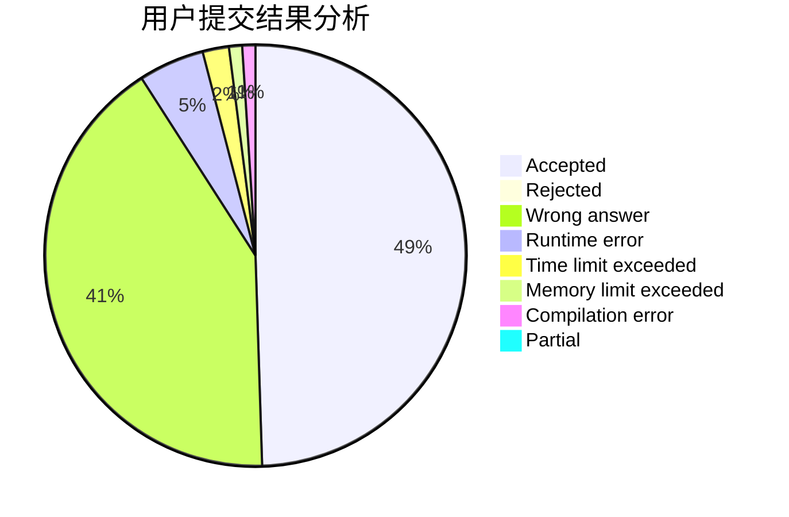
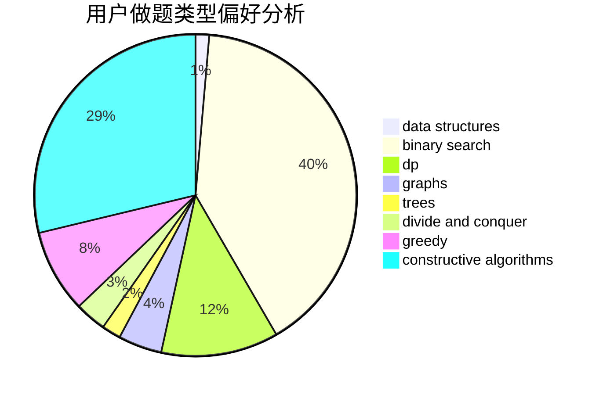
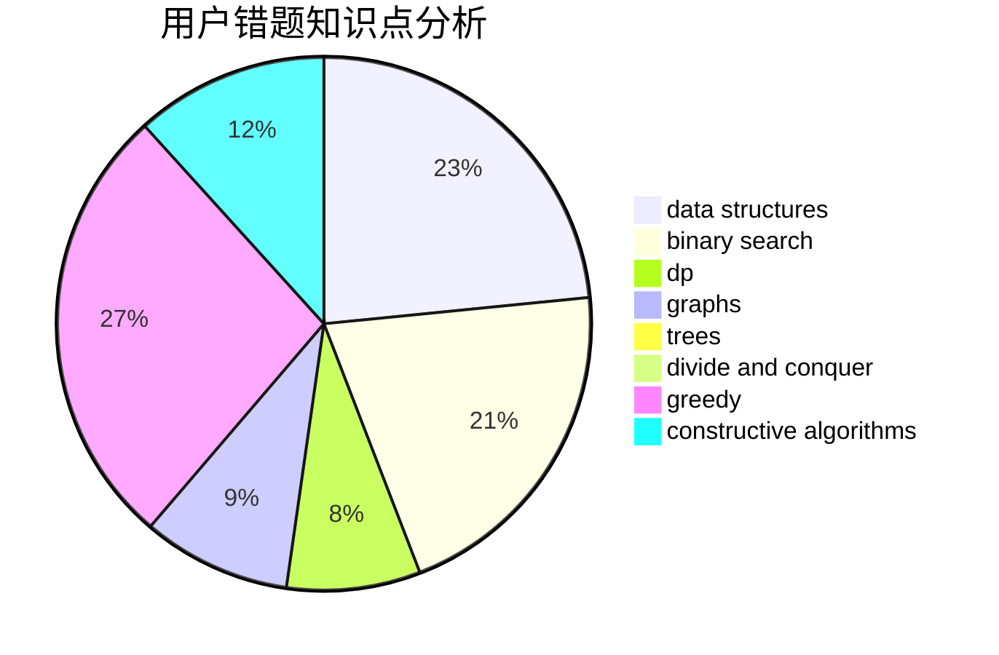

# comzyh

<!-- tabs:start -->

#### **用户提交结果分析**

#### **用户做题类型偏好分析**

#### **用户错题知识点分析**

<!-- tabs:end -->
# 推荐题目
[452E](https://codeforces.com/contest/452/problem/E)		data structures,
                        dsu,
                        string suffix structures,
                        strings		  
[555E](https://codeforces.com/contest/555/problem/E)		dfs and similar,
                        graphs,
                        trees		  
[1384E](https://codeforces.com/contest/1384/problem/E)		dsu,graphs,sortings,trees		  
[312A](https://codeforces.com/contest/312/problem/A)		implementation,
                        strings		  
[261B](https://codeforces.com/contest/261/problem/B)		dp,
                        math,
                        probabilities		  
[567B](https://codeforces.com/contest/567/problem/B)		implementation		  
[1009E](https://codeforces.com/contest/1009/problem/E)		combinatorics,
                        math,
                        probabilities		  
[300E](https://codeforces.com/contest/300/problem/E)		binary search,
                        math,
                        number theory		  
[568B](https://codeforces.com/contest/568/problem/B)		combinatorics,
                        dp,
                        math		  
[994A](https://codeforces.com/contest/994/problem/A)		implementation		  
