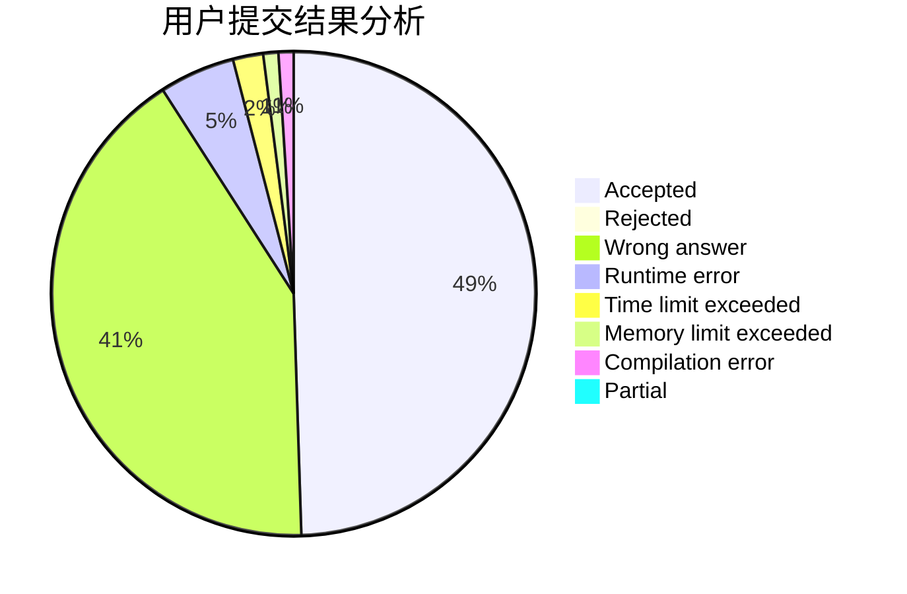
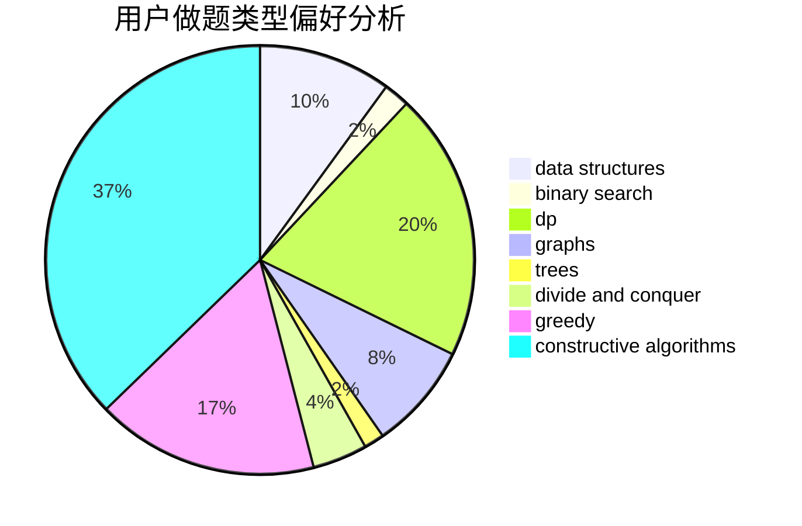
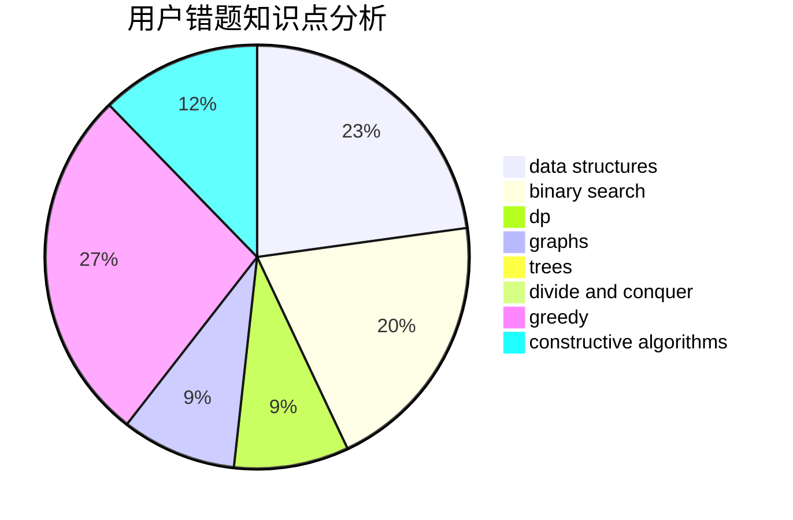

# comzyh

<!-- tabs:start -->

#### **用户提交结果分析**

#### **用户做题类型偏好分析**

#### **用户错题知识点分析**

<!-- tabs:end -->
# 推荐题目
[430C](https://codeforces.com/contest/430/problem/C)		dsu,graphs,sortings,trees		  
[534B](https://codeforces.com/contest/534/problem/B)		dp,
                        greedy,
                        math		  
[1375F](https://codeforces.com/contest/1375/problem/F)		constructive algorithms,
                        games,
                        interactive,
                        math		  
[295C](https://codeforces.com/contest/295/problem/C)		combinatorics,
                        dp,
                        graphs,
                        shortest paths		  
[23E](https://codeforces.com/contest/23/problem/E)		dp		  
[542F](https://codeforces.com/contest/542/problem/F)		dp,
                        greedy		  
[1009B](https://codeforces.com/contest/1009/problem/B)		greedy,
                        implementation		  
[286D](https://codeforces.com/contest/286/problem/D)		data structures,
                        sortings		  
[544A](https://codeforces.com/contest/544/problem/A)		implementation,
                        strings		  
[97A](https://codeforces.com/contest/97/problem/A)		brute force,
                        implementation		  
