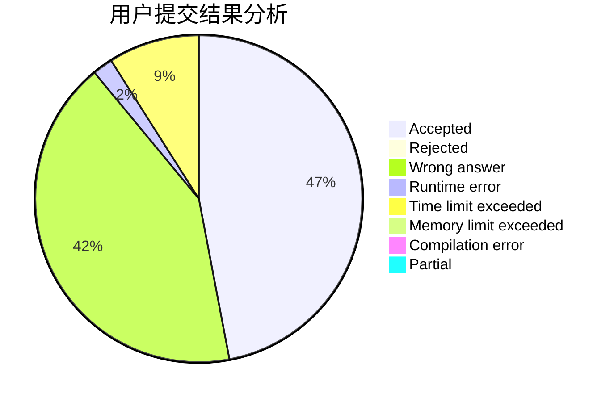
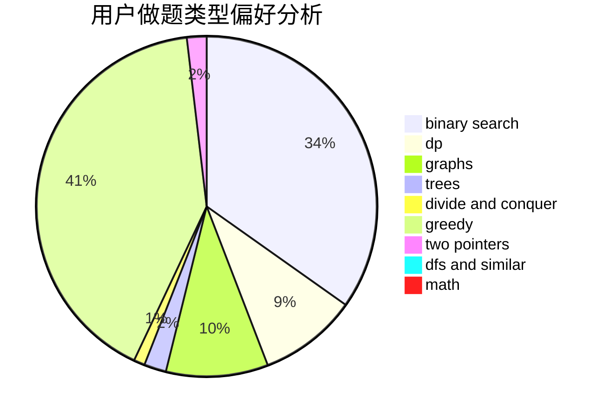

# conan1024hao

<!-- tabs:start -->

#### **用户提交结果分析**

#### **用户做题类型偏好分析**

<!-- tabs:end -->
# 推荐题目
[1476A](https://codeforces.com/contest/1476/problem/A)
[1491G](https://codeforces.com/contest/1491/problem/G)
[870A](https://codeforces.com/contest/870/problem/A)
[24E](https://codeforces.com/contest/24/problem/E)
[495B](https://codeforces.com/contest/495/problem/B)
[39D](https://codeforces.com/contest/39/problem/D)
[772E](https://codeforces.com/contest/772/problem/E)
[725C](https://codeforces.com/contest/725/problem/C)
[1230F](https://codeforces.com/contest/1230/problem/F)
[599B](https://codeforces.com/contest/599/problem/B)
