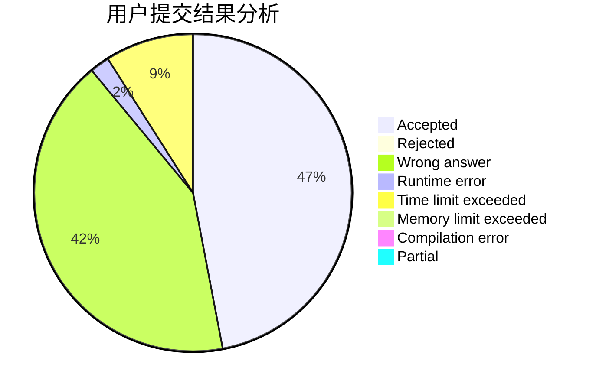
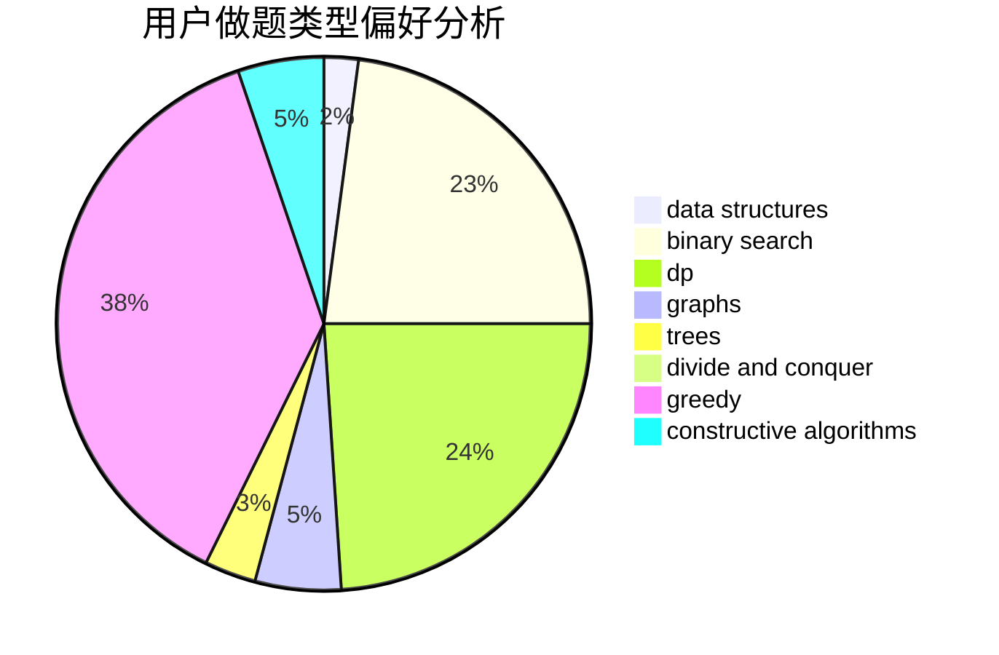
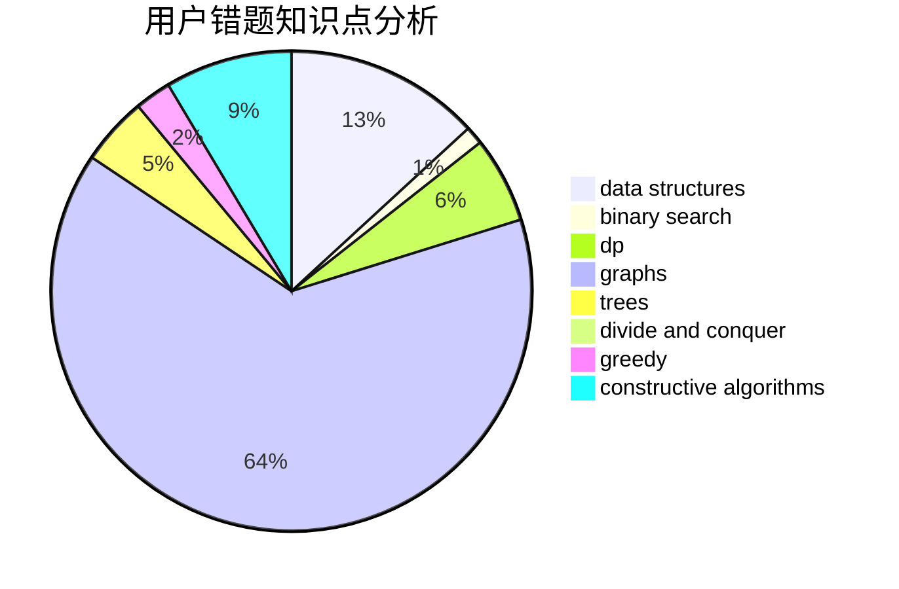

# conan1024hao

<!-- tabs:start -->

#### **用户提交结果分析**

#### **用户做题类型偏好分析**

#### **用户错题知识点分析**

<!-- tabs:end -->
# 推荐题目
[1468G](https://codeforces.com/contest/1468/problem/G)		binary search,
                        geometry		  
[1484C](https://codeforces.com/contest/1484/problem/C)		dsu,graphs,sortings,trees		  
[851D](https://codeforces.com/contest/851/problem/D)		dsu,graphs,sortings,trees		  
[22B](https://codeforces.com/contest/22/problem/B)		brute force,
                        dp		  
[476B](https://codeforces.com/contest/476/problem/B)		bitmasks,
                        brute force,
                        combinatorics,
                        dp,
                        math,
                        probabilities		  
[369B](https://codeforces.com/contest/369/problem/B)		constructive algorithms,
                        implementation,
                        math		  
[754D](https://codeforces.com/contest/754/problem/D)		binary search,
                        data structures,
                        greedy,
                        sortings		  
[707A](https://codeforces.com/contest/707/problem/A)		implementation		  
[1223G](https://codeforces.com/contest/1223/problem/G)		binary search,
                        math,
                        number theory		  
[577E](https://codeforces.com/contest/577/problem/E)		dsu,graphs,sortings,trees		  
