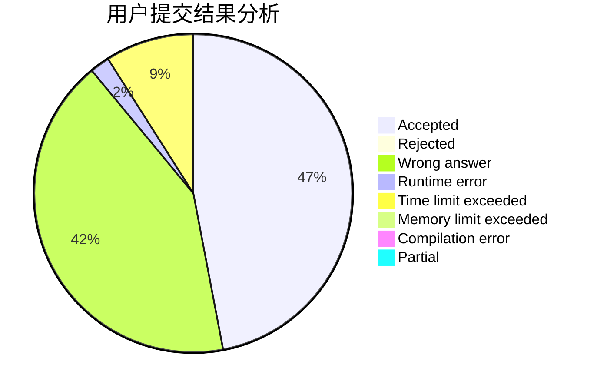
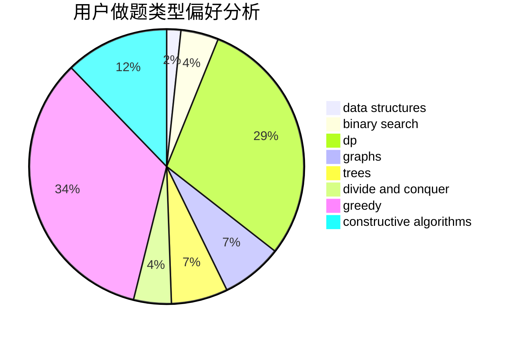

# conan1024hao

<!-- tabs:start -->

#### **用户提交结果分析**

#### **用户做题类型偏好分析**

#### **用户错题知识点分析**

<!-- tabs:end -->
# 推荐题目
[1476A](https://codeforces.com/contest/1476/problem/A)		binary search,
                        constructive algorithms,
                        greedy,
                        math		  
[1491G](https://codeforces.com/contest/1491/problem/G)		constructive algorithms,
                        graphs,
                        math		  
[870A](https://codeforces.com/contest/870/problem/A)		brute force,
                        implementation		  
[24E](https://codeforces.com/contest/24/problem/E)		binary search		  
[495B](https://codeforces.com/contest/495/problem/B)		math,
                        number theory		  
[39D](https://codeforces.com/contest/39/problem/D)		math		  
[772E](https://codeforces.com/contest/772/problem/E)		binary search,
                        divide and conquer,
                        interactive,
                        trees		  
[725C](https://codeforces.com/contest/725/problem/C)		brute force,
                        constructive algorithms,
                        implementation,
                        strings		  
[1230F](https://codeforces.com/contest/1230/problem/F)		dsu,graphs,sortings,trees		  
[599B](https://codeforces.com/contest/599/problem/B)		implementation		  
