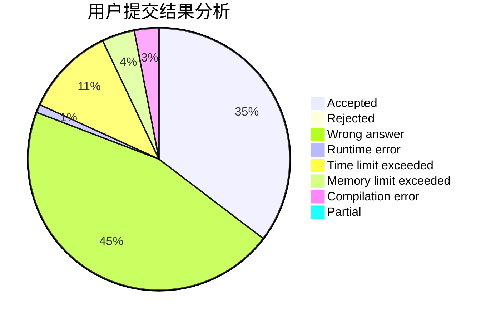
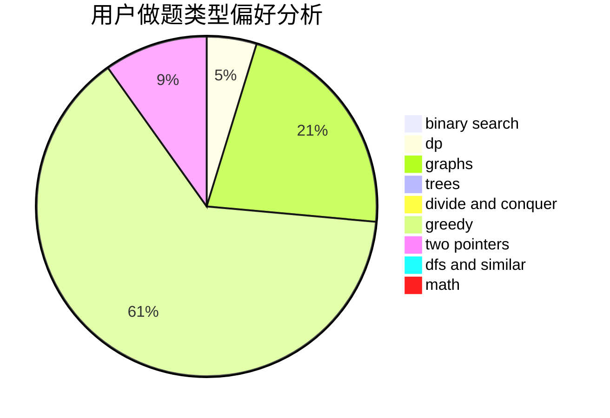

# cppascalinux

<!-- tabs:start -->

#### **用户提交结果分析**

#### **用户做题类型偏好分析**

<!-- tabs:end -->
# 推荐题目
[1360D](https://codeforces.com/contest/1360/problem/D)
[802G](https://codeforces.com/contest/802/problem/G)
[1161B](https://codeforces.com/contest/1161/problem/B)
[851A](https://codeforces.com/contest/851/problem/A)
[990F](https://codeforces.com/contest/990/problem/F)
[705B](https://codeforces.com/contest/705/problem/B)
[765D](https://codeforces.com/contest/765/problem/D)
[566G](https://codeforces.com/contest/566/problem/G)
[443D](https://codeforces.com/contest/443/problem/D)
[1198F](https://codeforces.com/contest/1198/problem/F)
