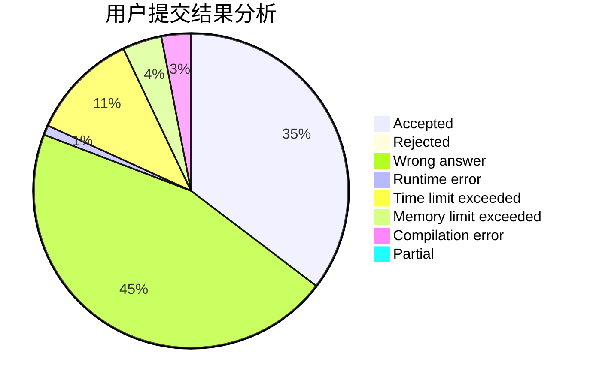
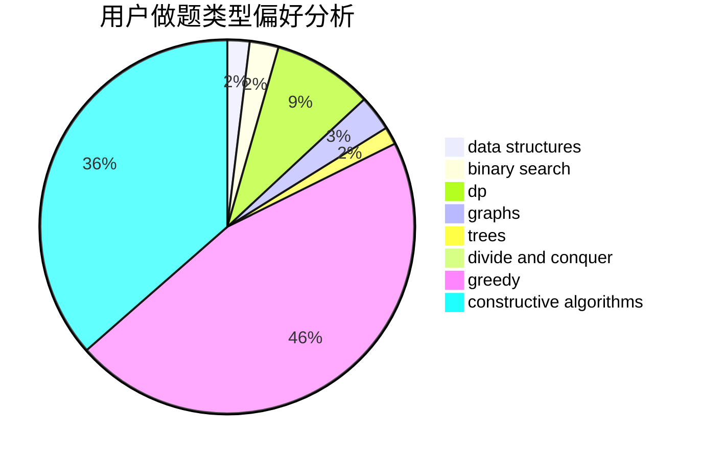
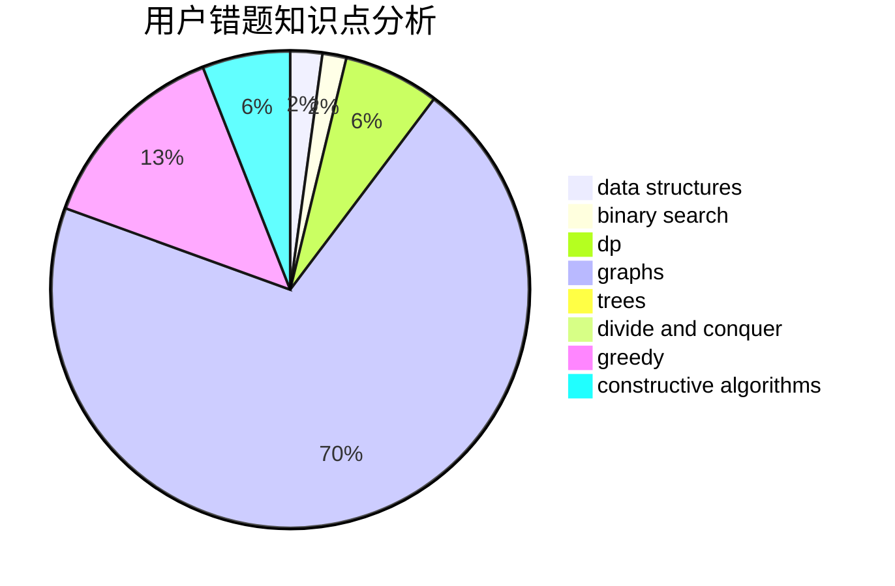

# cppascalinux

<!-- tabs:start -->

#### **用户提交结果分析**

#### **用户做题类型偏好分析**

#### **用户错题知识点分析**

<!-- tabs:end -->
# 推荐题目
[1360D](https://codeforces.com/contest/1360/problem/D)		math,
                        number theory		  
[802G](https://codeforces.com/contest/802/problem/G)		implementation,
                        strings		  
[1161B](https://codeforces.com/contest/1161/problem/B)		dsu,graphs,sortings,trees		  
[851A](https://codeforces.com/contest/851/problem/A)		implementation,
                        math		  
[990F](https://codeforces.com/contest/990/problem/F)		dfs and similar,
                        dp,
                        greedy,
                        trees		  
[705B](https://codeforces.com/contest/705/problem/B)		games,
                        math		  
[765D](https://codeforces.com/contest/765/problem/D)		constructive algorithms,
                        dsu,
                        math		  
[566G](https://codeforces.com/contest/566/problem/G)		geometry		  
[443D](https://codeforces.com/contest/443/problem/D)		dsu,graphs,sortings,trees		  
[1198F](https://codeforces.com/contest/1198/problem/F)		greedy,
                        number theory,
                        probabilities		  
