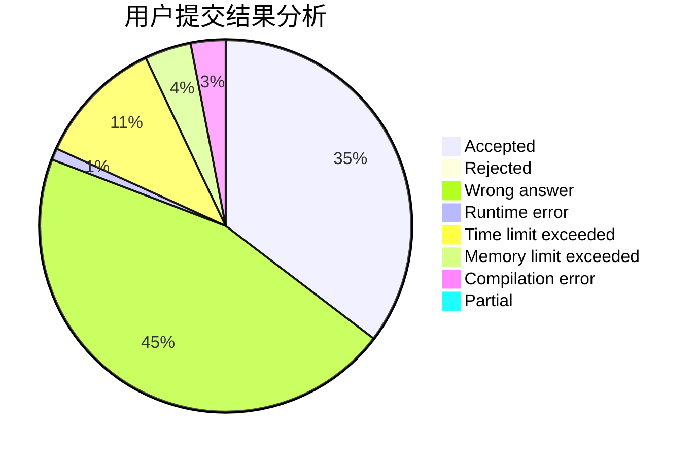
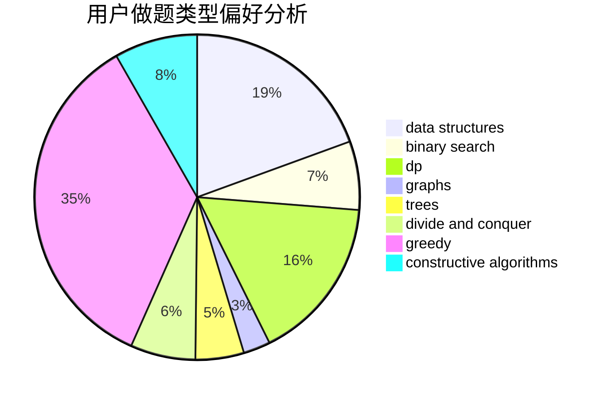
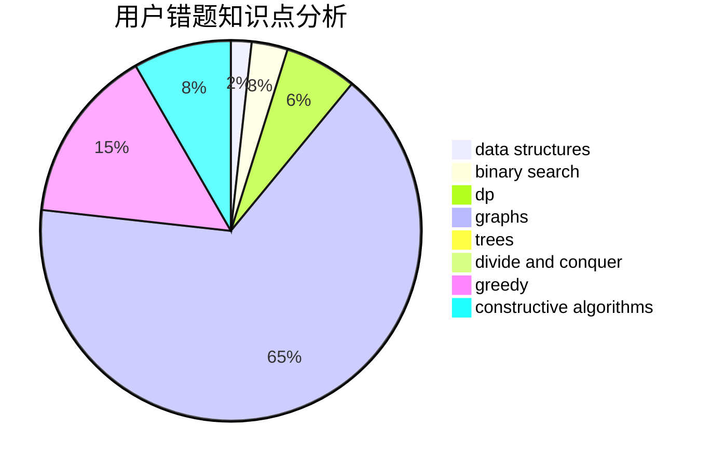

# cppascalinux

<!-- tabs:start -->

#### **用户提交结果分析**

#### **用户做题类型偏好分析**

#### **用户错题知识点分析**

<!-- tabs:end -->
# 推荐题目
[1353F](https://codeforces.com/contest/1353/problem/F)		brute force,
                        dp		  
[785B](https://codeforces.com/contest/785/problem/B)		greedy,
                        sortings		  
[1158C](https://codeforces.com/contest/1158/problem/C)		constructive algorithms,
                        data structures,
                        dfs and similar,
                        graphs,
                        greedy,
                        math,
                        sortings		  
[833A](https://codeforces.com/contest/833/problem/A)		math,
                        number theory		  
[977A](https://codeforces.com/contest/977/problem/A)		implementation		  
[681C](https://codeforces.com/contest/681/problem/C)		constructive algorithms,
                        data structures,
                        greedy		  
[746B](https://codeforces.com/contest/746/problem/B)		implementation,
                        strings		  
[542D](https://codeforces.com/contest/542/problem/D)		dfs and similar,
                        dp,
                        hashing,
                        math,
                        number theory		  
[418C](https://codeforces.com/contest/418/problem/C)		dsu,graphs,sortings,trees		  
[1194D](https://codeforces.com/contest/1194/problem/D)		games,
                        math		  
