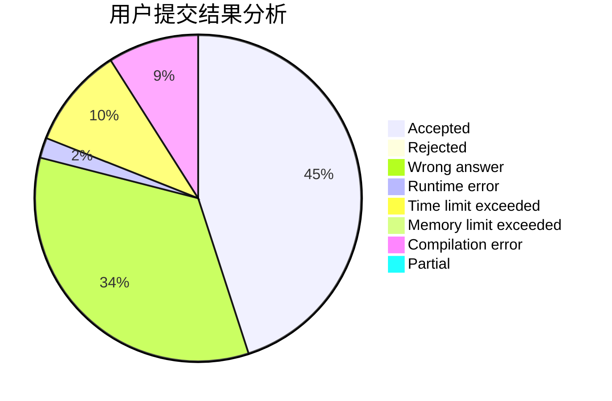
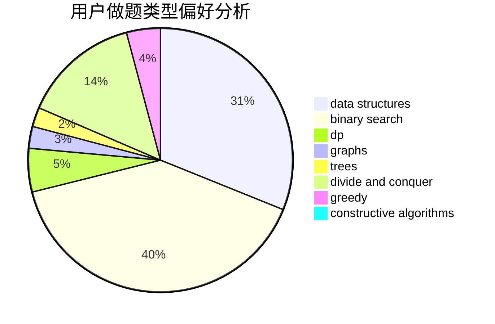
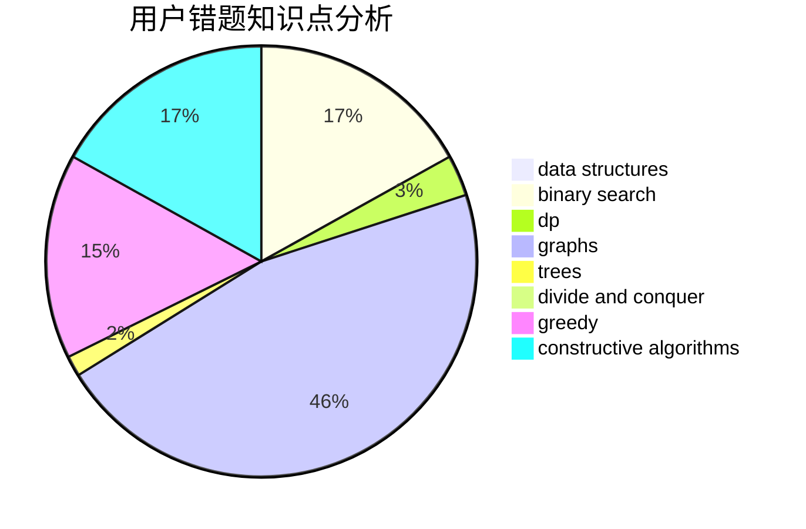

# cppisgood

<!-- tabs:start -->

#### **用户提交结果分析**

#### **用户做题类型偏好分析**

#### **用户错题知识点分析**

<!-- tabs:end -->
# 推荐题目
[940E](https://codeforces.com/contest/940/problem/E)		data structures,
                        dp,
                        greedy,
                        math		  
[317C](https://codeforces.com/contest/317/problem/C)		constructive algorithms,
                        dfs and similar,
                        graphs,
                        trees		  
[316G1](https://codeforces.com/contest/316G/problem/1)		hashing,
                        strings		  
[982A](https://codeforces.com/contest/982/problem/A)		brute force,
                        constructive algorithms		  
[1266E](https://codeforces.com/contest/1266/problem/E)		data structures,
                        greedy,
                        implementation		  
[1355F](https://codeforces.com/contest/1355/problem/F)		constructive algorithms,
                        interactive,
                        number theory		  
[810A](https://codeforces.com/contest/810/problem/A)		implementation,
                        math		  
[588A](https://codeforces.com/contest/588/problem/A)		greedy		  
[1163D](https://codeforces.com/contest/1163/problem/D)		dp,
                        strings		  
[794G](https://codeforces.com/contest/794/problem/G)		combinatorics,
                        dp,
                        math		  
