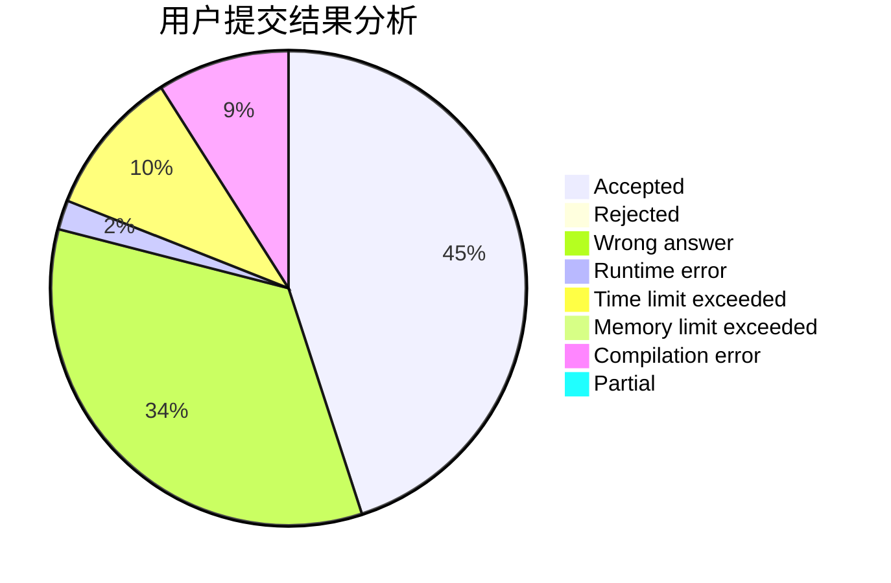
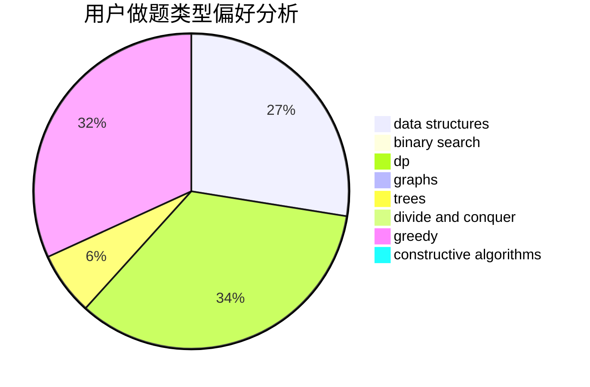
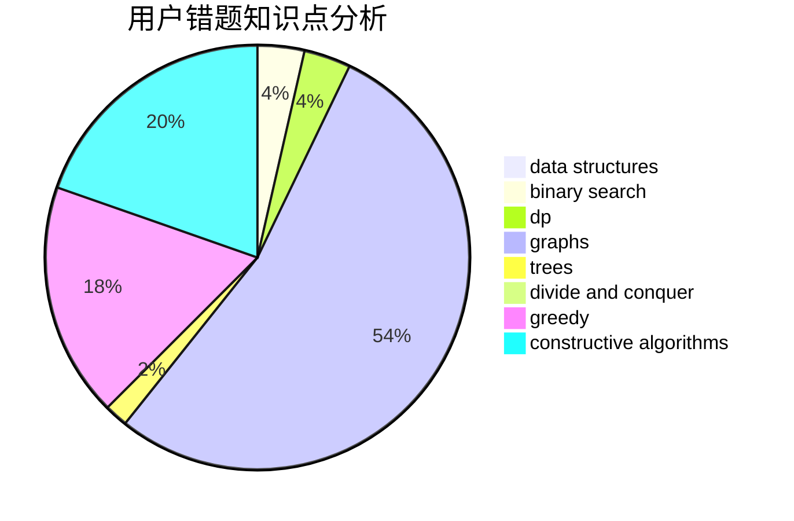

# cppisgood

<!-- tabs:start -->

#### **用户提交结果分析**

#### **用户做题类型偏好分析**

#### **用户错题知识点分析**

<!-- tabs:end -->
# 推荐题目
[962B](https://codeforces.com/contest/962/problem/B)		constructive algorithms,
                        greedy,
                        implementation		  
[346E](https://codeforces.com/contest/346/problem/E)		math,
                        number theory		  
[344A](https://codeforces.com/contest/344/problem/A)		implementation		  
[997D](https://codeforces.com/contest/997/problem/D)		combinatorics,
                        divide and conquer,
                        trees		  
[1271F](https://codeforces.com/contest/1271/problem/F)		brute force		  
[1362E](https://codeforces.com/contest/1362/problem/E)		dsu,graphs,sortings,trees		  
[828A](https://codeforces.com/contest/828/problem/A)		implementation		  
[608C](https://codeforces.com/contest/608/problem/C)		dsu,graphs,sortings,trees		  
[11652](https://codeforces.com/contest/1165/problem/2)		dsu,graphs,sortings,trees		  
[80A](https://codeforces.com/contest/80/problem/A)		brute force		  
