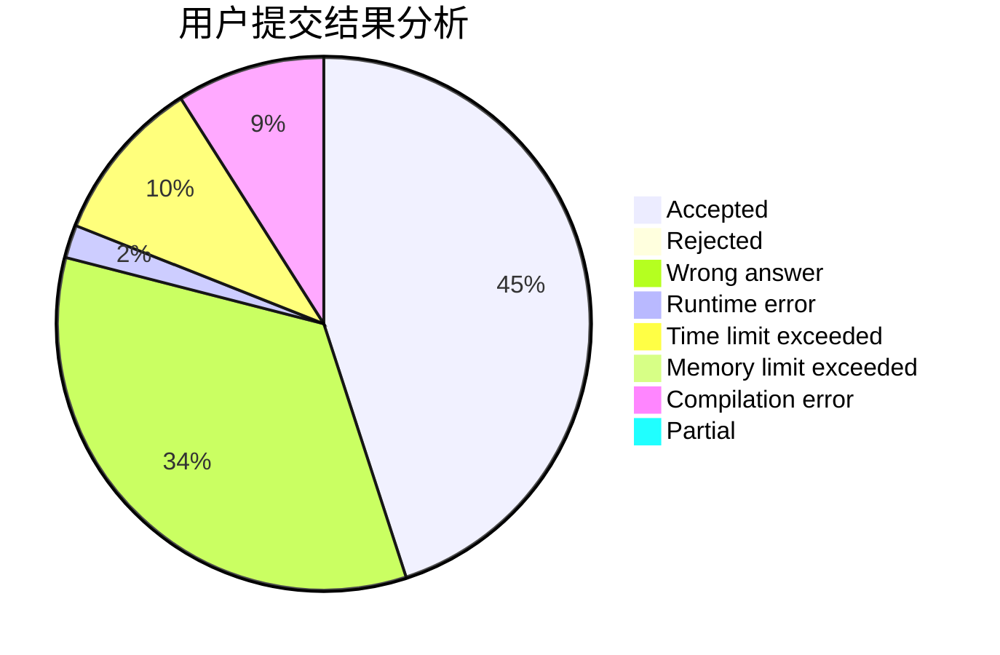
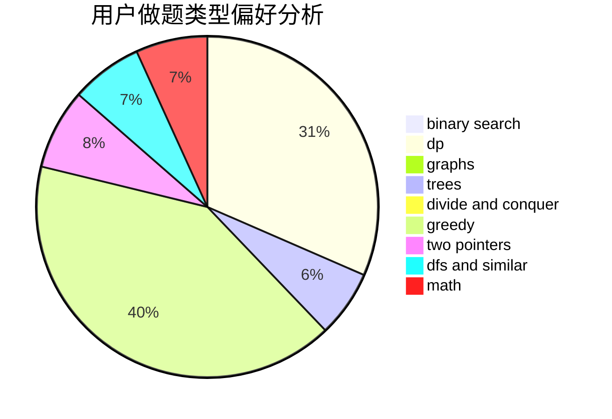

# cppisgood

<!-- tabs:start -->

#### **用户提交结果分析**

#### **用户做题类型偏好分析**

<!-- tabs:end -->
# 推荐题目
[962B](https://codeforces.com/contest/962/problem/B)
[346E](https://codeforces.com/contest/346/problem/E)
[344A](https://codeforces.com/contest/344/problem/A)
[997D](https://codeforces.com/contest/997/problem/D)
[1271F](https://codeforces.com/contest/1271/problem/F)
[1362E](https://codeforces.com/contest/1362/problem/E)
[828A](https://codeforces.com/contest/828/problem/A)
[608C](https://codeforces.com/contest/608/problem/C)
[11652](https://codeforces.com/contest/1165/problem/2)
[80A](https://codeforces.com/contest/80/problem/A)
