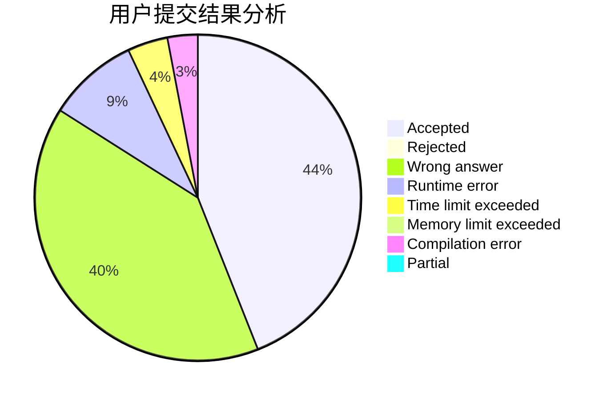
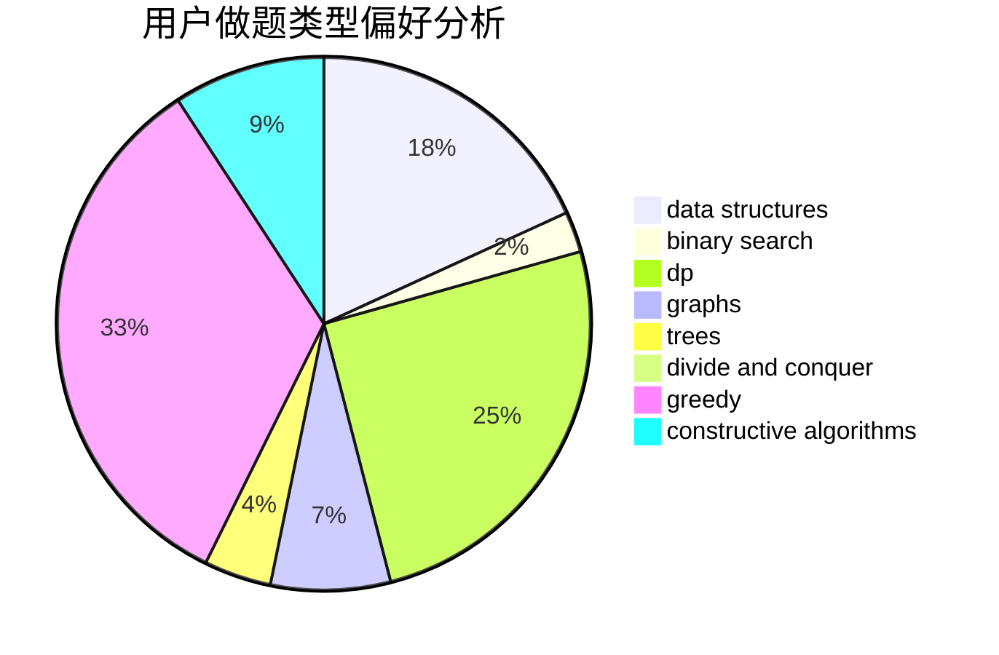
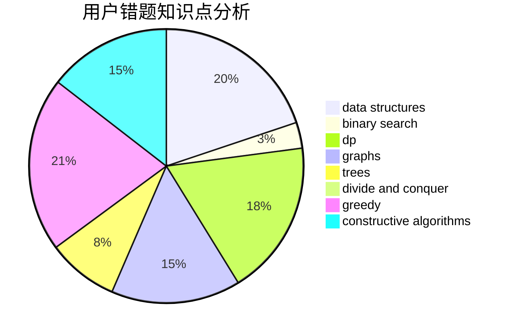

# cqssssss
<!-- tabs:start -->
#### **用户提交结果分析**

#### **用户做题类型偏好分析**

#### **用户错题知识点分析**

<!-- tabs:end -->
# 推荐题目
[Bricks](http://codeforces.com/problemset/problem/1404/E)		flows,
                        graph matchings,
                        graphs		  
[Exploration plan](http://codeforces.com/problemset/problem/852/D)		binary search,
                        flows,
                        graph matchings,
                        shortest paths		  
[Dima and Text Messages](http://codeforces.com/problemset/problem/358/B)		brute force,
                        strings		  
[Little Girl and Maximum Sum](http://codeforces.com/problemset/problem/276/C)		data structures,
                        greedy,
                        implementation,
                        sortings		  
[Equalizing Two Strings](http://codeforces.com/problemset/problem/1256/F)		constructive algorithms,
                        sortings,
                        strings		  
[New Year Permutation](http://codeforces.com/problemset/problem/500/B)		dfs and similar,
                        dsu,
                        graphs,
                        greedy,
                        math,
                        sortings		  
[Guess two numbers](https://codeforces.com/contest/1008/problem/E)		binary search,
                        interactive		  
[Two Tables](http://codeforces.com/problemset/problem/228/B)		brute force,
                        implementation		  
[Mod Mod Mod](http://codeforces.com/problemset/problem/889/E)		binary search,
                        dp,
                        math		  
[Steps to One](http://codeforces.com/problemset/problem/1139/D)		dp,
                        math,
                        number theory,
                        probabilities		  
<!-- tabs:start -->
#### **data structures**
[Bricks](http://codeforces.com/problemset/problem/276/C)		data structures,
                        greedy,
                        implementation,
                        sortings		  
[Exploration plan](http://codeforces.com/problemset/problem/414/D)		binary search,
                        data structures,
                        greedy,
                        trees,
                        two pointers		  
[Dima and Text Messages](https://codeforces.com/contest/1053/problem/C)		data structures		  
[Little Girl and Maximum Sum](http://codeforces.com/problemset/problem/418/D)		data structures,
                        graphs,
                        trees		  
[Equalizing Two Strings](http://codeforces.com/problemset/problem/13/E)		data structures,
                        dsu		  
[New Year Permutation](http://codeforces.com/problemset/problem/176/E)		data structures,
                        dfs and similar,
                        trees		  
[Guess two numbers](http://codeforces.com/problemset/problem/242/E)		bitmasks,
                        data structures		  
[Two Tables](http://codeforces.com/problemset/problem/4/C)		data structures,
                        hashing,
                        implementation		  
[Mod Mod Mod](http://codeforces.com/problemset/problem/1492/C)		binary search,
                        data structures,
                        dp,
                        greedy,
                        two pointers		  
[Steps to One](http://codeforces.com/problemset/problem/1490/G)		binary search,
                        data structures,
                        math		  
#### **binary search**
[Bricks](http://codeforces.com/problemset/problem/852/D)		binary search,
                        flows,
                        graph matchings,
                        shortest paths		  
[Exploration plan](https://codeforces.com/contest/1008/problem/E)		binary search,
                        interactive		  
[Dima and Text Messages](http://codeforces.com/problemset/problem/889/E)		binary search,
                        dp,
                        math		  
[Little Girl and Maximum Sum](http://codeforces.com/problemset/problem/414/D)		binary search,
                        data structures,
                        greedy,
                        trees,
                        two pointers		  
[Equalizing Two Strings](http://codeforces.com/problemset/problem/1100/E)		binary search,
                        dfs and similar,
                        graphs		  
[New Year Permutation](http://codeforces.com/problemset/problem/274/A)		binary search,
                        greedy,
                        sortings		  
[Guess two numbers](http://codeforces.com/problemset/problem/1492/C)		binary search,
                        data structures,
                        dp,
                        greedy,
                        two pointers		  
[Two Tables](http://codeforces.com/problemset/problem/1463/D)		binary search,
                        constructive algorithms,
                        greedy,
                        two pointers		  
[Mod Mod Mod](http://codeforces.com/problemset/problem/1490/G)		binary search,
                        data structures,
                        math		  
[Steps to One](http://codeforces.com/problemset/problem/1479/D)		binary search,
                        bitmasks,
                        brute force,
                        data structures,
                        probabilities,
                        trees		  
#### **dp**
[Bricks](http://codeforces.com/problemset/problem/889/E)		binary search,
                        dp,
                        math		  
[Exploration plan](http://codeforces.com/problemset/problem/1139/D)		dp,
                        math,
                        number theory,
                        probabilities		  
[Dima and Text Messages](http://codeforces.com/problemset/problem/1156/F)		dp,
                        math,
                        probabilities		  
[Little Girl and Maximum Sum](http://codeforces.com/problemset/problem/1253/C)		dp,
                        greedy,
                        math,
                        sortings		  
[Equalizing Two Strings](http://codeforces.com/problemset/problem/13/D)		dp,
                        geometry		  
[New Year Permutation](http://codeforces.com/problemset/problem/1237/F)		combinatorics,
                        dp		  
[Guess two numbers](https://codeforces.com/contest/116/problem/C)		bitmasks,
                        brute force,
                        dp,
                        graphs		  
[Two Tables](http://codeforces.com/problemset/problem/1132/F)		dp		  
[Mod Mod Mod](http://codeforces.com/problemset/problem/1328/D)		constructive algorithms,
                        dp,
                        graphs,
                        greedy,
                        math		  
[Steps to One](http://codeforces.com/problemset/problem/86/C)		dp,
                        string suffix structures,
                        trees		  
#### **graph**
[Bricks](http://codeforces.com/problemset/problem/1404/E)		flows,
                        graph matchings,
                        graphs		  
[Exploration plan](http://codeforces.com/problemset/problem/852/D)		binary search,
                        flows,
                        graph matchings,
                        shortest paths		  
[Dima and Text Messages](http://codeforces.com/problemset/problem/500/B)		dfs and similar,
                        dsu,
                        graphs,
                        greedy,
                        math,
                        sortings		  
[Little Girl and Maximum Sum](http://codeforces.com/problemset/problem/316/C2)		flows,
                        graph matchings		  
[Equalizing Two Strings](http://codeforces.com/problemset/problem/441/D)		constructive algorithms,
                        dsu,
                        graphs,
                        implementation,
                        math,
                        string suffix structures		  
[New Year Permutation](http://codeforces.com/problemset/problem/818/G)		flows,
                        graphs		  
[Guess two numbers](https://codeforces.com/contest/116/problem/C)		bitmasks,
                        brute force,
                        dp,
                        graphs		  
[Two Tables](http://codeforces.com/problemset/problem/1100/E)		binary search,
                        dfs and similar,
                        graphs		  
[Mod Mod Mod](http://codeforces.com/problemset/problem/36/E)		constructive algorithms,
                        dsu,
                        graphs,
                        implementation		  
[Steps to One](http://codeforces.com/problemset/problem/1187/G)		flows,
                        graphs		  
#### **trees**
[Bricks](http://codeforces.com/problemset/problem/414/D)		binary search,
                        data structures,
                        greedy,
                        trees,
                        two pointers		  
[Exploration plan](http://codeforces.com/problemset/problem/418/D)		data structures,
                        graphs,
                        trees		  
[Dima and Text Messages](http://codeforces.com/problemset/problem/1205/D)		constructive algorithms,
                        trees		  
[Little Girl and Maximum Sum](http://codeforces.com/problemset/problem/86/C)		dp,
                        string suffix structures,
                        trees		  
[Equalizing Two Strings](http://codeforces.com/problemset/problem/176/E)		data structures,
                        dfs and similar,
                        trees		  
[New Year Permutation](http://codeforces.com/problemset/problem/1276/D)		dp,
                        trees		  
[Guess two numbers](http://codeforces.com/problemset/problem/1479/D)		binary search,
                        bitmasks,
                        brute force,
                        data structures,
                        probabilities,
                        trees		  
[Two Tables](http://codeforces.com/problemset/problem/1511/C)		brute force,
                        data structures,
                        implementation,
                        trees		  
[Mod Mod Mod](http://codeforces.com/problemset/problem/1499/F)		combinatorics,
                        dfs and similar,
                        dp,
                        trees		  
[Steps to One](http://codeforces.com/problemset/problem/1491/E)		brute force,
                        dfs and similar,
                        divide and conquer,
                        number theory,
                        trees		  
#### **divide and conquer**
[Bricks](http://codeforces.com/problemset/problem/1461/D)		binary search,
                        brute force,
                        data structures,
                        divide and conquer,
                        implementation,
                        sortings		  
[Exploration plan](http://codeforces.com/problemset/problem/1466/G)		combinatorics,
                        divide and conquer,
                        hashing,
                        math,
                        string suffix structures,
                        strings		  
[Dima and Text Messages](http://codeforces.com/problemset/problem/1490/D)		dfs and similar,
                        divide and conquer,
                        implementation		  
[Little Girl and Maximum Sum](https://codeforces.com/contest/1483/problem/C)		data structures,
                        divide and conquer,
                        dp		  
[Equalizing Two Strings](http://codeforces.com/problemset/problem/1491/E)		brute force,
                        dfs and similar,
                        divide and conquer,
                        number theory,
                        trees		  
[New Year Permutation](http://codeforces.com/problemset/problem/1303/G)		data structures,
                        divide and conquer,
                        geometry,
                        trees		  
[Guess two numbers](http://codeforces.com/problemset/problem/1494/D)		constructive algorithms,
                        data structures,
                        dfs and similar,
                        divide and conquer,
                        dsu,
                        greedy,
                        sortings,
                        trees		  
[Two Tables](http://codeforces.com/problemset/problem/1482/E)		data structures,
                        divide and conquer,
                        dp		  
[Mod Mod Mod](http://codeforces.com/problemset/problem/566/C)		dfs and similar,
                        divide and conquer,
                        trees		  
[Steps to One](http://codeforces.com/problemset/problem/1428/F)		binary search,
                        data structures,
                        divide and conquer,
                        dp,
                        two pointers		  
#### **greedy**
[Bricks](http://codeforces.com/problemset/problem/276/C)		data structures,
                        greedy,
                        implementation,
                        sortings		  
[Exploration plan](http://codeforces.com/problemset/problem/500/B)		dfs and similar,
                        dsu,
                        graphs,
                        greedy,
                        math,
                        sortings		  
[Dima and Text Messages](http://codeforces.com/problemset/problem/92/B)		greedy		  
[Little Girl and Maximum Sum](http://codeforces.com/problemset/problem/1253/C)		dp,
                        greedy,
                        math,
                        sortings		  
[Equalizing Two Strings](http://codeforces.com/problemset/problem/414/D)		binary search,
                        data structures,
                        greedy,
                        trees,
                        two pointers		  
[New Year Permutation](http://codeforces.com/problemset/problem/1107/C)		greedy,
                        sortings,
                        two pointers		  
[Guess two numbers](http://codeforces.com/problemset/problem/1077/B)		greedy		  
[Two Tables](http://codeforces.com/problemset/problem/1041/A)		greedy,
                        implementation,
                        sortings		  
[Mod Mod Mod](http://codeforces.com/problemset/problem/1031/D)		greedy		  
[Steps to One](http://codeforces.com/problemset/problem/274/A)		binary search,
                        greedy,
                        sortings		  
#### **constructive algorithms**
[Bricks](http://codeforces.com/problemset/problem/1256/F)		constructive algorithms,
                        sortings,
                        strings		  
[Exploration plan](https://codeforces.com/contest/1243/problem/C)		constructive algorithms,
                        math,
                        number theory		  
[Dima and Text Messages](http://codeforces.com/problemset/problem/1054/C)		constructive algorithms,
                        implementation		  
[Little Girl and Maximum Sum](http://codeforces.com/problemset/problem/441/D)		constructive algorithms,
                        dsu,
                        graphs,
                        implementation,
                        math,
                        string suffix structures		  
[Equalizing Two Strings](http://codeforces.com/problemset/problem/36/E)		constructive algorithms,
                        dsu,
                        graphs,
                        implementation		  
[New Year Permutation](http://codeforces.com/problemset/problem/1384/A)		constructive algorithms,
                        greedy,
                        strings		  
[Guess two numbers](http://codeforces.com/problemset/problem/1328/D)		constructive algorithms,
                        dp,
                        graphs,
                        greedy,
                        math		  
[Two Tables](http://codeforces.com/problemset/problem/1368/C)		constructive algorithms		  
[Mod Mod Mod](http://codeforces.com/problemset/problem/1205/D)		constructive algorithms,
                        trees		  
[Steps to One](http://codeforces.com/problemset/problem/1108/D)		constructive algorithms,
                        dp,
                        greedy		  
#### **sortings**
[Bricks](http://codeforces.com/problemset/problem/276/C)		data structures,
                        greedy,
                        implementation,
                        sortings		  
[Exploration plan](http://codeforces.com/problemset/problem/1256/F)		constructive algorithms,
                        sortings,
                        strings		  
[Dima and Text Messages](http://codeforces.com/problemset/problem/500/B)		dfs and similar,
                        dsu,
                        graphs,
                        greedy,
                        math,
                        sortings		  
[Little Girl and Maximum Sum](http://codeforces.com/problemset/problem/272/D)		combinatorics,
                        math,
                        sortings		  
[Equalizing Two Strings](http://codeforces.com/problemset/problem/1253/C)		dp,
                        greedy,
                        math,
                        sortings		  
[New Year Permutation](http://codeforces.com/problemset/problem/1206/A)		math,
                        sortings		  
[Guess two numbers](http://codeforces.com/problemset/problem/1107/C)		greedy,
                        sortings,
                        two pointers		  
[Two Tables](http://codeforces.com/problemset/problem/1041/A)		greedy,
                        implementation,
                        sortings		  
[Mod Mod Mod](http://codeforces.com/problemset/problem/274/A)		binary search,
                        greedy,
                        sortings		  
[Steps to One](http://codeforces.com/problemset/problem/853/B)		greedy,
                        sortings,
                        two pointers		  
<!-- tabs:end -->
