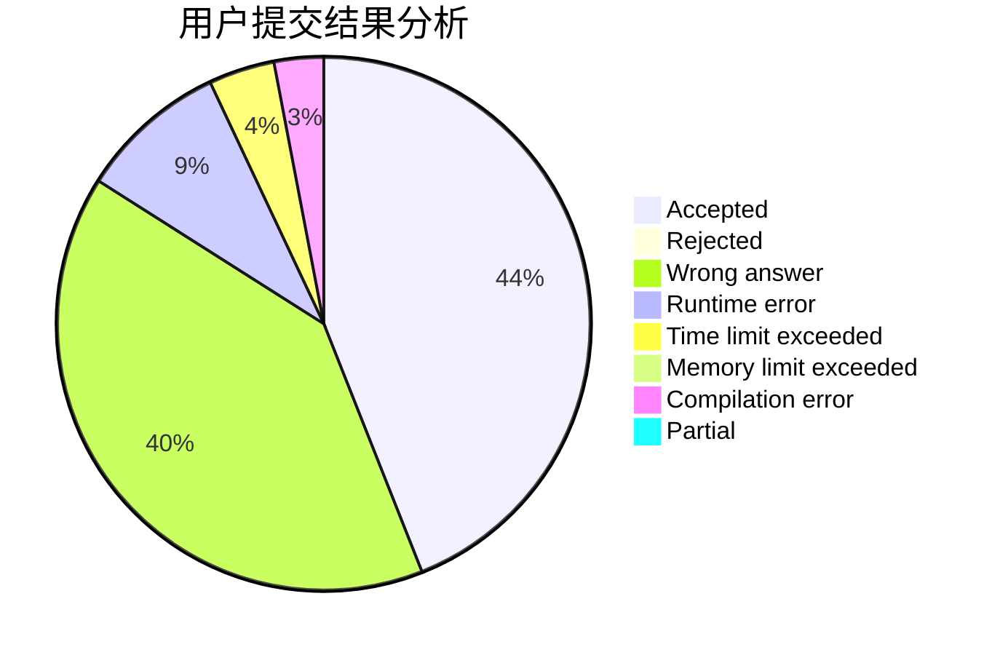
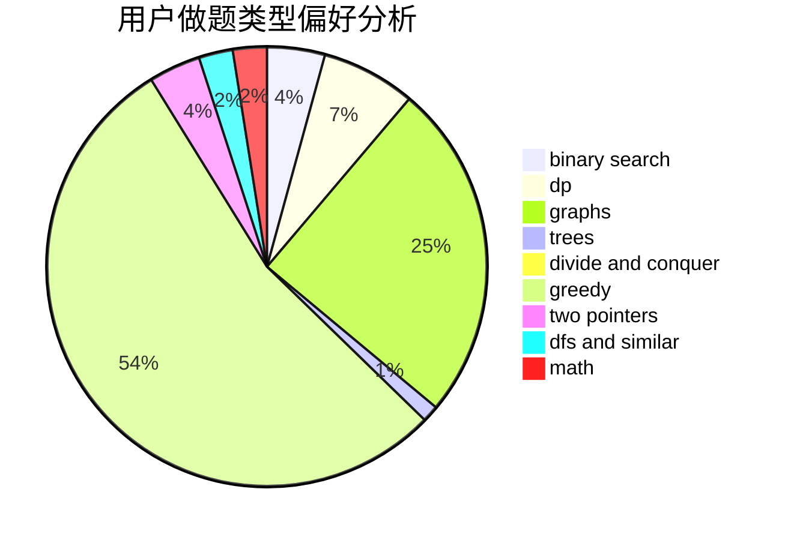

# cqssssss

<!-- tabs:start -->

#### **用户提交结果分析**

#### **用户做题类型偏好分析**

<!-- tabs:end -->
# 推荐题目
[11411](https://codeforces.com/contest/1141/problem/1)
[870C](https://codeforces.com/contest/870/problem/C)
[383D](https://codeforces.com/contest/383/problem/D)
[290C](https://codeforces.com/contest/290/problem/C)
[838F](https://codeforces.com/contest/838/problem/F)
[1393D](https://codeforces.com/contest/1393/problem/D)
[521B](https://codeforces.com/contest/521/problem/B)
[246C](https://codeforces.com/contest/246/problem/C)
[1009C](https://codeforces.com/contest/1009/problem/C)
[979A](https://codeforces.com/contest/979/problem/A)
