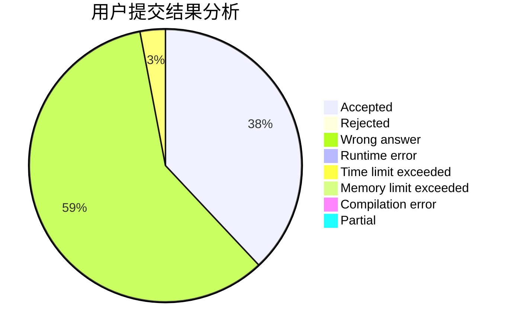
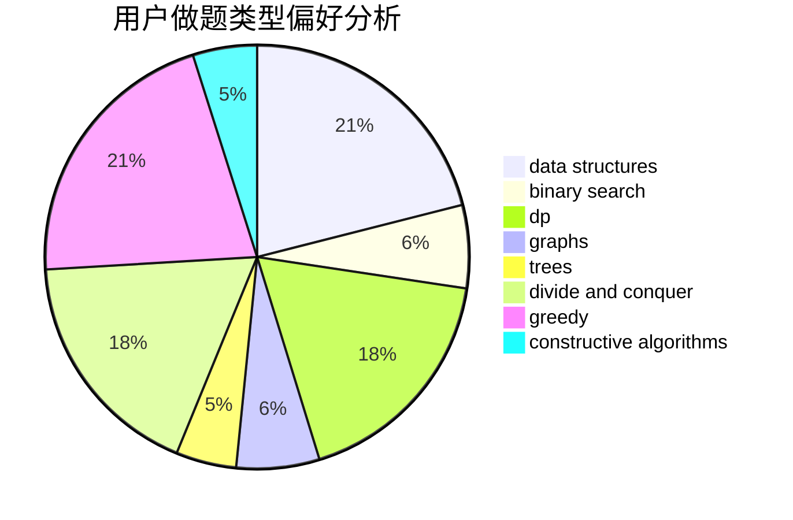
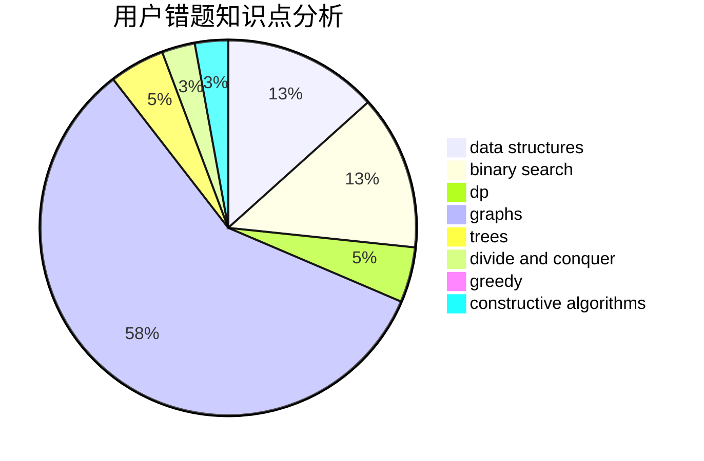

# cqyzzzx

<!-- tabs:start -->

#### **用户提交结果分析**

#### **用户做题类型偏好分析**

#### **用户错题知识点分析**

<!-- tabs:end -->
# 推荐题目
[13563](https://codeforces.com/contest/1356/problem/3)		dsu,graphs,sortings,trees		  
[1246F](https://codeforces.com/contest/1246/problem/F)		nan		  
[13A](https://codeforces.com/contest/13/problem/A)		implementation,
                        math		  
[851B](https://codeforces.com/contest/851/problem/B)		geometry,
                        math		  
[79D](https://codeforces.com/contest/79/problem/D)		bitmasks,
                        dp,
                        shortest paths		  
[252A](https://codeforces.com/contest/252/problem/A)		brute force,
                        implementation		  
[798B](https://codeforces.com/contest/798/problem/B)		brute force,
                        dp,
                        strings		  
[1096D](https://codeforces.com/contest/1096/problem/D)		dp		  
[618D](https://codeforces.com/contest/618/problem/D)		dfs and similar,
                        dp,
                        graph matchings,
                        greedy,
                        trees		  
[819D](https://codeforces.com/contest/819/problem/D)		number theory		  
