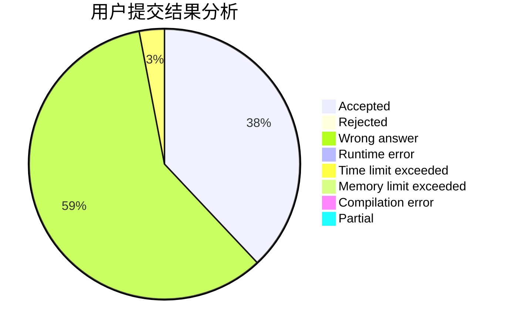
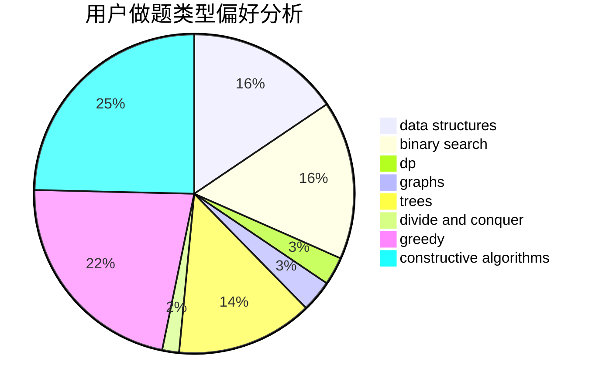
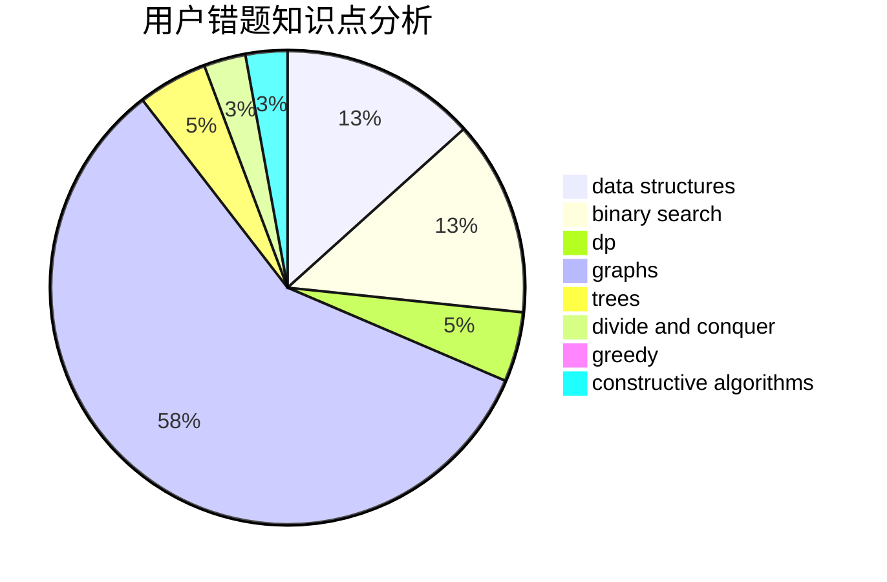

# cqyzzzx
<!-- tabs:start -->
#### **用户提交结果分析**

#### **用户做题类型偏好分析**

#### **用户错题知识点分析**

<!-- tabs:end -->
# 推荐题目
[Slime and Hats](http://codeforces.com/problemset/problem/1349/E)		constructive algorithms,
                        dp,
                        greedy		  
[Find Divisible](http://codeforces.com/problemset/problem/1096/A)		greedy,
                        implementation,
                        math		  
[Strings Equalization](https://codeforces.com/contest/1241/problem/B)		strings		  
[Fence](http://codeforces.com/problemset/problem/363/B)		brute force,
                        dp		  
[K Paths](http://codeforces.com/problemset/problem/981/H)		combinatorics,
                        data structures,
                        dp,
                        fft,
                        math		  
[Maximum Element](http://codeforces.com/problemset/problem/886/E)		combinatorics,
                        dp,
                        math		  
[Bear and Friendship Condition](https://codeforces.com/contest/791/problem/B)		dfs and similar,
                        dsu,
                        graphs		  
[Shortest Path](http://codeforces.com/problemset/problem/59/E)		graphs,
                        shortest paths		  
[Blackboard Fibonacci](https://codeforces.com/contest/218/problem/D)		brute force,
                        math		  
[Falling Anvils](http://codeforces.com/problemset/problem/77/B)		math,
                        probabilities		  
<!-- tabs:start -->
#### **data structures**
[Slime and Hats](http://codeforces.com/problemset/problem/981/H)		combinatorics,
                        data structures,
                        dp,
                        fft,
                        math		  
[Find Divisible](http://codeforces.com/problemset/problem/338/E)		data structures		  
[Strings Equalization](https://codeforces.com/contest/1432/problem/D)		data structures,
                        dp,
                        strings		  
[Fence](http://codeforces.com/problemset/problem/587/C)		data structures,
                        trees		  
[K Paths](http://codeforces.com/problemset/problem/833/B)		binary search,
                        data structures,
                        divide and conquer,
                        dp,
                        two pointers		  
[Maximum Element](http://codeforces.com/problemset/problem/767/D)		binary search,
                        data structures,
                        greedy,
                        sortings,
                        two pointers		  
[Bear and Friendship Condition](http://codeforces.com/problemset/problem/777/E)		brute force,
                        data structures,
                        dp,
                        greedy,
                        sortings		  
[Shortest Path](http://codeforces.com/problemset/problem/1492/C)		binary search,
                        data structures,
                        dp,
                        greedy,
                        two pointers		  
[Blackboard Fibonacci](http://codeforces.com/problemset/problem/1490/G)		binary search,
                        data structures,
                        math		  
[Falling Anvils](http://codeforces.com/problemset/problem/1479/D)		binary search,
                        bitmasks,
                        brute force,
                        data structures,
                        probabilities,
                        trees		  
#### **binary search**
[Slime and Hats](http://codeforces.com/problemset/problem/780/H)		binary search,
                        geometry,
                        implementation,
                        two pointers		  
[Find Divisible](https://codeforces.com/contest/672/problem/D)		binary search,
                        greedy		  
[Strings Equalization](http://codeforces.com/problemset/problem/833/B)		binary search,
                        data structures,
                        divide and conquer,
                        dp,
                        two pointers		  
[Fence](https://codeforces.com/contest/781/problem/F)		binary search,
                        geometry,
                        implementation,
                        two pointers		  
[K Paths](http://codeforces.com/problemset/problem/701/C)		binary search,
                        strings,
                        two pointers		  
[Maximum Element](https://codeforces.com/contest/1509/problem/E)		binary search,
                        bitmasks,
                        combinatorics,
                        constructive algorithms,
                        implementation,
                        math		  
[Bear and Friendship Condition](http://codeforces.com/problemset/problem/767/D)		binary search,
                        data structures,
                        greedy,
                        sortings,
                        two pointers		  
[Shortest Path](http://codeforces.com/problemset/problem/11/E)		binary search,
                        dp,
                        greedy		  
[Blackboard Fibonacci](http://codeforces.com/problemset/problem/1326/D2)		binary search,
                        greedy,
                        hashing,
                        string suffix structures,
                        strings		  
[Falling Anvils](http://codeforces.com/problemset/problem/1492/C)		binary search,
                        data structures,
                        dp,
                        greedy,
                        two pointers		  
#### **dp**
[Slime and Hats](http://codeforces.com/problemset/problem/1349/E)		constructive algorithms,
                        dp,
                        greedy		  
[Find Divisible](http://codeforces.com/problemset/problem/363/B)		brute force,
                        dp		  
[Strings Equalization](http://codeforces.com/problemset/problem/981/H)		combinatorics,
                        data structures,
                        dp,
                        fft,
                        math		  
[Fence](http://codeforces.com/problemset/problem/886/E)		combinatorics,
                        dp,
                        math		  
[K Paths](http://codeforces.com/problemset/problem/803/E)		dp,
                        graphs		  
[Maximum Element](http://codeforces.com/problemset/problem/526/E)		dp,
                        implementation		  
[Bear and Friendship Condition](https://codeforces.com/contest/1432/problem/D)		data structures,
                        dp,
                        strings		  
[Shortest Path](http://codeforces.com/problemset/problem/833/B)		binary search,
                        data structures,
                        divide and conquer,
                        dp,
                        two pointers		  
[Blackboard Fibonacci](http://codeforces.com/problemset/problem/869/C)		combinatorics,
                        dp,
                        math		  
[Falling Anvils](http://codeforces.com/problemset/problem/261/D)		dp		  
#### **graph**
[Slime and Hats](https://codeforces.com/contest/791/problem/B)		dfs and similar,
                        dsu,
                        graphs		  
[Find Divisible](http://codeforces.com/problemset/problem/59/E)		graphs,
                        shortest paths		  
[Strings Equalization](http://codeforces.com/problemset/problem/803/E)		dp,
                        graphs		  
[Fence](http://codeforces.com/problemset/problem/1089/D)		graphs		  
[K Paths](http://codeforces.com/problemset/problem/1487/C)		brute force,
                        constructive algorithms,
                        dfs and similar,
                        graphs,
                        greedy,
                        implementation,
                        math		  
[Maximum Element](http://codeforces.com/problemset/problem/1437/C)		dp,
                        flows,
                        graph matchings,
                        greedy,
                        math,
                        sortings		  
[Bear and Friendship Condition](http://codeforces.com/problemset/problem/1470/D)		constructive algorithms,
                        dfs and similar,
                        graph matchings,
                        graphs,
                        greedy		  
[Shortest Path](http://codeforces.com/problemset/problem/1476/C)		dp,
                        graphs,
                        greedy		  
[Blackboard Fibonacci](http://codeforces.com/problemset/problem/1304/D)		constructive algorithms,
                        graphs,
                        greedy,
                        two pointers		  
[Falling Anvils](http://codeforces.com/problemset/problem/1475/C)		combinatorics,
                        graphs,
                        math		  
#### **trees**
[Slime and Hats](http://codeforces.com/problemset/problem/587/C)		data structures,
                        trees		  
[Find Divisible](http://codeforces.com/problemset/problem/1479/D)		binary search,
                        bitmasks,
                        brute force,
                        data structures,
                        probabilities,
                        trees		  
[Strings Equalization](http://codeforces.com/problemset/problem/1511/C)		brute force,
                        data structures,
                        implementation,
                        trees		  
[Fence](http://codeforces.com/problemset/problem/1499/F)		combinatorics,
                        dfs and similar,
                        dp,
                        trees		  
[K Paths](http://codeforces.com/problemset/problem/1491/E)		brute force,
                        dfs and similar,
                        divide and conquer,
                        number theory,
                        trees		  
[Maximum Element](http://codeforces.com/problemset/problem/1466/D)		data structures,
                        greedy,
                        sortings,
                        trees		  
[Bear and Friendship Condition](http://codeforces.com/problemset/problem/1495/D)		combinatorics,
                        dfs and similar,
                        graphs,
                        math,
                        shortest paths,
                        trees		  
[Shortest Path](http://codeforces.com/problemset/problem/1303/G)		data structures,
                        divide and conquer,
                        geometry,
                        trees		  
[Blackboard Fibonacci](http://codeforces.com/problemset/problem/1454/E)		combinatorics,
                        dfs and similar,
                        graphs,
                        trees		  
[Falling Anvils](http://codeforces.com/problemset/problem/1494/D)		constructive algorithms,
                        data structures,
                        dfs and similar,
                        divide and conquer,
                        dsu,
                        greedy,
                        sortings,
                        trees		  
#### **divide and conquer**
[Slime and Hats](http://codeforces.com/problemset/problem/833/B)		binary search,
                        data structures,
                        divide and conquer,
                        dp,
                        two pointers		  
[Find Divisible](http://codeforces.com/problemset/problem/1461/D)		binary search,
                        brute force,
                        data structures,
                        divide and conquer,
                        implementation,
                        sortings		  
[Strings Equalization](http://codeforces.com/problemset/problem/1466/G)		combinatorics,
                        divide and conquer,
                        hashing,
                        math,
                        string suffix structures,
                        strings		  
[Fence](http://codeforces.com/problemset/problem/1490/D)		dfs and similar,
                        divide and conquer,
                        implementation		  
[K Paths](https://codeforces.com/contest/1483/problem/C)		data structures,
                        divide and conquer,
                        dp		  
[Maximum Element](http://codeforces.com/problemset/problem/1491/E)		brute force,
                        dfs and similar,
                        divide and conquer,
                        number theory,
                        trees		  
[Bear and Friendship Condition](http://codeforces.com/problemset/problem/1303/G)		data structures,
                        divide and conquer,
                        geometry,
                        trees		  
[Shortest Path](http://codeforces.com/problemset/problem/1494/D)		constructive algorithms,
                        data structures,
                        dfs and similar,
                        divide and conquer,
                        dsu,
                        greedy,
                        sortings,
                        trees		  
[Blackboard Fibonacci](http://codeforces.com/problemset/problem/1482/E)		data structures,
                        divide and conquer,
                        dp		  
[Falling Anvils](http://codeforces.com/problemset/problem/566/C)		dfs and similar,
                        divide and conquer,
                        trees		  
#### **greedy**
[Slime and Hats](http://codeforces.com/problemset/problem/1349/E)		constructive algorithms,
                        dp,
                        greedy		  
[Find Divisible](http://codeforces.com/problemset/problem/1096/A)		greedy,
                        implementation,
                        math		  
[Strings Equalization](https://codeforces.com/contest/672/problem/D)		binary search,
                        greedy		  
[Fence](http://codeforces.com/problemset/problem/231/B)		constructive algorithms,
                        greedy		  
[K Paths](http://codeforces.com/problemset/problem/767/D)		binary search,
                        data structures,
                        greedy,
                        sortings,
                        two pointers		  
[Maximum Element](http://codeforces.com/problemset/problem/1391/D)		bitmasks,
                        brute force,
                        constructive algorithms,
                        dp,
                        greedy,
                        implementation		  
[Bear and Friendship Condition](http://codeforces.com/problemset/problem/11/E)		binary search,
                        dp,
                        greedy		  
[Shortest Path](http://codeforces.com/problemset/problem/777/E)		brute force,
                        data structures,
                        dp,
                        greedy,
                        sortings		  
[Blackboard Fibonacci](http://codeforces.com/problemset/problem/1326/D2)		binary search,
                        greedy,
                        hashing,
                        string suffix structures,
                        strings		  
[Falling Anvils](http://codeforces.com/problemset/problem/1492/C)		binary search,
                        data structures,
                        dp,
                        greedy,
                        two pointers		  
#### **constructive algorithms**
[Slime and Hats](http://codeforces.com/problemset/problem/1349/E)		constructive algorithms,
                        dp,
                        greedy		  
[Find Divisible](http://codeforces.com/problemset/problem/231/B)		constructive algorithms,
                        greedy		  
[Strings Equalization](https://codeforces.com/contest/1509/problem/E)		binary search,
                        bitmasks,
                        combinatorics,
                        constructive algorithms,
                        implementation,
                        math		  
[Fence](http://codeforces.com/problemset/problem/1374/F)		brute force,
                        constructive algorithms,
                        implementation,
                        sortings		  
[K Paths](http://codeforces.com/problemset/problem/1391/D)		bitmasks,
                        brute force,
                        constructive algorithms,
                        dp,
                        greedy,
                        implementation		  
[Maximum Element](http://codeforces.com/problemset/problem/776/B)		constructive algorithms,
                        number theory		  
[Bear and Friendship Condition](http://codeforces.com/problemset/problem/1493/A)		constructive algorithms,
                        greedy		  
[Shortest Path](http://codeforces.com/problemset/problem/1463/D)		binary search,
                        constructive algorithms,
                        greedy,
                        two pointers		  
[Blackboard Fibonacci](https://codeforces.com/contest/1456/problem/B)		bitmasks,
                        brute force,
                        constructive algorithms		  
[Falling Anvils](http://codeforces.com/problemset/problem/1492/D)		bitmasks,
                        constructive algorithms,
                        greedy,
                        math		  
#### **sortings**
[Slime and Hats](http://codeforces.com/problemset/problem/1374/F)		brute force,
                        constructive algorithms,
                        implementation,
                        sortings		  
[Find Divisible](http://codeforces.com/problemset/problem/767/D)		binary search,
                        data structures,
                        greedy,
                        sortings,
                        two pointers		  
[Strings Equalization](http://codeforces.com/problemset/problem/1137/A)		implementation,
                        sortings		  
[Fence](http://codeforces.com/problemset/problem/777/E)		brute force,
                        data structures,
                        dp,
                        greedy,
                        sortings		  
[K Paths](https://codeforces.com/contest/1496/problem/C)		geometry,
                        greedy,
                        math,
                        sortings		  
[Maximum Element](http://codeforces.com/problemset/problem/1495/A)		geometry,
                        greedy,
                        math,
                        sortings		  
[Bear and Friendship Condition](http://codeforces.com/problemset/problem/1497/A)		brute force,
                        data structures,
                        greedy,
                        sortings		  
[Shortest Path](http://codeforces.com/problemset/problem/1427/A)		math,
                        sortings		  
[Blackboard Fibonacci](http://codeforces.com/problemset/problem/1461/D)		binary search,
                        brute force,
                        data structures,
                        divide and conquer,
                        implementation,
                        sortings		  
[Falling Anvils](http://codeforces.com/problemset/problem/1437/C)		dp,
                        flows,
                        graph matchings,
                        greedy,
                        math,
                        sortings		  
<!-- tabs:end -->
