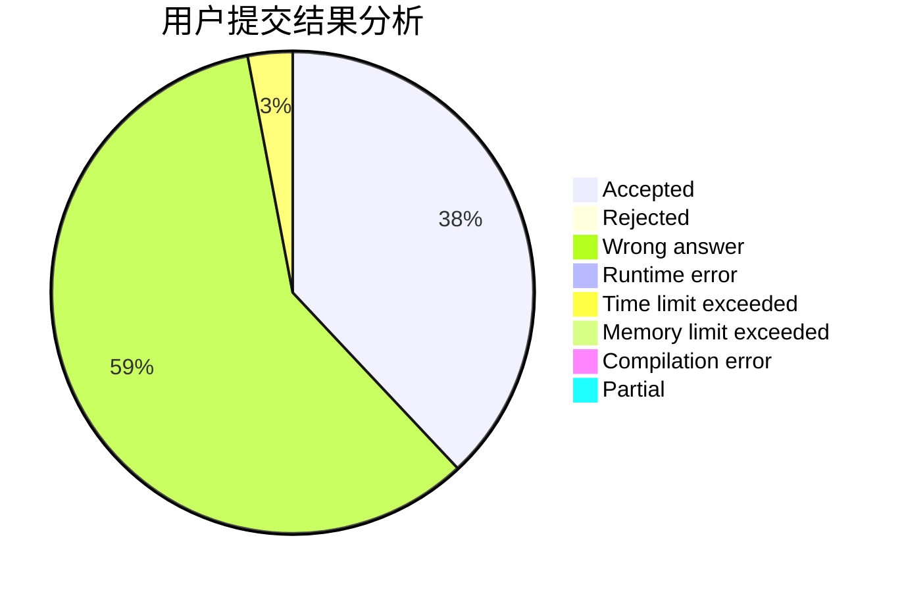
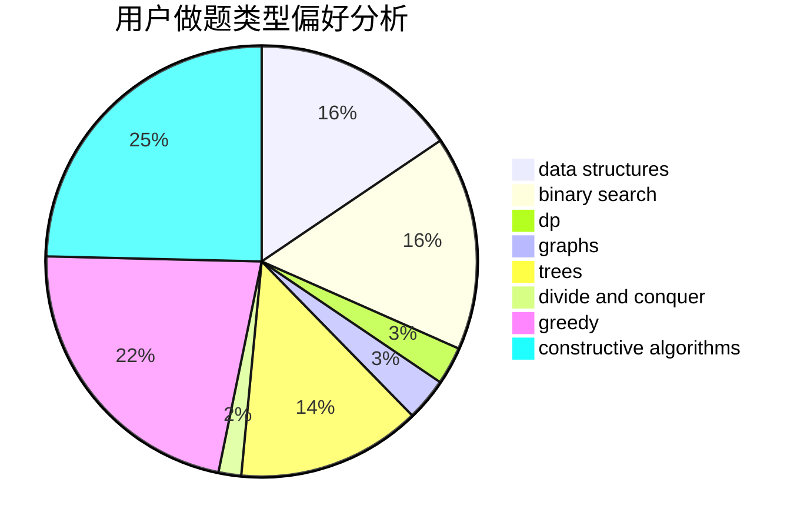
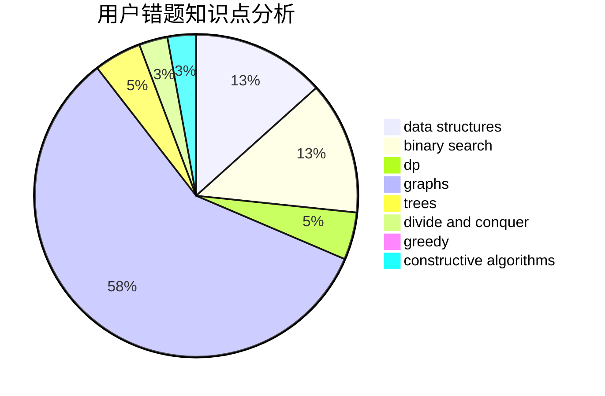

# cqyzzzx

<!-- tabs:start -->

#### **用户提交结果分析**

#### **用户做题类型偏好分析**

#### **用户错题知识点分析**

<!-- tabs:end -->
# 推荐题目
[1349E](https://codeforces.com/contest/1349/problem/E)		constructive algorithms,
                        dp,
                        greedy		  
[1241B](https://codeforces.com/contest/1241/problem/B)		dsu,graphs,sortings,trees		  
[1391D](https://codeforces.com/contest/1391/problem/D)		bitmasks,
                        brute force,
                        constructive algorithms,
                        dp,
                        greedy,
                        implementation		  
[833B](https://codeforces.com/contest/833/problem/B)		binary search,
                        data structures,
                        divide and conquer,
                        dp,
                        two pointers		  
[780H](https://codeforces.com/contest/780/problem/H)		binary search,
                        geometry,
                        implementation,
                        two pointers		  
[231B](https://codeforces.com/contest/231/problem/B)		constructive algorithms,
                        greedy		  
[77B](https://codeforces.com/contest/77/problem/B)		math,
                        probabilities		  
[1096A](https://codeforces.com/contest/1096/problem/A)		greedy,
                        implementation,
                        math		  
[59E](https://codeforces.com/contest/59/problem/E)		graphs,
                        shortest paths		  
[803E](https://codeforces.com/contest/803/problem/E)		dp,
                        graphs		  
