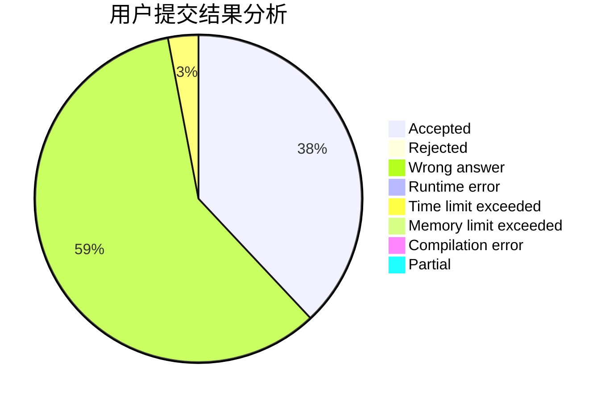
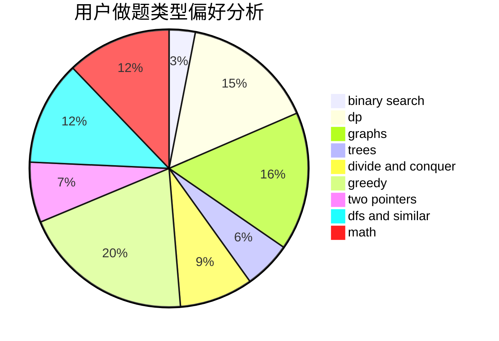

# cqyzzzx

<!-- tabs:start -->

#### **用户提交结果分析**

#### **用户做题类型偏好分析**

<!-- tabs:end -->
# 推荐题目
[13563](https://codeforces.com/contest/1356/problem/3)
[1246F](https://codeforces.com/contest/1246/problem/F)
[13A](https://codeforces.com/contest/13/problem/A)
[851B](https://codeforces.com/contest/851/problem/B)
[79D](https://codeforces.com/contest/79/problem/D)
[252A](https://codeforces.com/contest/252/problem/A)
[798B](https://codeforces.com/contest/798/problem/B)
[1096D](https://codeforces.com/contest/1096/problem/D)
[618D](https://codeforces.com/contest/618/problem/D)
[819D](https://codeforces.com/contest/819/problem/D)
