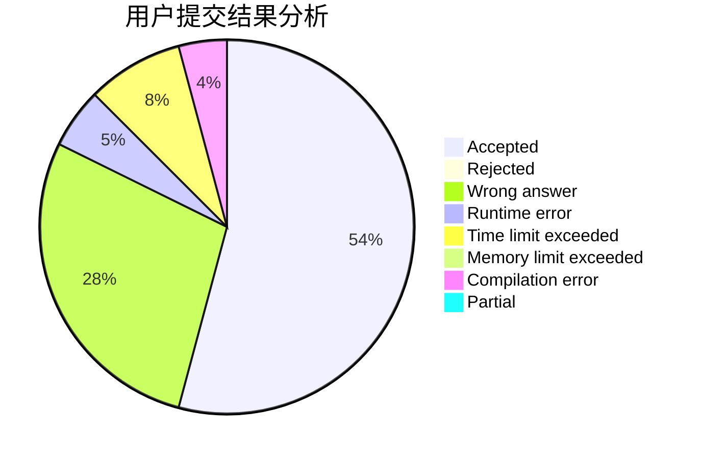
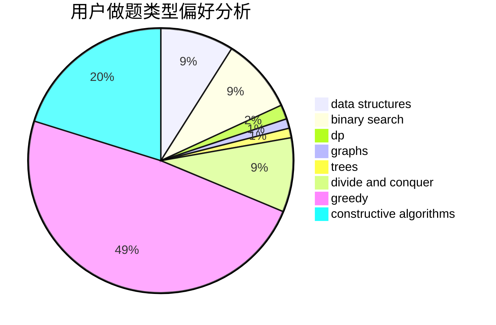
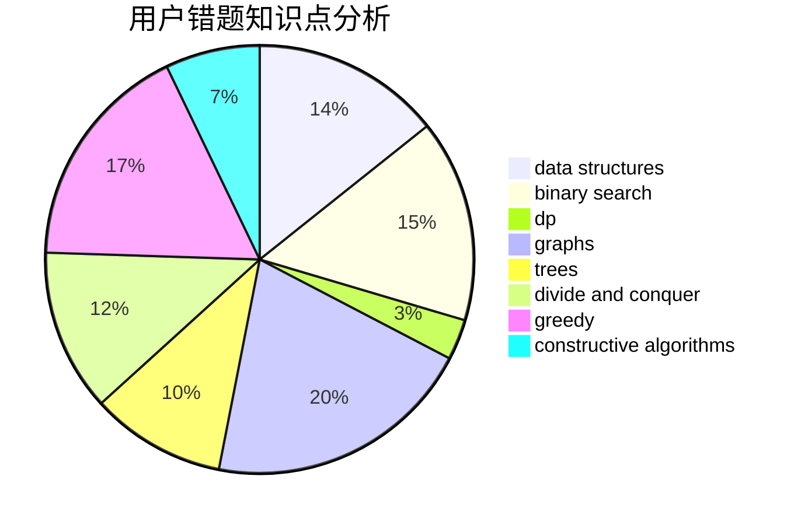

# AquaMoon

<!-- tabs:start -->

#### **用户提交结果分析**

#### **用户做题类型偏好分析**

#### **用户错题知识点分析**

<!-- tabs:end -->
# 推荐题目
[1416F](https://codeforces.com/contest/1416/problem/F)		flows,
                        graph matchings,
                        greedy,
                        implementation		  
[377E](https://codeforces.com/contest/377/problem/E)		dp,
                        geometry		  
[377A](https://codeforces.com/contest/377/problem/A)		dfs and similar		  
[1270G](https://codeforces.com/contest/1270/problem/G)		constructive algorithms,
                        dfs and similar,
                        graphs,
                        math		  
[1099D](https://codeforces.com/contest/1099/problem/D)		dsu,graphs,sortings,trees		  
[311D](https://codeforces.com/contest/311/problem/D)		data structures,
                        math		  
[377C](https://codeforces.com/contest/377/problem/C)		bitmasks,
                        dp,
                        games		  
[266A](https://codeforces.com/contest/266/problem/A)		implementation		  
[376B](https://codeforces.com/contest/376/problem/B)		implementation		  
[160C](https://codeforces.com/contest/160/problem/C)		implementation,
                        math,
                        sortings		  
