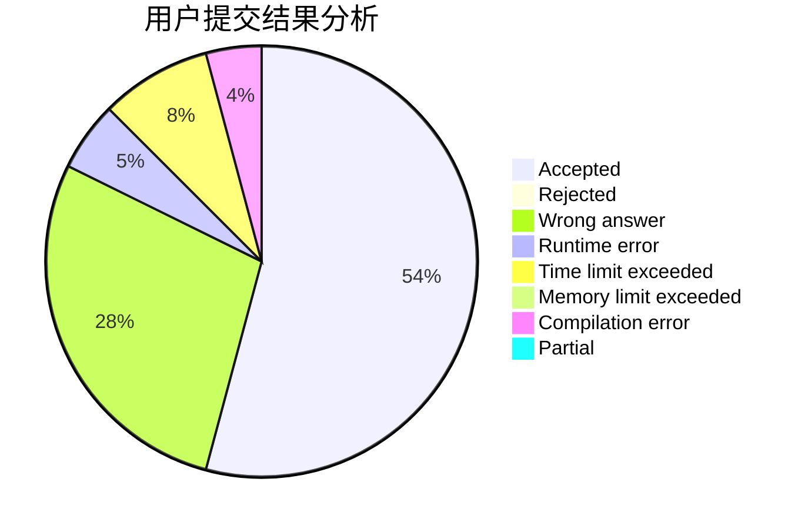
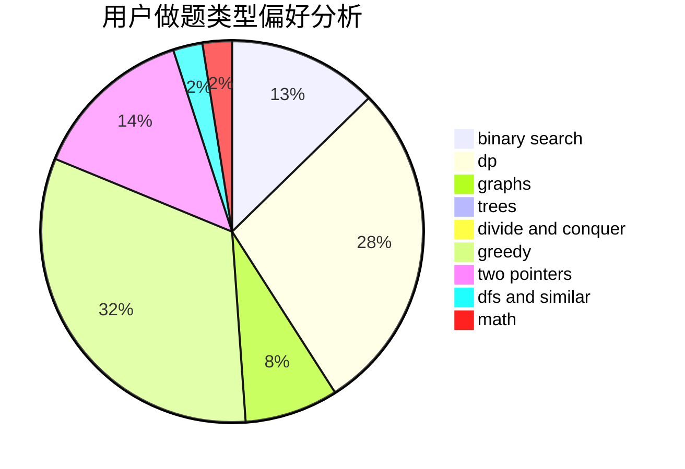

# AquaMoon

<!-- tabs:start -->

#### **用户提交结果分析**

#### **用户做题类型偏好分析**

<!-- tabs:end -->
# 推荐题目
[1424G](https://codeforces.com/contest/1424/problem/G)
[407B](https://codeforces.com/contest/407/problem/B)
[405B](https://codeforces.com/contest/405/problem/B)
[127A](https://codeforces.com/contest/127/problem/A)
[109A](https://codeforces.com/contest/109/problem/A)
[335A](https://codeforces.com/contest/335/problem/A)
[405D](https://codeforces.com/contest/405/problem/D)
[281D](https://codeforces.com/contest/281/problem/D)
[405A](https://codeforces.com/contest/405/problem/A)
[185E](https://codeforces.com/contest/185/problem/E)
