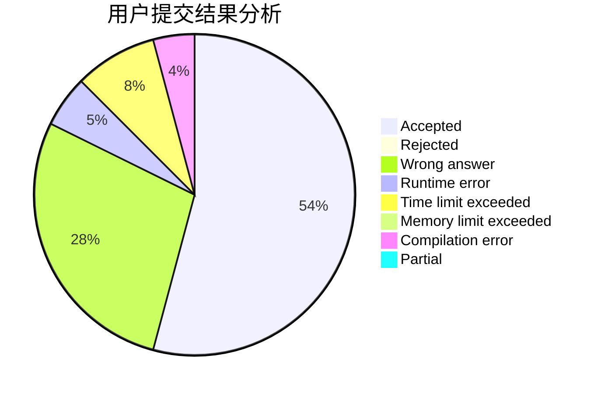
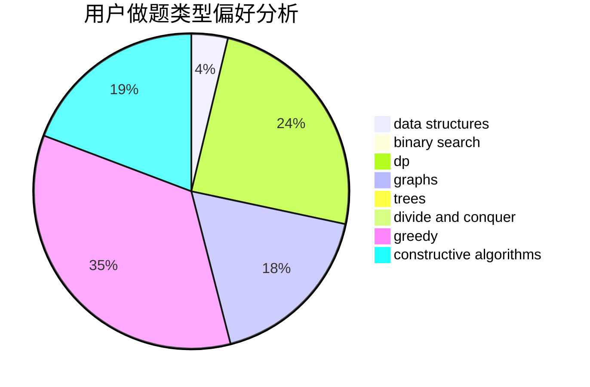
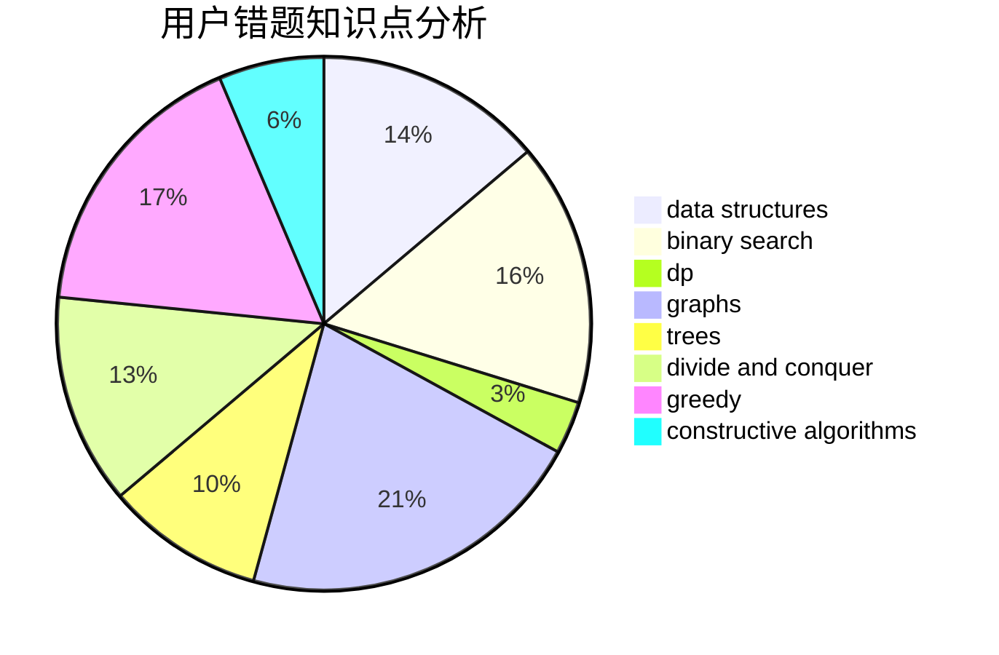

# AquaMoon

<!-- tabs:start -->

#### **用户提交结果分析**

#### **用户做题类型偏好分析**

#### **用户错题知识点分析**

<!-- tabs:end -->
# 推荐题目
[1424G](https://codeforces.com/contest/1424/problem/G)		data structures,
                        sortings		  
[407B](https://codeforces.com/contest/407/problem/B)		dp,
                        implementation		  
[405B](https://codeforces.com/contest/405/problem/B)		nan		  
[127A](https://codeforces.com/contest/127/problem/A)		geometry		  
[109A](https://codeforces.com/contest/109/problem/A)		brute force,
                        implementation		  
[335A](https://codeforces.com/contest/335/problem/A)		binary search,
                        constructive algorithms,
                        greedy		  
[405D](https://codeforces.com/contest/405/problem/D)		greedy,
                        implementation,
                        math		  
[281D](https://codeforces.com/contest/281/problem/D)		dsu,graphs,sortings,trees		  
[405A](https://codeforces.com/contest/405/problem/A)		greedy,
                        implementation,
                        sortings		  
[185E](https://codeforces.com/contest/185/problem/E)		binary search,
                        data structures		  
