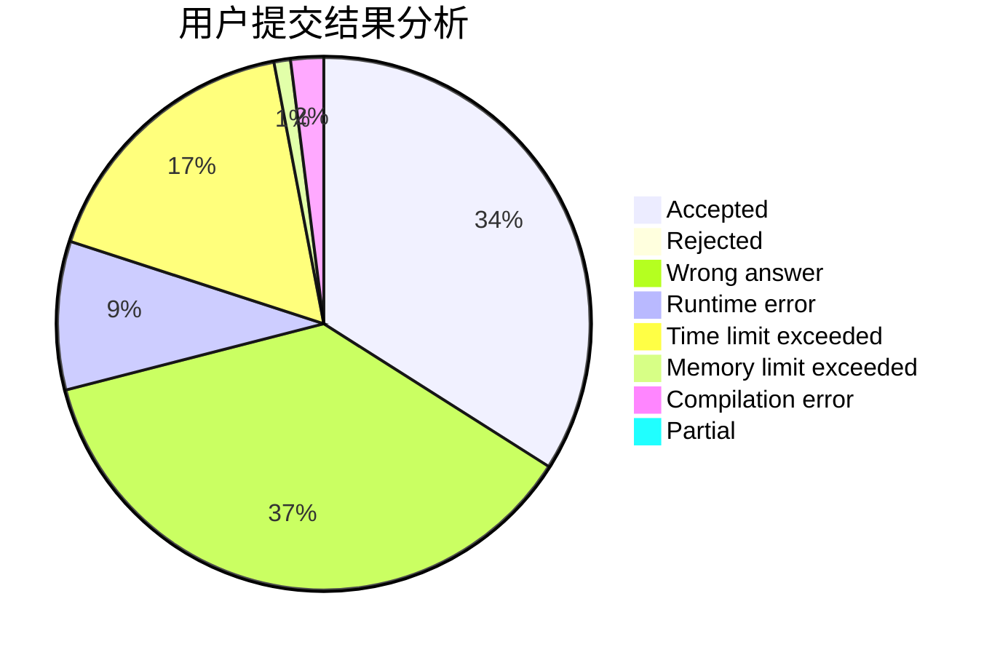
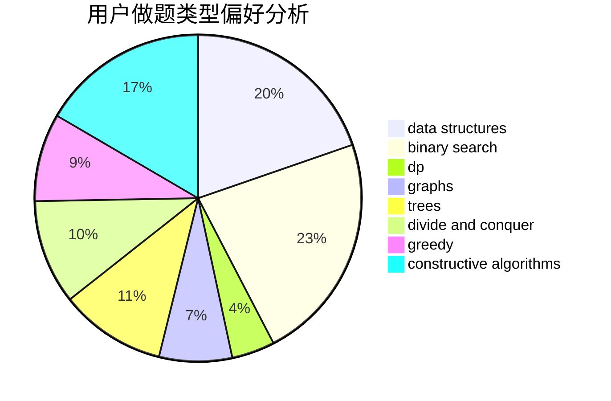
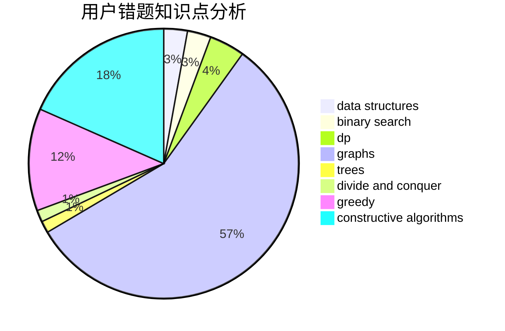

# crashed

<!-- tabs:start -->

#### **用户提交结果分析**

#### **用户做题类型偏好分析**

#### **用户错题知识点分析**

<!-- tabs:end -->
# 推荐题目
[1301D](https://codeforces.com/contest/1301/problem/D)		constructive algorithms,
                        graphs,
                        implementation		  
[465D](https://codeforces.com/contest/465/problem/D)		dsu,graphs,sortings,trees		  
[1070A](https://codeforces.com/contest/1070/problem/A)		dp,
                        graphs,
                        number theory,
                        shortest paths		  
[3C](https://codeforces.com/contest/3/problem/C)		brute force,
                        games,
                        implementation		  
[492E](https://codeforces.com/contest/492/problem/E)		math		  
[343B](https://codeforces.com/contest/343/problem/B)		data structures,
                        greedy,
                        implementation		  
[1148H](https://codeforces.com/contest/1148/problem/H)		data structures		  
[1095C](https://codeforces.com/contest/1095/problem/C)		bitmasks,
                        greedy		  
[825B](https://codeforces.com/contest/825/problem/B)		brute force,
                        implementation		  
[852I](https://codeforces.com/contest/852/problem/I)		brute force,
                        dfs and similar,
                        graphs,
                        trees		  
