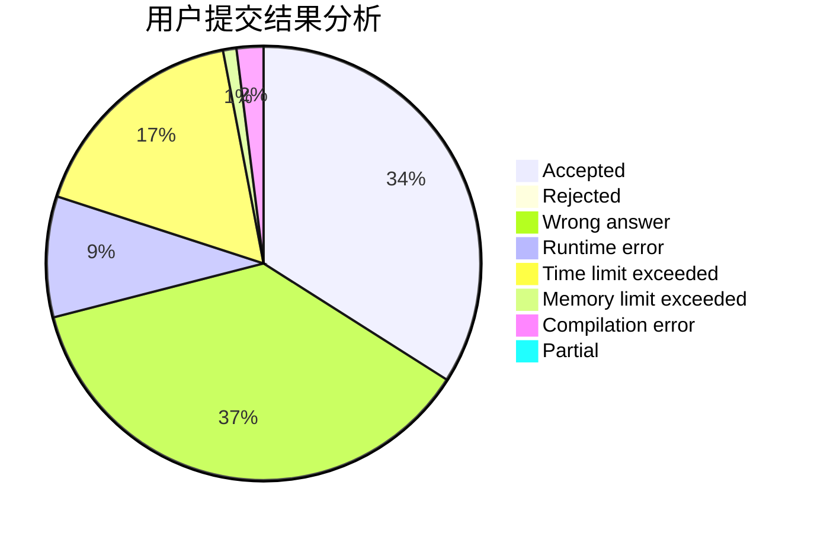
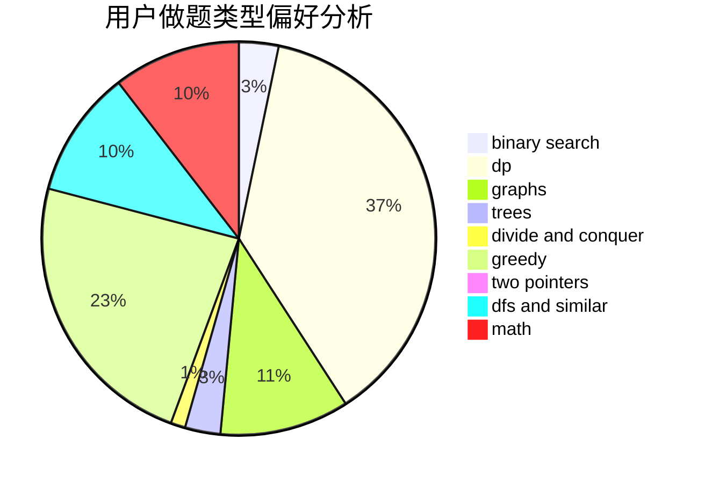

# crashed

<!-- tabs:start -->

#### **用户提交结果分析**

#### **用户做题类型偏好分析**

<!-- tabs:end -->
# 推荐题目
[1311A](https://codeforces.com/contest/1311/problem/A)
[484E](https://codeforces.com/contest/484/problem/E)
[1070D](https://codeforces.com/contest/1070/problem/D)
[429D](https://codeforces.com/contest/429/problem/D)
[5132](https://codeforces.com/contest/513/problem/2)
[36C](https://codeforces.com/contest/36/problem/C)
[1150C](https://codeforces.com/contest/1150/problem/C)
[1095F](https://codeforces.com/contest/1095/problem/F)
[843B](https://codeforces.com/contest/843/problem/B)
[871A](https://codeforces.com/contest/871/problem/A)
