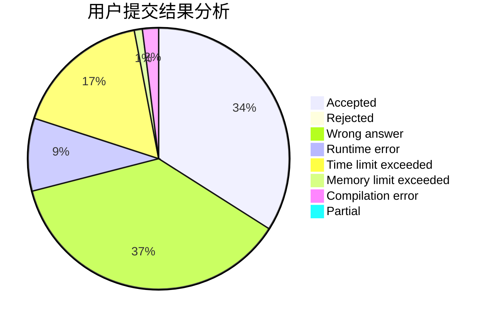
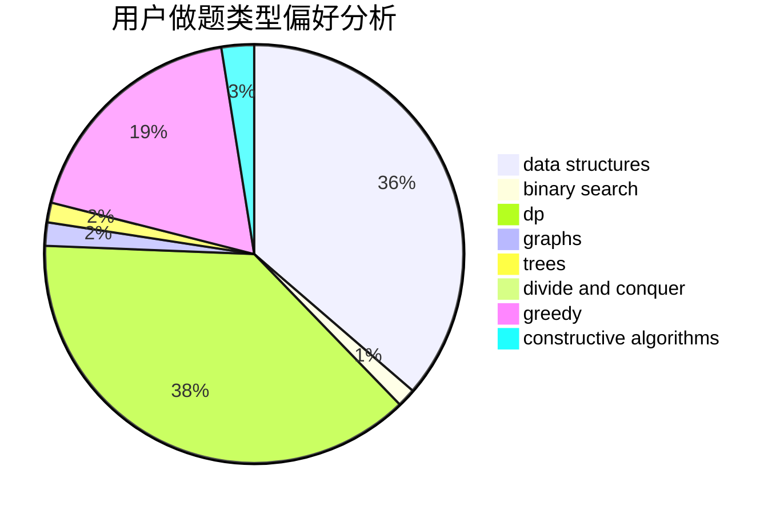
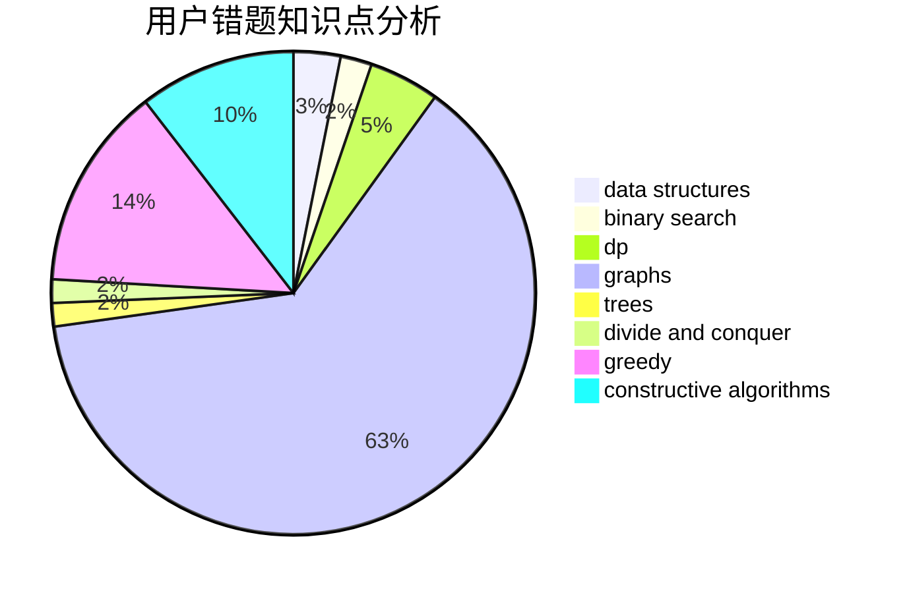

# crashed

<!-- tabs:start -->

#### **用户提交结果分析**

#### **用户做题类型偏好分析**

#### **用户错题知识点分析**

<!-- tabs:end -->
# 推荐题目
[1311A](https://codeforces.com/contest/1311/problem/A)		greedy,
                        implementation,
                        math		  
[484E](https://codeforces.com/contest/484/problem/E)		binary search,
                        constructive algorithms,
                        data structures		  
[1070D](https://codeforces.com/contest/1070/problem/D)		greedy		  
[429D](https://codeforces.com/contest/429/problem/D)		data structures,
                        divide and conquer,
                        geometry		  
[5132](https://codeforces.com/contest/513/problem/2)		dsu,graphs,sortings,trees		  
[36C](https://codeforces.com/contest/36/problem/C)		geometry,
                        implementation		  
[1150C](https://codeforces.com/contest/1150/problem/C)		dsu,graphs,sortings,trees		  
[1095F](https://codeforces.com/contest/1095/problem/F)		dsu,
                        graphs,
                        greedy		  
[843B](https://codeforces.com/contest/843/problem/B)		brute force,
                        interactive,
                        probabilities		  
[871A](https://codeforces.com/contest/871/problem/A)		dsu,graphs,sortings,trees		  
