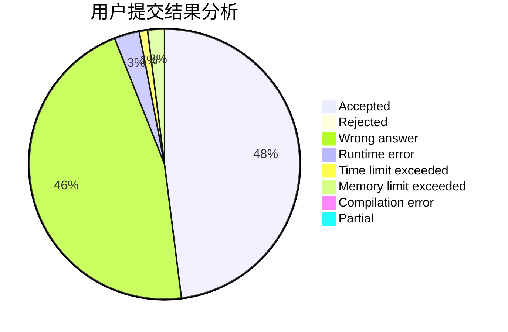
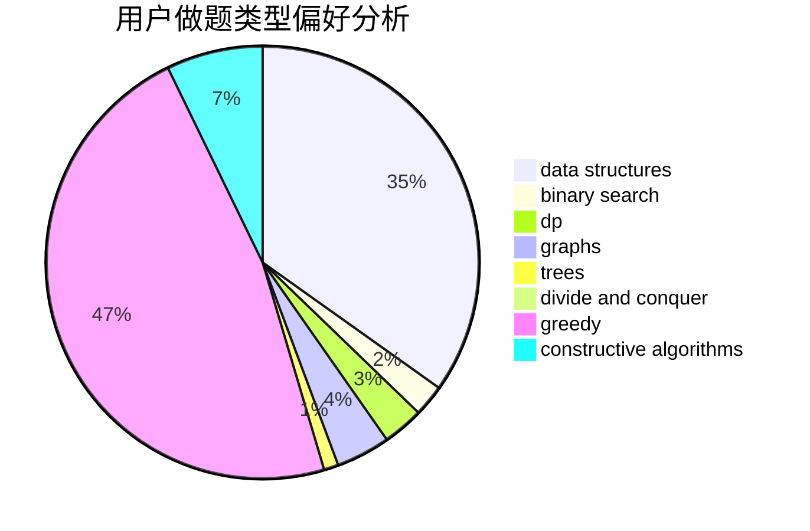
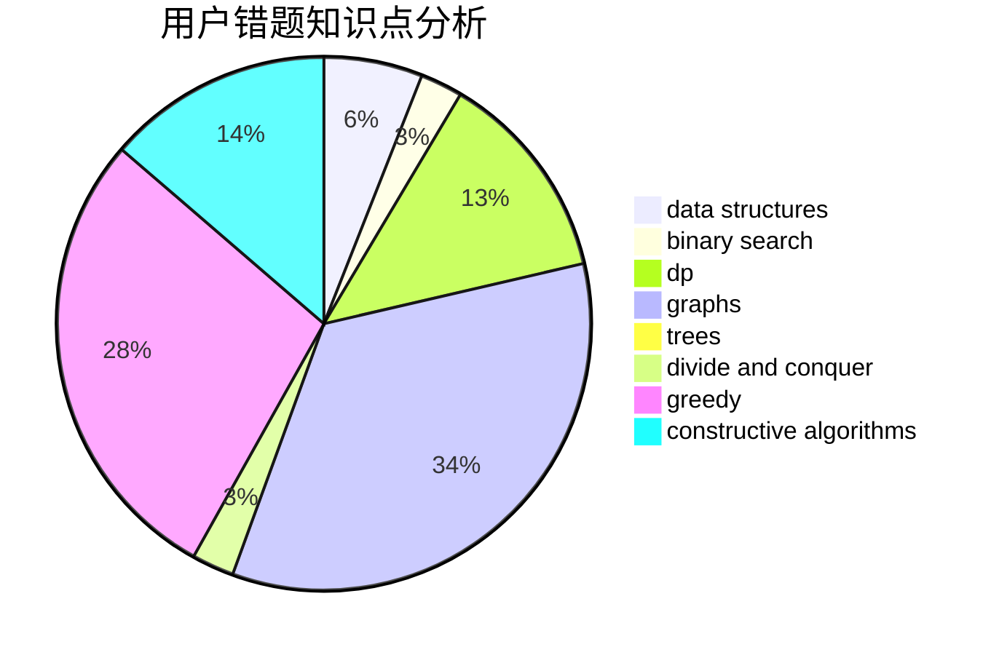

# crawarb

<!-- tabs:start -->

#### **用户提交结果分析**

#### **用户做题类型偏好分析**

#### **用户错题知识点分析**

<!-- tabs:end -->
# 推荐题目
[1331D](https://codeforces.com/contest/1331/problem/D)		implementation		  
[1467C](https://codeforces.com/contest/1467/problem/C)		constructive algorithms,
                        greedy		  
[730A](https://codeforces.com/contest/730/problem/A)		greedy,
                        implementation		  
[424E](https://codeforces.com/contest/424/problem/E)		dfs and similar,
                        dp,
                        probabilities		  
[343E](https://codeforces.com/contest/343/problem/E)		brute force,
                        dfs and similar,
                        divide and conquer,
                        flows,
                        graphs,
                        greedy,
                        trees		  
[811D](https://codeforces.com/contest/811/problem/D)		constructive algorithms,
                        dfs and similar,
                        graphs,
                        interactive		  
[301D](https://codeforces.com/contest/301/problem/D)		data structures		  
[232B](https://codeforces.com/contest/232/problem/B)		bitmasks,
                        combinatorics,
                        dp,
                        math		  
[1290E](https://codeforces.com/contest/1290/problem/E)		data structures		  
[778A](https://codeforces.com/contest/778/problem/A)		binary search,
                        greedy,
                        strings		  
