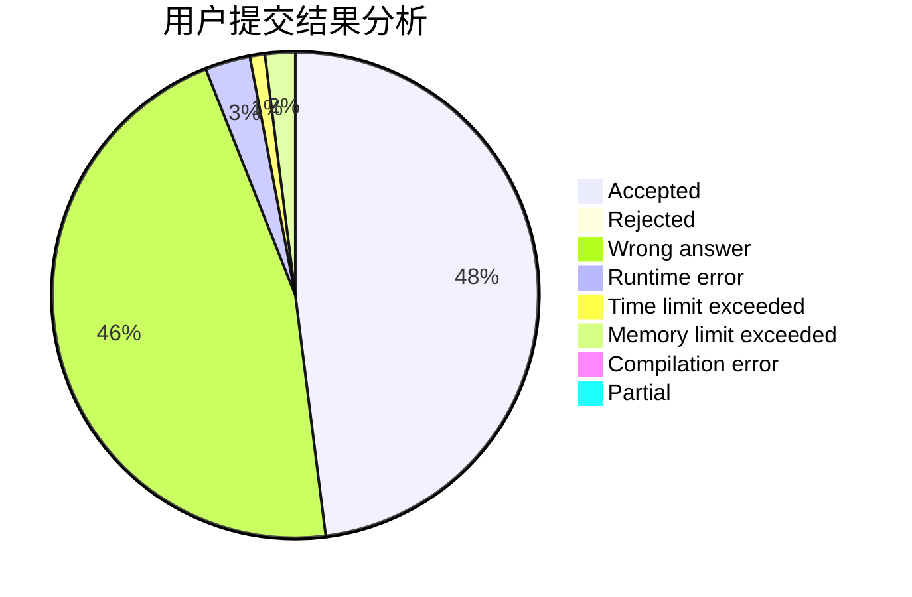
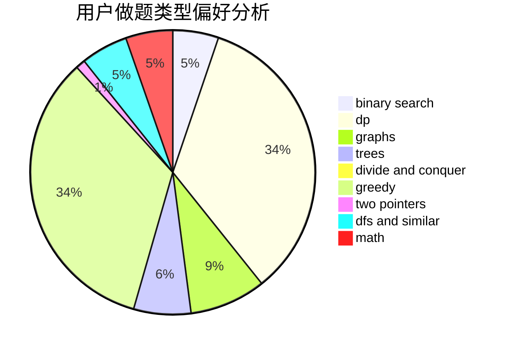

# crawarb

<!-- tabs:start -->

#### **用户提交结果分析**

#### **用户做题类型偏好分析**

<!-- tabs:end -->
# 推荐题目
[1337C](https://codeforces.com/contest/1337/problem/C)
[1474E](https://codeforces.com/contest/1474/problem/E)
[746G](https://codeforces.com/contest/746/problem/G)
[448B](https://codeforces.com/contest/448/problem/B)
[370A](https://codeforces.com/contest/370/problem/A)
[830B](https://codeforces.com/contest/830/problem/B)
[320B](https://codeforces.com/contest/320/problem/B)
[254A](https://codeforces.com/contest/254/problem/A)
[1297B](https://codeforces.com/contest/1297/problem/B)
[796C](https://codeforces.com/contest/796/problem/C)
