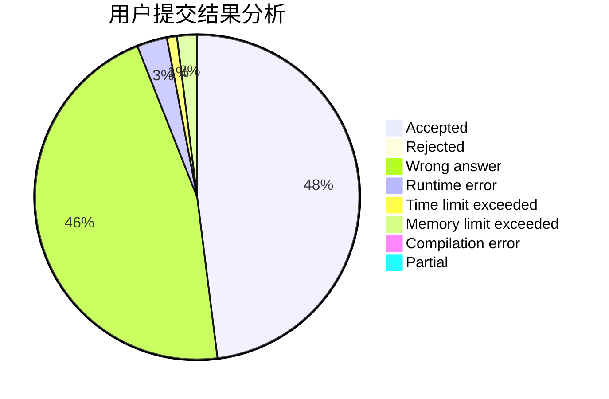
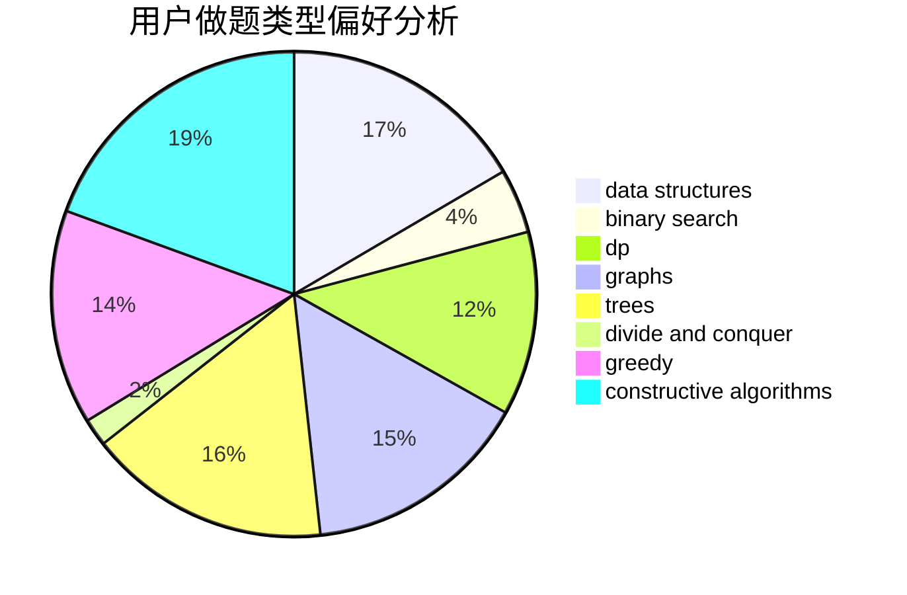

# crawarb

<!-- tabs:start -->

#### **用户提交结果分析**

#### **用户做题类型偏好分析**

#### **用户错题知识点分析**

<!-- tabs:end -->
# 推荐题目
[1337C](https://codeforces.com/contest/1337/problem/C)		dsu,graphs,sortings,trees		  
[1474E](https://codeforces.com/contest/1474/problem/E)		constructive algorithms,
                        greedy		  
[746G](https://codeforces.com/contest/746/problem/G)		constructive algorithms,
                        graphs,
                        trees		  
[448B](https://codeforces.com/contest/448/problem/B)		implementation,
                        strings		  
[370A](https://codeforces.com/contest/370/problem/A)		graphs,
                        math,
                        shortest paths		  
[830B](https://codeforces.com/contest/830/problem/B)		data structures,
                        implementation,
                        sortings		  
[320B](https://codeforces.com/contest/320/problem/B)		dfs and similar,
                        graphs		  
[254A](https://codeforces.com/contest/254/problem/A)		constructive algorithms,
                        sortings		  
[1297B](https://codeforces.com/contest/1297/problem/B)		*special problem,
                        implementation,
                        sortings		  
[796C](https://codeforces.com/contest/796/problem/C)		constructive algorithms,
                        data structures,
                        dp,
                        trees		  
