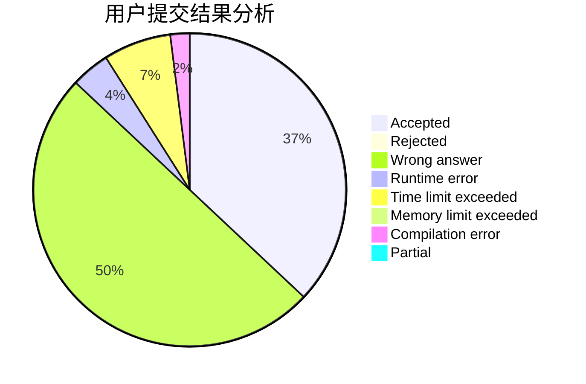
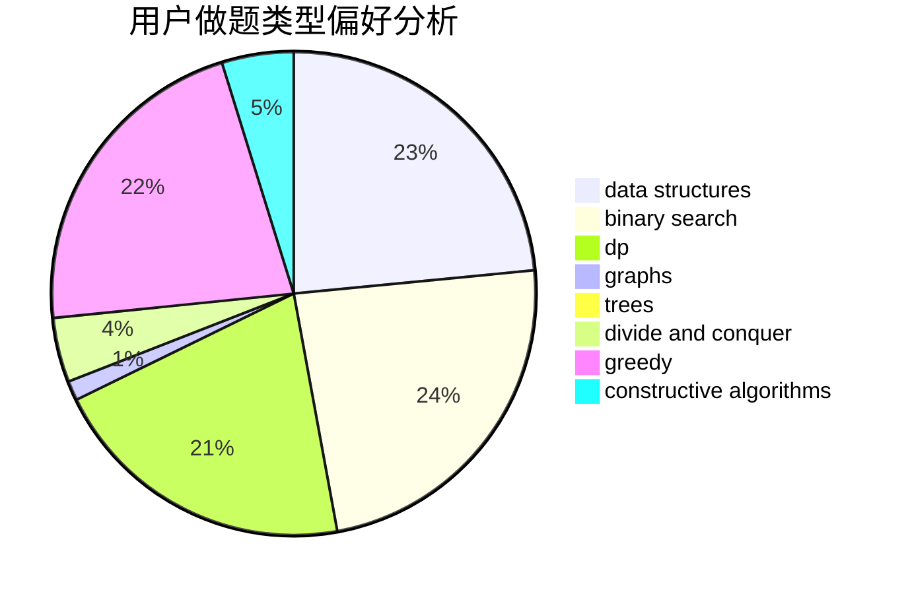
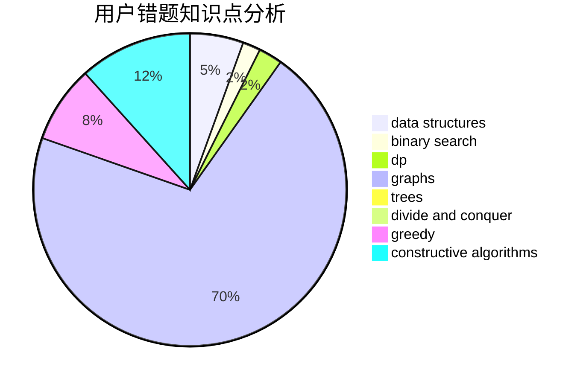

# crazyX_CN

<!-- tabs:start -->

#### **用户提交结果分析**

#### **用户做题类型偏好分析**

#### **用户错题知识点分析**

<!-- tabs:end -->
# 推荐题目
[940A](https://codeforces.com/contest/940/problem/A)		brute force,
                        greedy,
                        sortings		  
[1065B](https://codeforces.com/contest/1065/problem/B)		constructive algorithms,
                        graphs		  
[1119B](https://codeforces.com/contest/1119/problem/B)		binary search,
                        flows,
                        greedy,
                        sortings		  
[1370B](https://codeforces.com/contest/1370/problem/B)		constructive algorithms,
                        math,
                        number theory		  
[1168C](https://codeforces.com/contest/1168/problem/C)		bitmasks,
                        dp		  
[682A](https://codeforces.com/contest/682/problem/A)		constructive algorithms,
                        math,
                        number theory		  
[1062C](https://codeforces.com/contest/1062/problem/C)		greedy,
                        implementation,
                        math		  
[1236E](https://codeforces.com/contest/1236/problem/E)		binary search,
                        data structures,
                        dp,
                        dsu		  
[2B](https://codeforces.com/contest/2/problem/B)		dp,
                        math		  
[590D](https://codeforces.com/contest/590/problem/D)		dp		  
