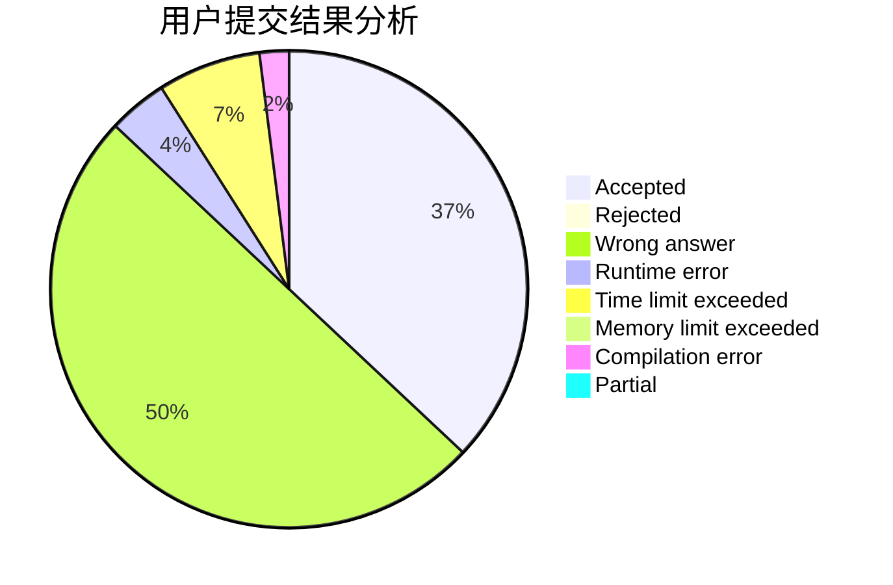
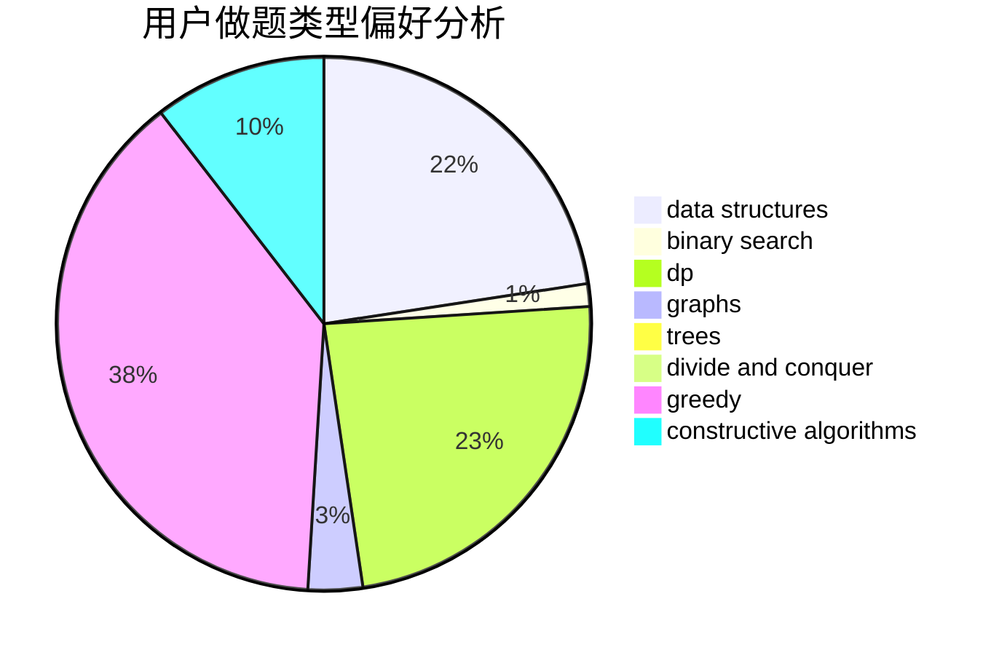
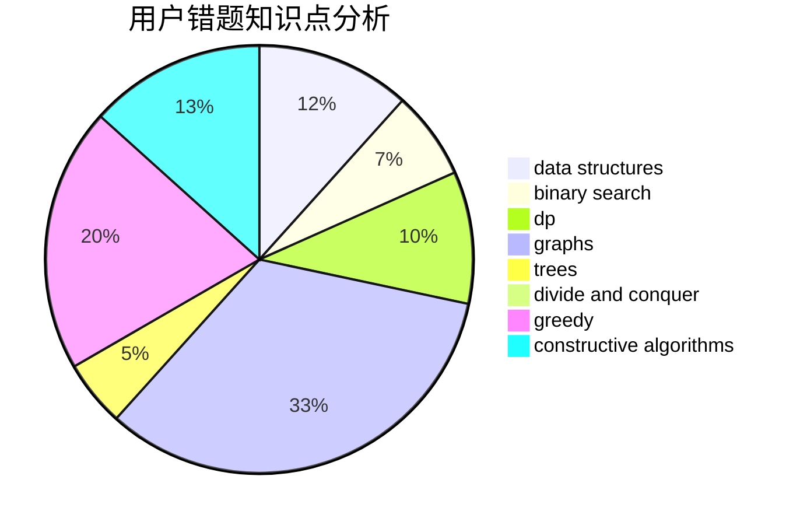

# crazyX_CN

<!-- tabs:start -->

#### **用户提交结果分析**

#### **用户做题类型偏好分析**

#### **用户错题知识点分析**

<!-- tabs:end -->
# 推荐题目
[961E](https://codeforces.com/contest/961/problem/E)		data structures		  
[1065F](https://codeforces.com/contest/1065/problem/F)		dfs and similar,
                        dp,
                        trees		  
[1121B](https://codeforces.com/contest/1121/problem/B)		brute force,
                        implementation		  
[13791](https://codeforces.com/contest/1379/problem/1)		dsu,graphs,sortings,trees		  
[11732](https://codeforces.com/contest/1173/problem/2)		dsu,graphs,sortings,trees		  
[706A](https://codeforces.com/contest/706/problem/A)		brute force,
                        geometry,
                        implementation		  
[1062F](https://codeforces.com/contest/1062/problem/F)		dfs and similar,
                        graphs		  
[1241B](https://codeforces.com/contest/1241/problem/B)		dsu,graphs,sortings,trees		  
[318A](https://codeforces.com/contest/318/problem/A)		math		  
[610B](https://codeforces.com/contest/610/problem/B)		constructive algorithms,
                        implementation		  
