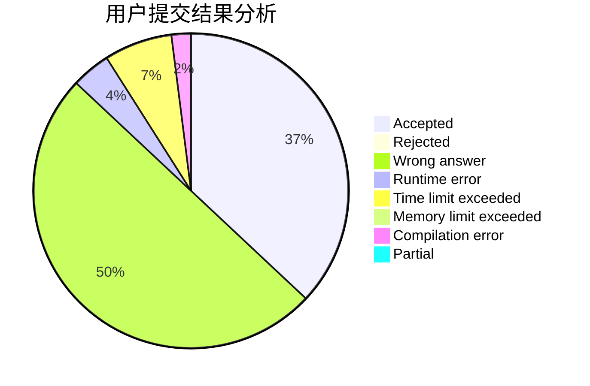
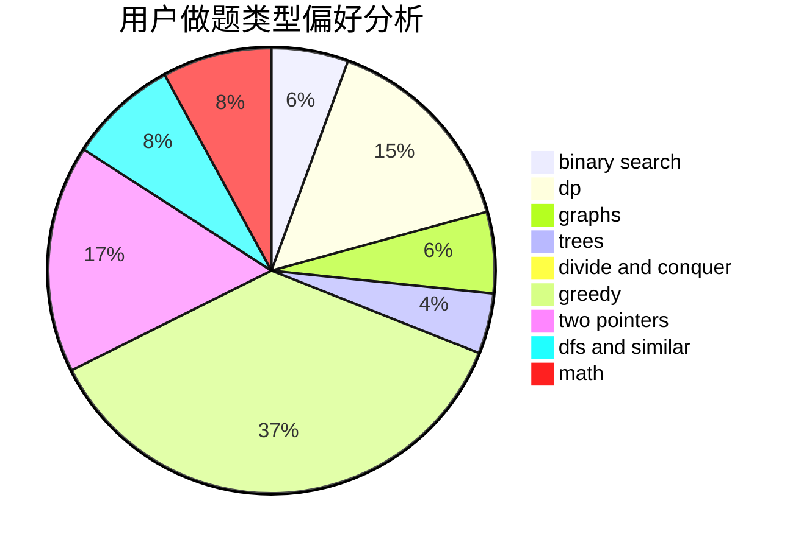

# crazyX_CN

<!-- tabs:start -->

#### **用户提交结果分析**

#### **用户做题类型偏好分析**

<!-- tabs:end -->
# 推荐题目
[961E](https://codeforces.com/contest/961/problem/E)
[1065F](https://codeforces.com/contest/1065/problem/F)
[1121B](https://codeforces.com/contest/1121/problem/B)
[13791](https://codeforces.com/contest/1379/problem/1)
[11732](https://codeforces.com/contest/1173/problem/2)
[706A](https://codeforces.com/contest/706/problem/A)
[1062F](https://codeforces.com/contest/1062/problem/F)
[1241B](https://codeforces.com/contest/1241/problem/B)
[318A](https://codeforces.com/contest/318/problem/A)
[610B](https://codeforces.com/contest/610/problem/B)
