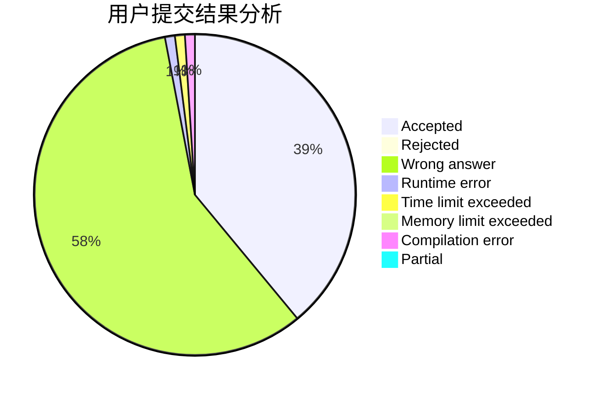
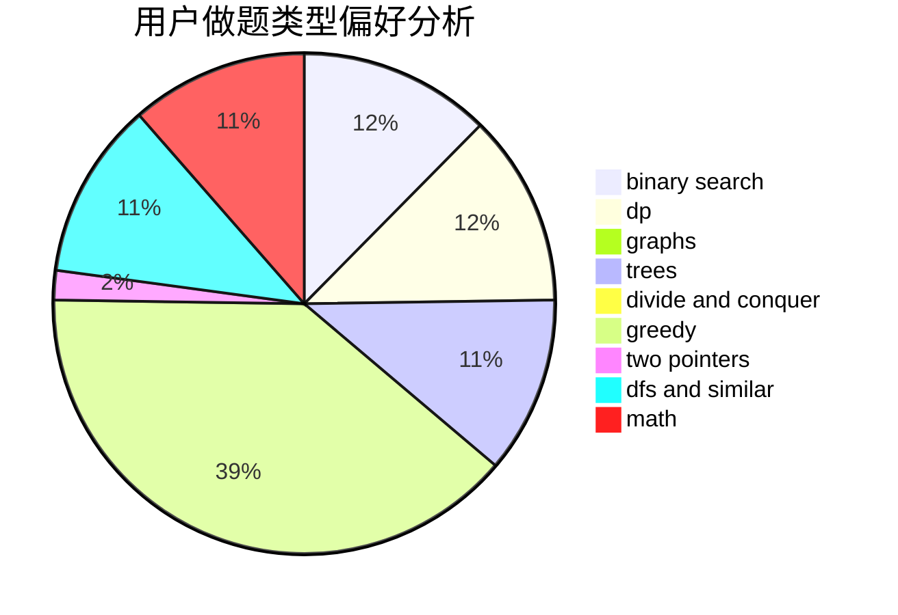

# crazy_fz

<!-- tabs:start -->

#### **用户提交结果分析**

#### **用户做题类型偏好分析**

<!-- tabs:end -->
# 推荐题目
[628C](https://codeforces.com/contest/628/problem/C)
[26B](https://codeforces.com/contest/26/problem/B)
[180E](https://codeforces.com/contest/180/problem/E)
[1395E](https://codeforces.com/contest/1395/problem/E)
[749A](https://codeforces.com/contest/749/problem/A)
[1325B](https://codeforces.com/contest/1325/problem/B)
[1133D](https://codeforces.com/contest/1133/problem/D)
[1290E](https://codeforces.com/contest/1290/problem/E)
[831D](https://codeforces.com/contest/831/problem/D)
[1023B](https://codeforces.com/contest/1023/problem/B)
