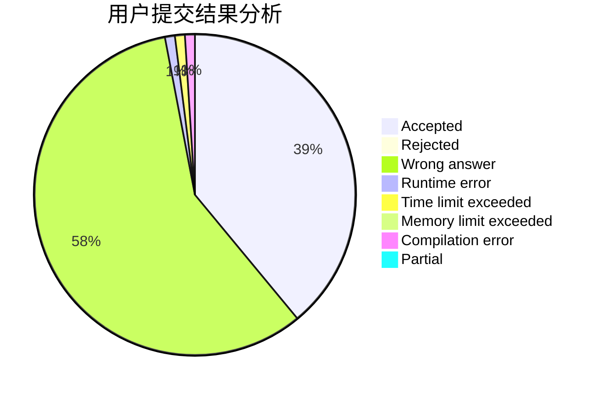
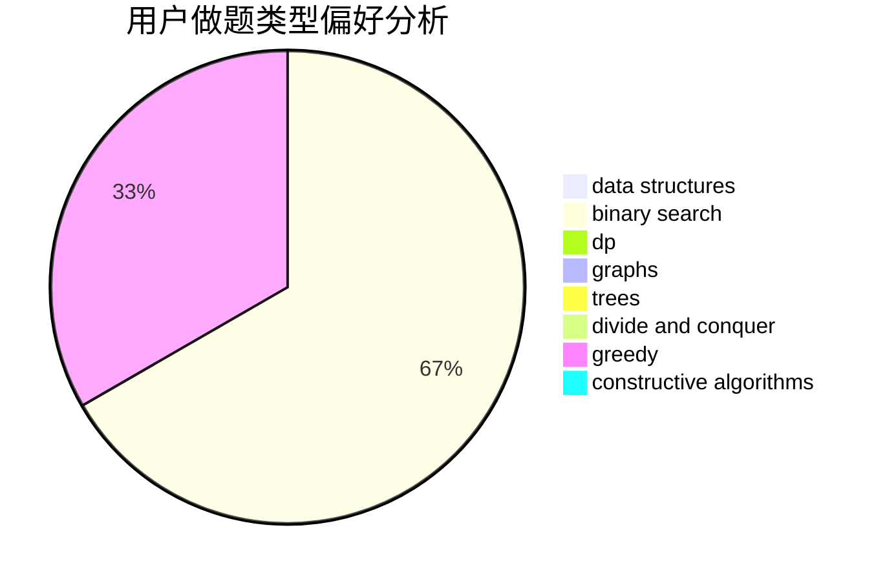

# crazy_fz

<!-- tabs:start -->

#### **用户提交结果分析**

#### **用户做题类型偏好分析**

#### **用户错题知识点分析**

<!-- tabs:end -->
# 推荐题目
[609C](https://codeforces.com/contest/609/problem/C)		implementation,
                        math		  
[252A](https://codeforces.com/contest/252/problem/A)		brute force,
                        implementation		  
[158E](https://codeforces.com/contest/158/problem/E)		*special problem,
                        dp,
                        sortings		  
[1385E](https://codeforces.com/contest/1385/problem/E)		constructive algorithms,
                        dfs and similar,
                        graphs		  
[730J](https://codeforces.com/contest/730/problem/J)		dp		  
[1315C](https://codeforces.com/contest/1315/problem/C)		greedy		  
[1131G](https://codeforces.com/contest/1131/problem/G)		data structures,
                        dp,
                        two pointers		  
[1283E](https://codeforces.com/contest/1283/problem/E)		dp,
                        greedy		  
[813B](https://codeforces.com/contest/813/problem/B)		brute force,
                        math		  
[1020D](https://codeforces.com/contest/1020/problem/D)		dsu,graphs,sortings,trees		  
