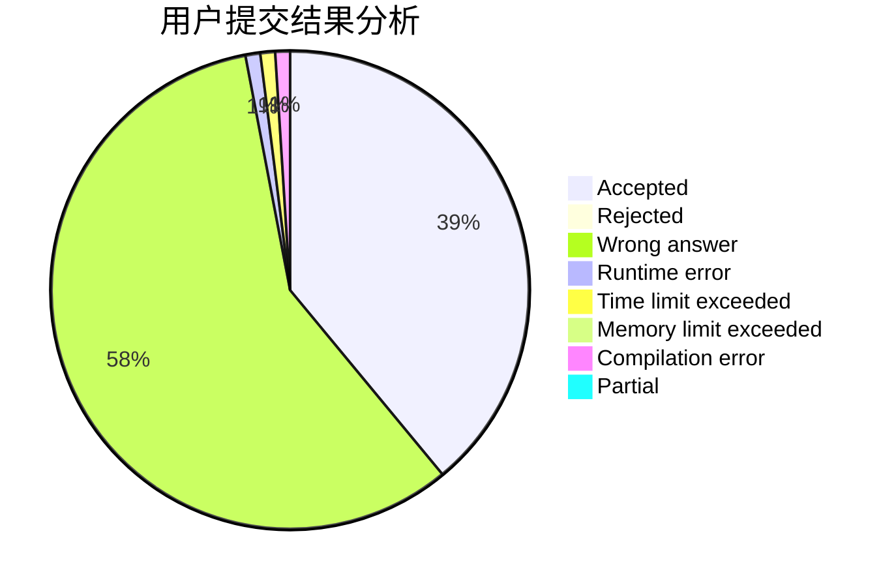
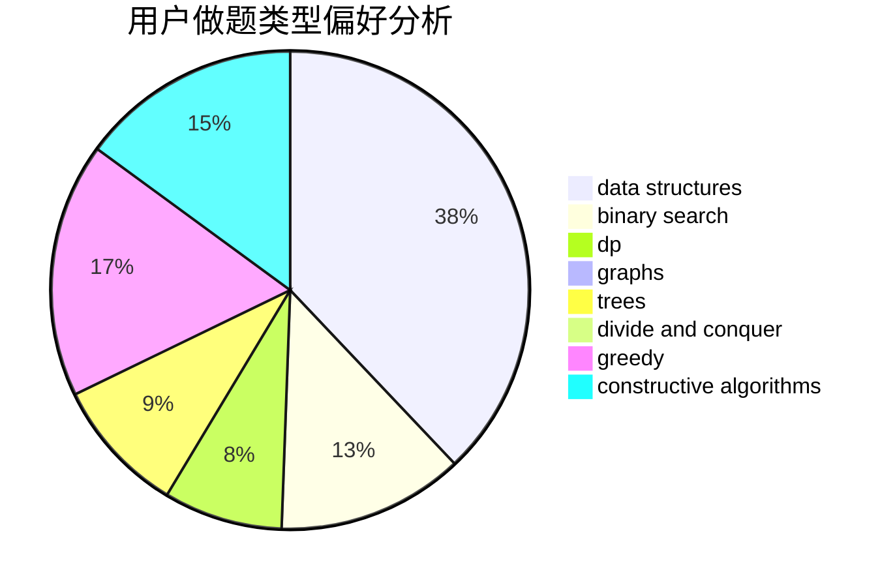

# crazy_fz

<!-- tabs:start -->

#### **用户提交结果分析**

#### **用户做题类型偏好分析**

#### **用户错题知识点分析**

<!-- tabs:end -->
# 推荐题目
[628C](https://codeforces.com/contest/628/problem/C)		greedy,
                        strings		  
[26B](https://codeforces.com/contest/26/problem/B)		greedy		  
[180E](https://codeforces.com/contest/180/problem/E)		binary search,
                        dp,
                        two pointers		  
[1395E](https://codeforces.com/contest/1395/problem/E)		dsu,graphs,sortings,trees		  
[749A](https://codeforces.com/contest/749/problem/A)		greedy,
                        implementation,
                        math,
                        number theory		  
[1325B](https://codeforces.com/contest/1325/problem/B)		greedy,
                        implementation		  
[1133D](https://codeforces.com/contest/1133/problem/D)		hashing,
                        math,
                        number theory		  
[1290E](https://codeforces.com/contest/1290/problem/E)		data structures		  
[831D](https://codeforces.com/contest/831/problem/D)		dsu,graphs,sortings,trees		  
[1023B](https://codeforces.com/contest/1023/problem/B)		math		  
