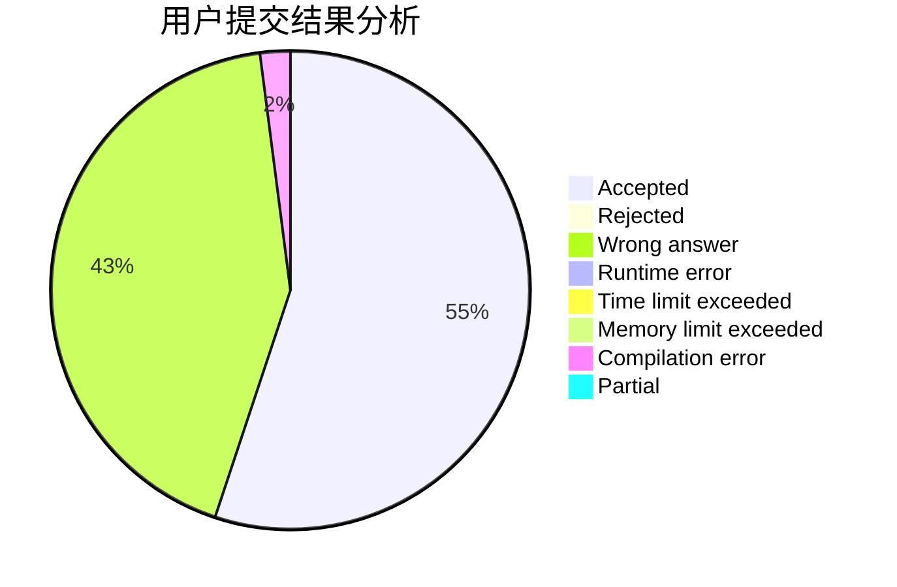
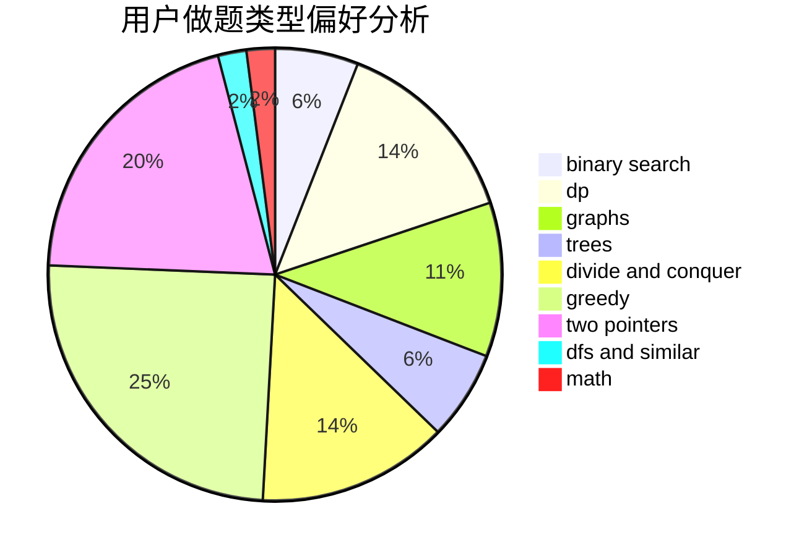

# crp_cpp

<!-- tabs:start -->

#### **用户提交结果分析**

#### **用户做题类型偏好分析**

<!-- tabs:end -->
# 推荐题目
[808A](https://codeforces.com/contest/808/problem/A)
[1366F](https://codeforces.com/contest/1366/problem/F)
[838F](https://codeforces.com/contest/838/problem/F)
[1314F](https://codeforces.com/contest/1314/problem/F)
[1350E](https://codeforces.com/contest/1350/problem/E)
[437A](https://codeforces.com/contest/437/problem/A)
[1310D](https://codeforces.com/contest/1310/problem/D)
[834C](https://codeforces.com/contest/834/problem/C)
[281A](https://codeforces.com/contest/281/problem/A)
[1147B](https://codeforces.com/contest/1147/problem/B)
