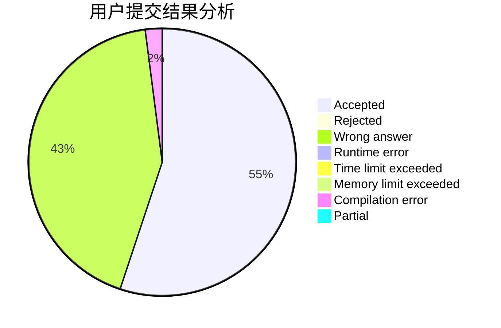
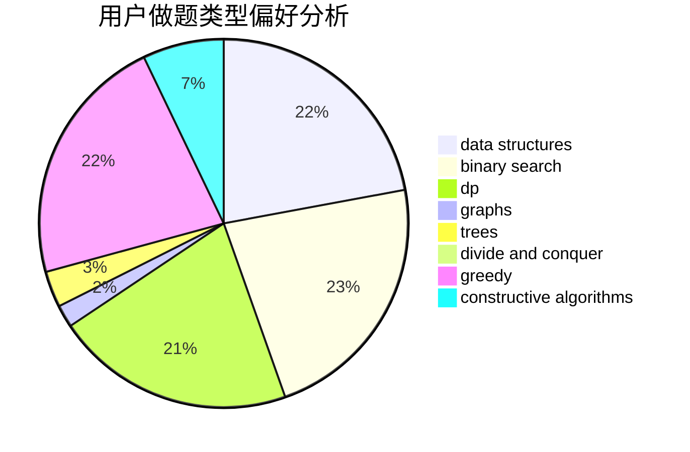
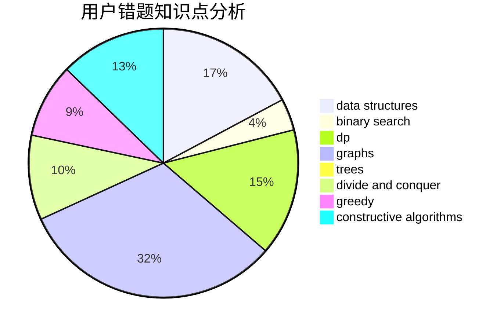

# crp_cpp

<!-- tabs:start -->

#### **用户提交结果分析**

#### **用户做题类型偏好分析**

#### **用户错题知识点分析**

<!-- tabs:end -->
# 推荐题目
[792B](https://codeforces.com/contest/792/problem/B)		implementation		  
[1358D](https://codeforces.com/contest/1358/problem/D)		binary search,
                        brute force,
                        greedy,
                        implementation,
                        two pointers		  
[818G](https://codeforces.com/contest/818/problem/G)		flows,
                        graphs		  
[1305G](https://codeforces.com/contest/1305/problem/G)		bitmasks,
                        brute force,
                        dp,
                        dsu,
                        graphs		  
[1344A](https://codeforces.com/contest/1344/problem/A)		math,
                        number theory,
                        sortings		  
[409G](https://codeforces.com/contest/409/problem/G)		*special problem,
                        geometry		  
[1301A](https://codeforces.com/contest/1301/problem/A)		implementation,
                        strings		  
[815C](https://codeforces.com/contest/815/problem/C)		brute force,
                        dp,
                        trees		  
[265D](https://codeforces.com/contest/265/problem/D)		dsu,graphs,sortings,trees		  
[1145A](https://codeforces.com/contest/1145/problem/A)		implementation		  
