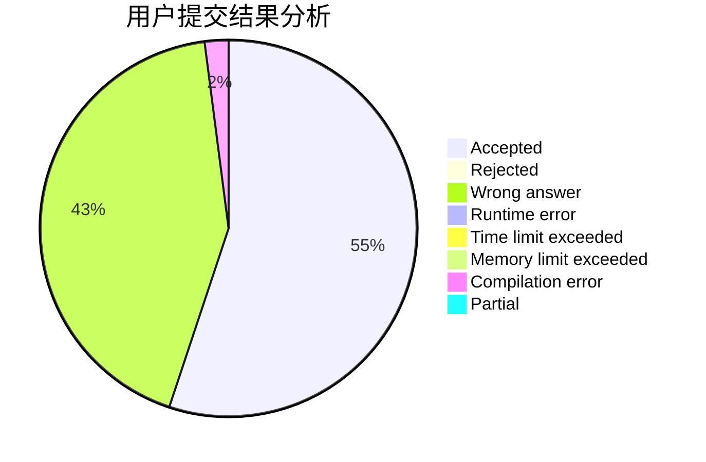
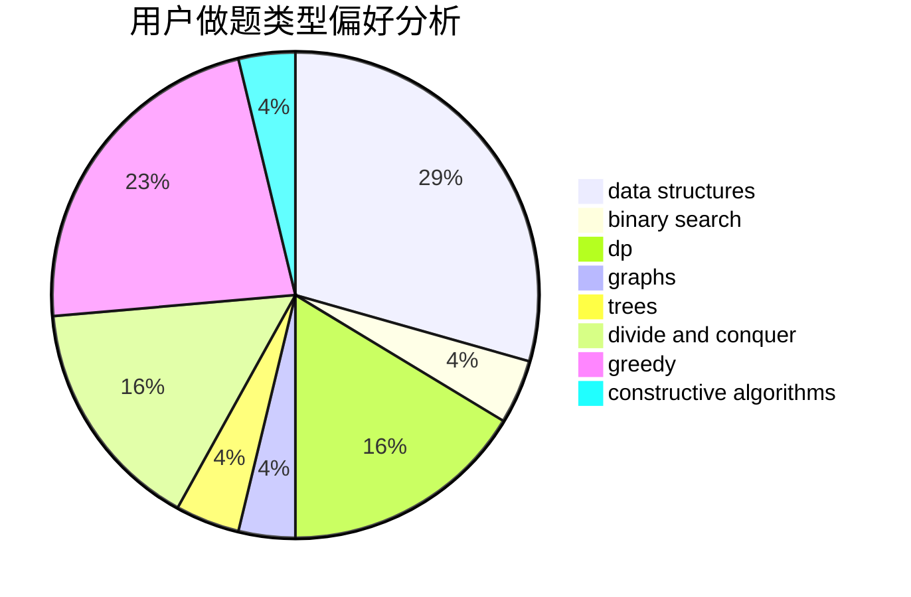
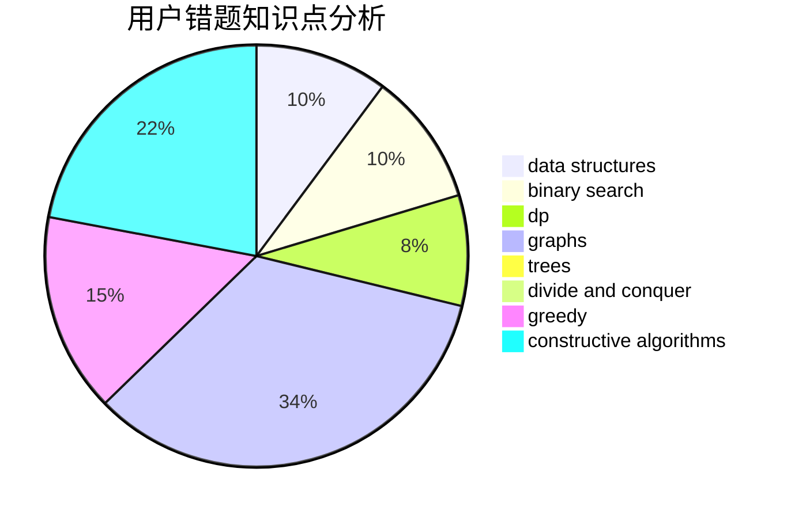

# crp_cpp

<!-- tabs:start -->

#### **用户提交结果分析**

#### **用户做题类型偏好分析**

#### **用户错题知识点分析**

<!-- tabs:end -->
# 推荐题目
[808A](https://codeforces.com/contest/808/problem/A)		implementation		  
[1366F](https://codeforces.com/contest/1366/problem/F)		binary search,
                        dp,
                        geometry,
                        graphs		  
[838F](https://codeforces.com/contest/838/problem/F)		nan		  
[1314F](https://codeforces.com/contest/1314/problem/F)		dsu,graphs,sortings,trees		  
[1350E](https://codeforces.com/contest/1350/problem/E)		dsu,graphs,sortings,trees		  
[437A](https://codeforces.com/contest/437/problem/A)		implementation		  
[1310D](https://codeforces.com/contest/1310/problem/D)		dp,
                        graphs,
                        probabilities		  
[834C](https://codeforces.com/contest/834/problem/C)		dsu,graphs,sortings,trees		  
[281A](https://codeforces.com/contest/281/problem/A)		implementation,
                        strings		  
[1147B](https://codeforces.com/contest/1147/problem/B)		brute force,
                        strings		  
