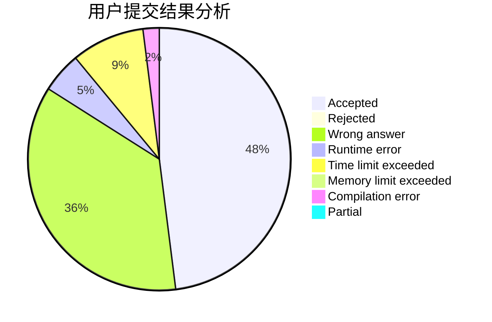
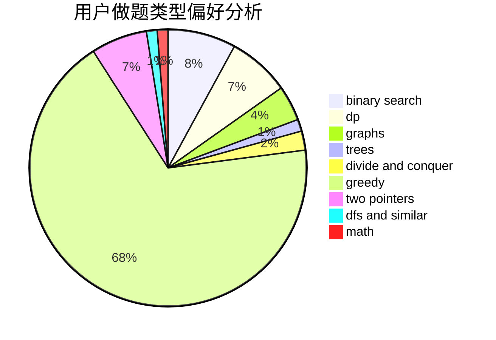

# cs142857

<!-- tabs:start -->

#### **用户提交结果分析**

#### **用户做题类型偏好分析**

<!-- tabs:end -->
# 推荐题目
[962B](https://codeforces.com/contest/962/problem/B)
[1169B](https://codeforces.com/contest/1169/problem/B)
[515A](https://codeforces.com/contest/515/problem/A)
[429D](https://codeforces.com/contest/429/problem/D)
[28B](https://codeforces.com/contest/28/problem/B)
[1425A](https://codeforces.com/contest/1425/problem/A)
[616B](https://codeforces.com/contest/616/problem/B)
[1341E](https://codeforces.com/contest/1341/problem/E)
[369C](https://codeforces.com/contest/369/problem/C)
[1321F](https://codeforces.com/contest/1321/problem/F)
