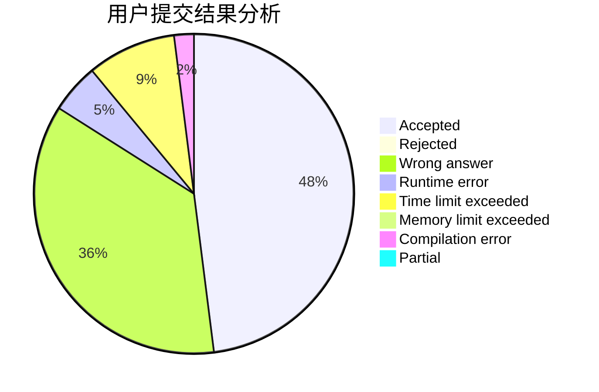
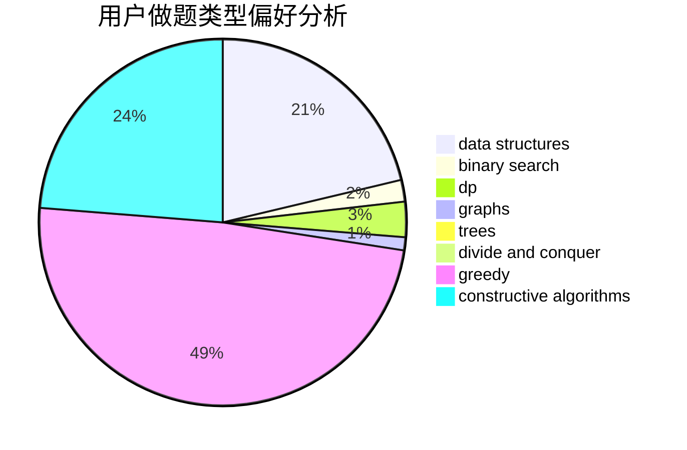

# cs142857

<!-- tabs:start -->

#### **用户提交结果分析**

#### **用户做题类型偏好分析**

#### **用户错题知识点分析**

<!-- tabs:end -->
# 推荐题目
[962B](https://codeforces.com/contest/962/problem/B)		constructive algorithms,
                        greedy,
                        implementation		  
[1169B](https://codeforces.com/contest/1169/problem/B)		graphs,
                        implementation		  
[515A](https://codeforces.com/contest/515/problem/A)		math		  
[429D](https://codeforces.com/contest/429/problem/D)		data structures,
                        divide and conquer,
                        geometry		  
[28B](https://codeforces.com/contest/28/problem/B)		dfs and similar,
                        dsu,
                        graphs		  
[1425A](https://codeforces.com/contest/1425/problem/A)		games,
                        greedy		  
[616B](https://codeforces.com/contest/616/problem/B)		games,
                        greedy		  
[1341E](https://codeforces.com/contest/1341/problem/E)		dsu,graphs,sortings,trees		  
[369C](https://codeforces.com/contest/369/problem/C)		dfs and similar,
                        graphs,
                        trees		  
[1321F](https://codeforces.com/contest/1321/problem/F)		dsu,graphs,sortings,trees		  
