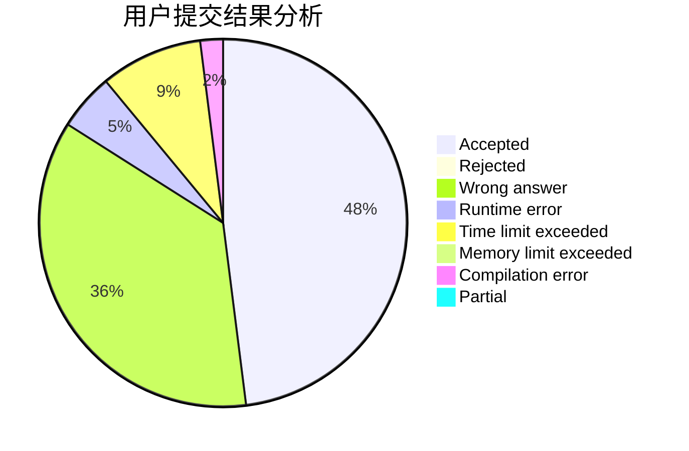
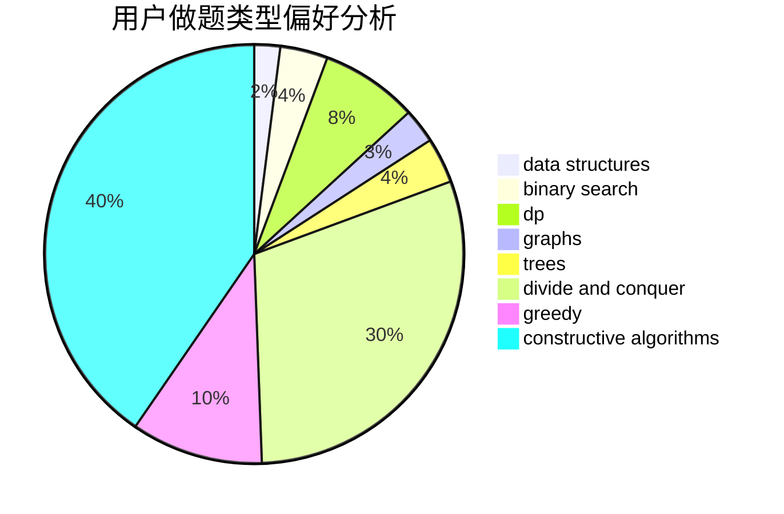

# cs142857

<!-- tabs:start -->

#### **用户提交结果分析**

#### **用户做题类型偏好分析**

#### **用户错题知识点分析**

<!-- tabs:end -->
# 推荐题目
[940E](https://codeforces.com/contest/940/problem/E)		data structures,
                        dp,
                        greedy,
                        math		  
[1166C](https://codeforces.com/contest/1166/problem/C)		binary search,
                        sortings,
                        two pointers		  
[494E](https://codeforces.com/contest/494/problem/E)		data structures,
                        games		  
[3C](https://codeforces.com/contest/3/problem/C)		brute force,
                        games,
                        implementation		  
[274C](https://codeforces.com/contest/274/problem/C)		brute force,
                        geometry		  
[1417D](https://codeforces.com/contest/1417/problem/D)		dsu,graphs,sortings,trees		  
[598C](https://codeforces.com/contest/598/problem/C)		geometry,
                        sortings		  
[1334F](https://codeforces.com/contest/1334/problem/F)		binary search,
                        data structures,
                        dp,
                        greedy		  
[342C](https://codeforces.com/contest/342/problem/C)		geometry		  
[1312D](https://codeforces.com/contest/1312/problem/D)		combinatorics,
                        math		  
