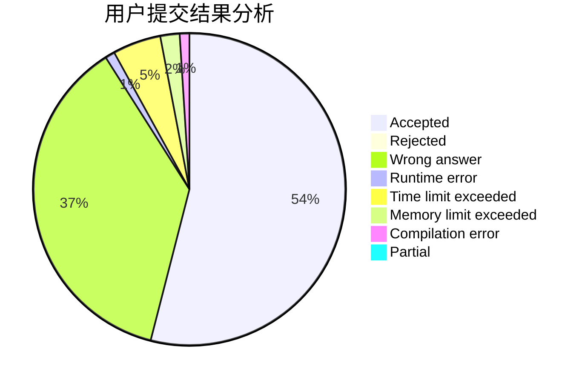
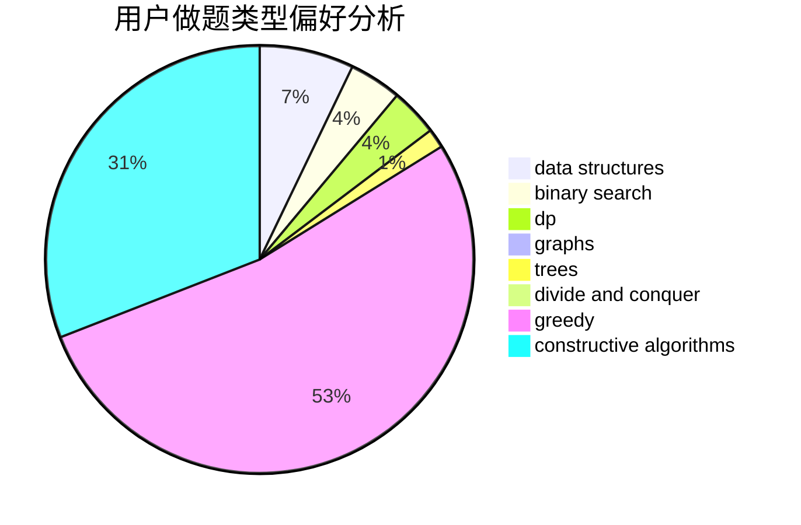
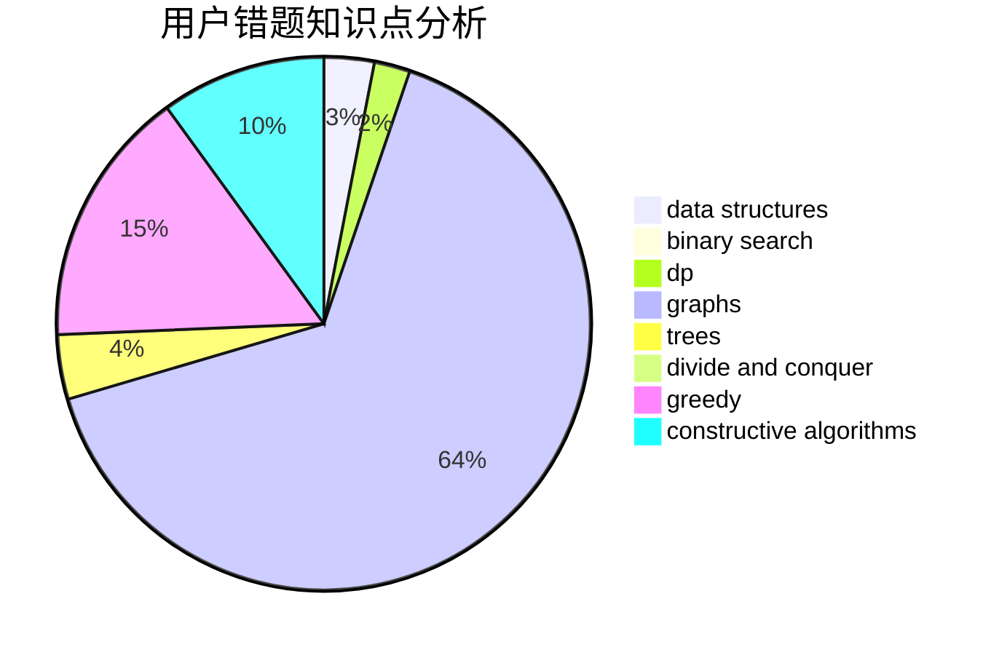

# csawyer

<!-- tabs:start -->

#### **用户提交结果分析**

#### **用户做题类型偏好分析**

#### **用户错题知识点分析**

<!-- tabs:end -->
# 推荐题目
[1471E](https://codeforces.com/contest/1471/problem/E)		dsu,graphs,sortings,trees		  
[38A](https://codeforces.com/contest/38/problem/A)		implementation		  
[1141D](https://codeforces.com/contest/1141/problem/D)		greedy,
                        implementation		  
[103E](https://codeforces.com/contest/103/problem/E)		flows,
                        graph matchings		  
[1020A](https://codeforces.com/contest/1020/problem/A)		math		  
[916D](https://codeforces.com/contest/916/problem/D)		data structures,
                        interactive,
                        trees		  
[290C](https://codeforces.com/contest/290/problem/C)		*special problem,
                        graph matchings,
                        implementation,
                        trees		  
[1486D](https://codeforces.com/contest/1486/problem/D)		binary search,
                        data structures,
                        dp		  
[700B](https://codeforces.com/contest/700/problem/B)		dfs and similar,
                        dp,
                        graphs,
                        trees		  
[804D](https://codeforces.com/contest/804/problem/D)		binary search,
                        brute force,
                        dfs and similar,
                        dp,
                        sortings,
                        trees		  
