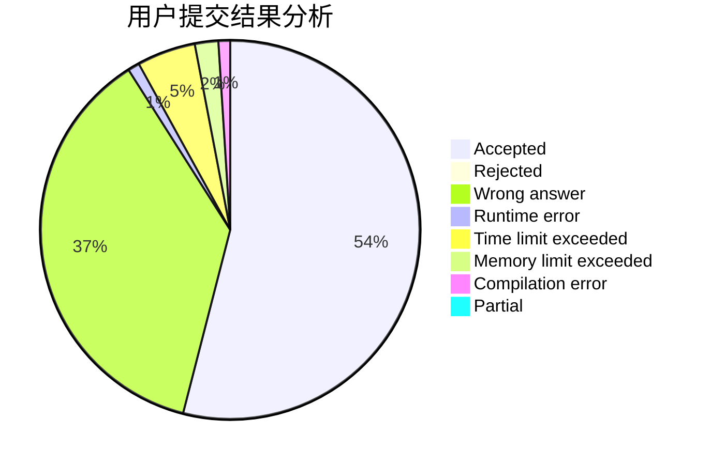
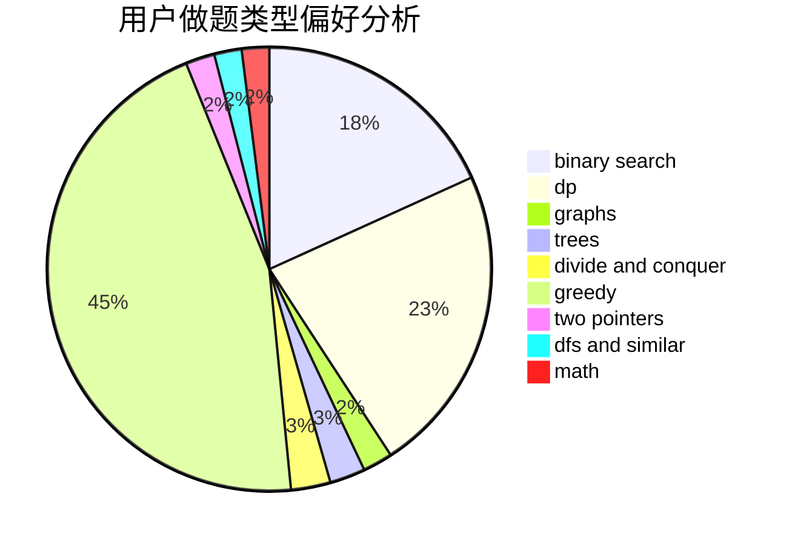

# csawyer

<!-- tabs:start -->

#### **用户提交结果分析**

#### **用户做题类型偏好分析**

<!-- tabs:end -->
# 推荐题目
[1471E](https://codeforces.com/contest/1471/problem/E)
[38A](https://codeforces.com/contest/38/problem/A)
[1141D](https://codeforces.com/contest/1141/problem/D)
[103E](https://codeforces.com/contest/103/problem/E)
[1020A](https://codeforces.com/contest/1020/problem/A)
[916D](https://codeforces.com/contest/916/problem/D)
[290C](https://codeforces.com/contest/290/problem/C)
[1486D](https://codeforces.com/contest/1486/problem/D)
[700B](https://codeforces.com/contest/700/problem/B)
[804D](https://codeforces.com/contest/804/problem/D)
