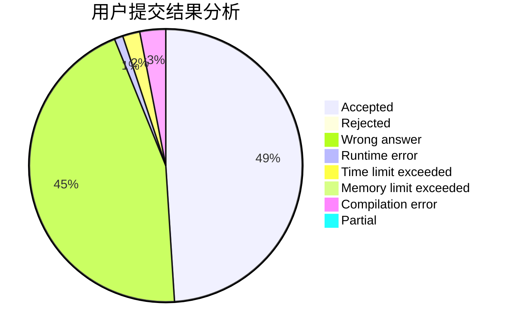
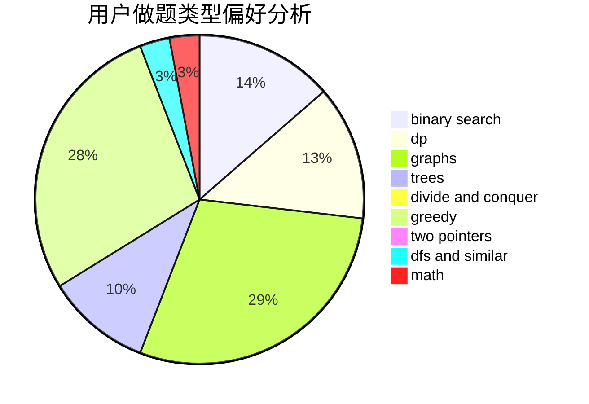

# csc_love_champx

<!-- tabs:start -->

#### **用户提交结果分析**

#### **用户做题类型偏好分析**

<!-- tabs:end -->
# 推荐题目
[1062A](https://codeforces.com/contest/1062/problem/A)
[535A](https://codeforces.com/contest/535/problem/A)
[997E](https://codeforces.com/contest/997/problem/E)
[804B](https://codeforces.com/contest/804/problem/B)
[879B](https://codeforces.com/contest/879/problem/B)
[543B](https://codeforces.com/contest/543/problem/B)
[1028B](https://codeforces.com/contest/1028/problem/B)
[786E](https://codeforces.com/contest/786/problem/E)
[741B](https://codeforces.com/contest/741/problem/B)
[1204A](https://codeforces.com/contest/1204/problem/A)
