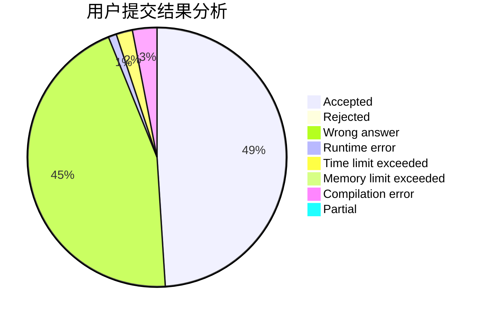
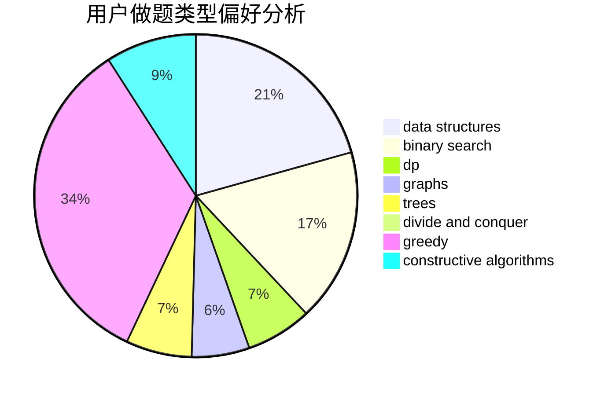
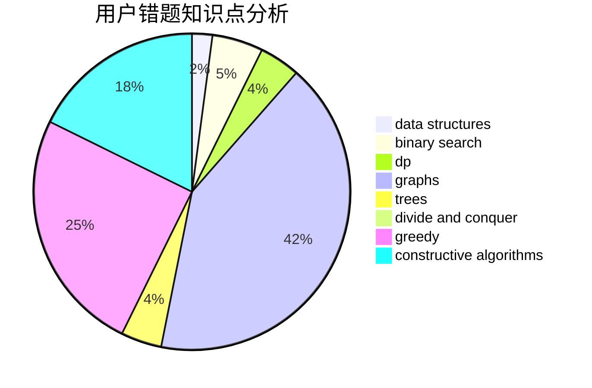

# csc_love_champx

<!-- tabs:start -->

#### **用户提交结果分析**

#### **用户做题类型偏好分析**

#### **用户错题知识点分析**

<!-- tabs:end -->
# 推荐题目
[1062A](https://codeforces.com/contest/1062/problem/A)		greedy,
                        implementation		  
[535A](https://codeforces.com/contest/535/problem/A)		brute force,
                        implementation		  
[997E](https://codeforces.com/contest/997/problem/E)		data structures		  
[804B](https://codeforces.com/contest/804/problem/B)		combinatorics,
                        greedy,
                        implementation,
                        math		  
[879B](https://codeforces.com/contest/879/problem/B)		data structures,
                        implementation		  
[543B](https://codeforces.com/contest/543/problem/B)		constructive algorithms,
                        graphs,
                        shortest paths		  
[1028B](https://codeforces.com/contest/1028/problem/B)		constructive algorithms,
                        math		  
[786E](https://codeforces.com/contest/786/problem/E)		data structures,
                        flows,
                        graphs,
                        trees		  
[741B](https://codeforces.com/contest/741/problem/B)		dfs and similar,
                        dp,
                        dsu		  
[1204A](https://codeforces.com/contest/1204/problem/A)		math		  
