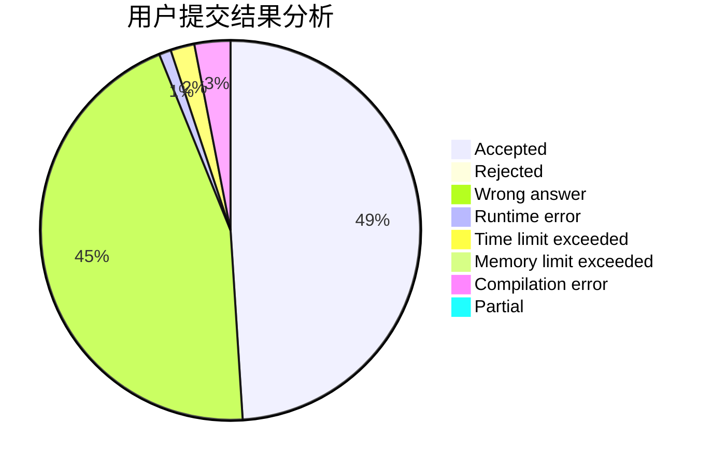
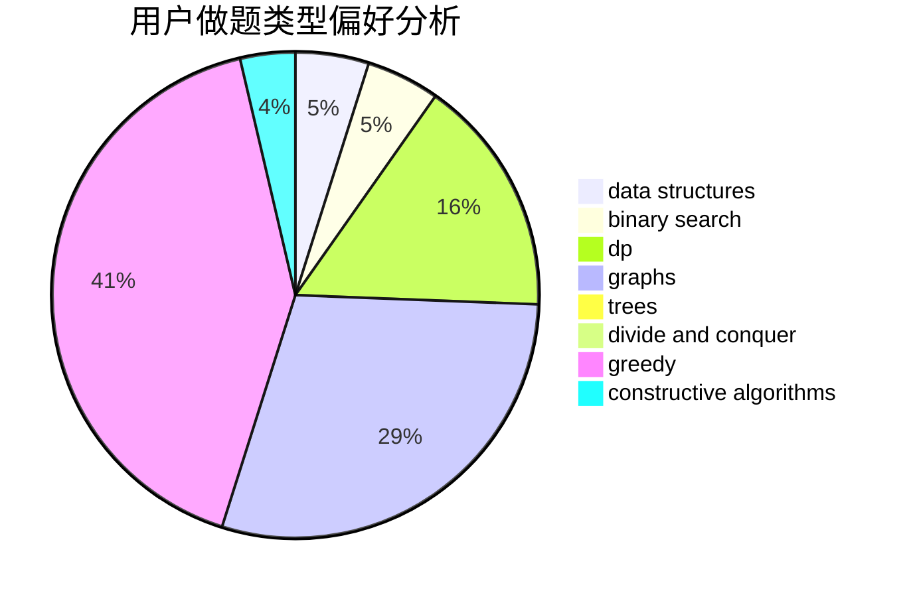
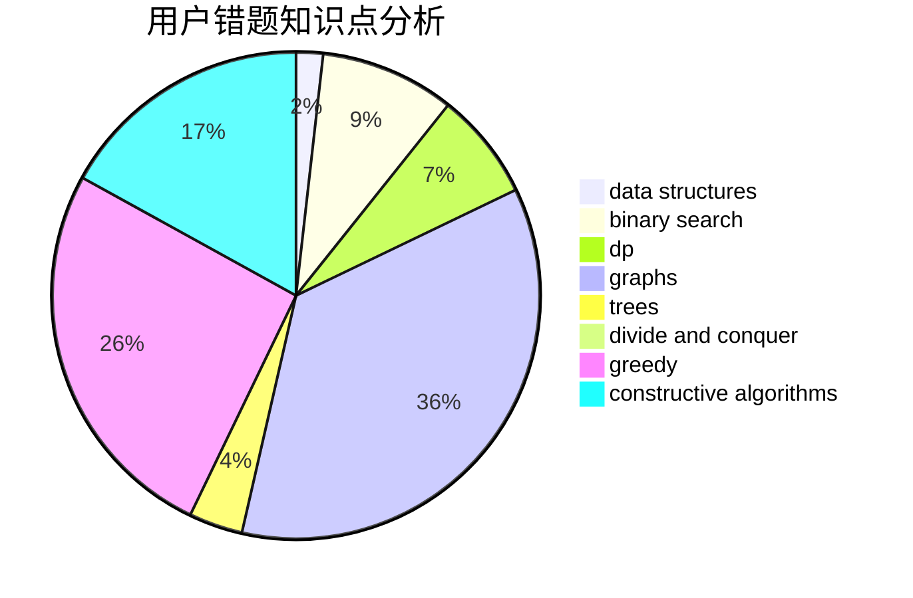

# csc_love_champx

<!-- tabs:start -->

#### **用户提交结果分析**

#### **用户做题类型偏好分析**

#### **用户错题知识点分析**

<!-- tabs:end -->
# 推荐题目
[1061C](https://codeforces.com/contest/1061/problem/C)		data structures,
                        dp,
                        implementation,
                        math,
                        number theory		  
[512A](https://codeforces.com/contest/512/problem/A)		dsu,graphs,sortings,trees		  
[982B](https://codeforces.com/contest/982/problem/B)		data structures,
                        greedy,
                        implementation		  
[788E](https://codeforces.com/contest/788/problem/E)		data structures		  
[861B](https://codeforces.com/contest/861/problem/B)		dsu,graphs,sortings,trees		  
[516B](https://codeforces.com/contest/516/problem/B)		dsu,graphs,sortings,trees		  
[1027F](https://codeforces.com/contest/1027/problem/F)		binary search,
                        dfs and similar,
                        dsu,
                        graph matchings,
                        graphs		  
[767C](https://codeforces.com/contest/767/problem/C)		dfs and similar,
                        graphs,
                        greedy,
                        trees		  
[723E](https://codeforces.com/contest/723/problem/E)		constructive algorithms,
                        dfs and similar,
                        flows,
                        graphs,
                        greedy		  
[11C](https://codeforces.com/contest/11/problem/C)		implementation		  
