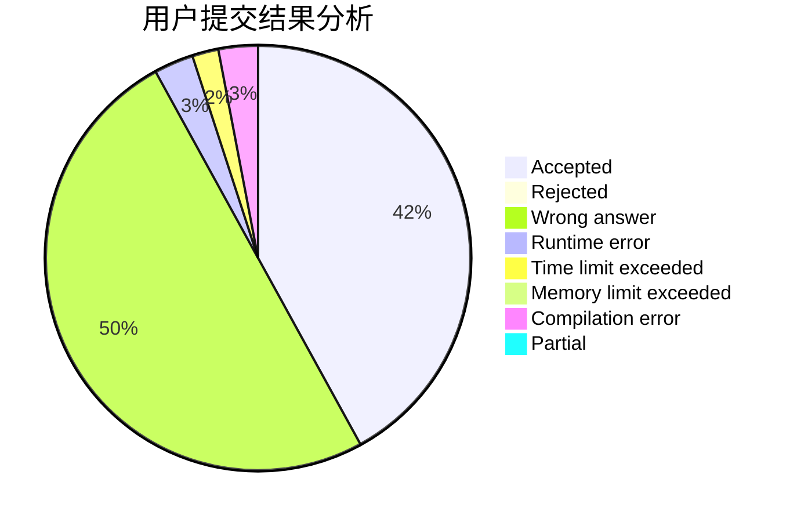
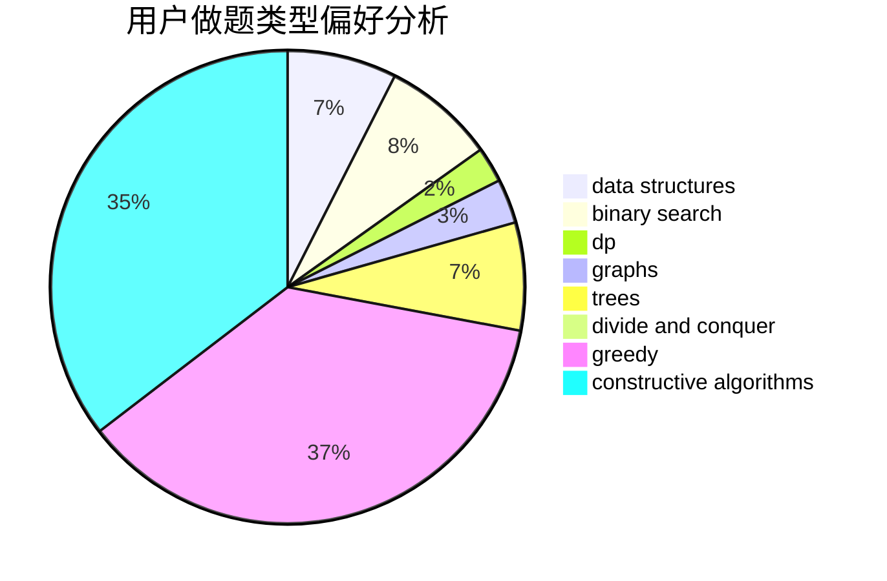
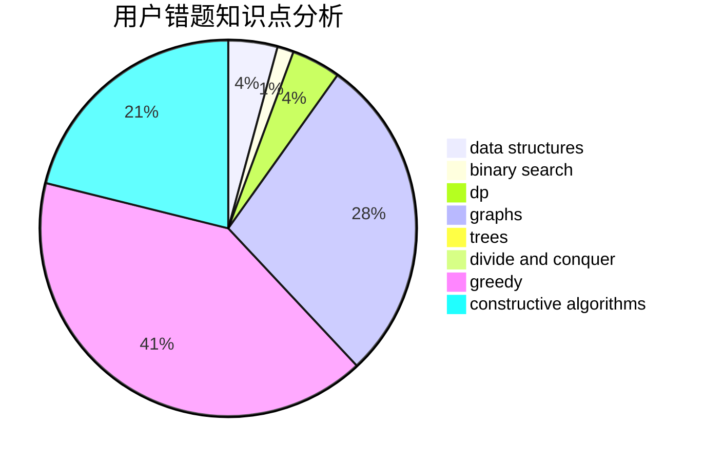

# ctq1999

<!-- tabs:start -->

#### **用户提交结果分析**

#### **用户做题类型偏好分析**

#### **用户错题知识点分析**

<!-- tabs:end -->
# 推荐题目
[543C](https://codeforces.com/contest/543/problem/C)		bitmasks,
                        dp		  
[359B](https://codeforces.com/contest/359/problem/B)		constructive algorithms,
                        dp,
                        math		  
[789B](https://codeforces.com/contest/789/problem/B)		brute force,
                        implementation,
                        math		  
[660A](https://codeforces.com/contest/660/problem/A)		greedy,
                        implementation,
                        math,
                        number theory		  
[468A](https://codeforces.com/contest/468/problem/A)		constructive algorithms,
                        greedy,
                        math		  
[1119G](https://codeforces.com/contest/1119/problem/G)		constructive algorithms,
                        implementation		  
[280D](https://codeforces.com/contest/280/problem/D)		data structures,
                        flows,
                        graphs,
                        implementation		  
[652D](https://codeforces.com/contest/652/problem/D)		data structures,
                        sortings		  
[629C](https://codeforces.com/contest/629/problem/C)		dp,
                        strings		  
[825B](https://codeforces.com/contest/825/problem/B)		brute force,
                        implementation		  
