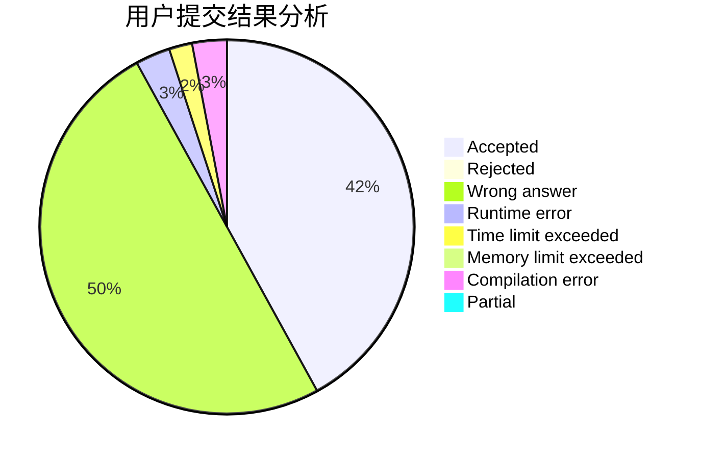
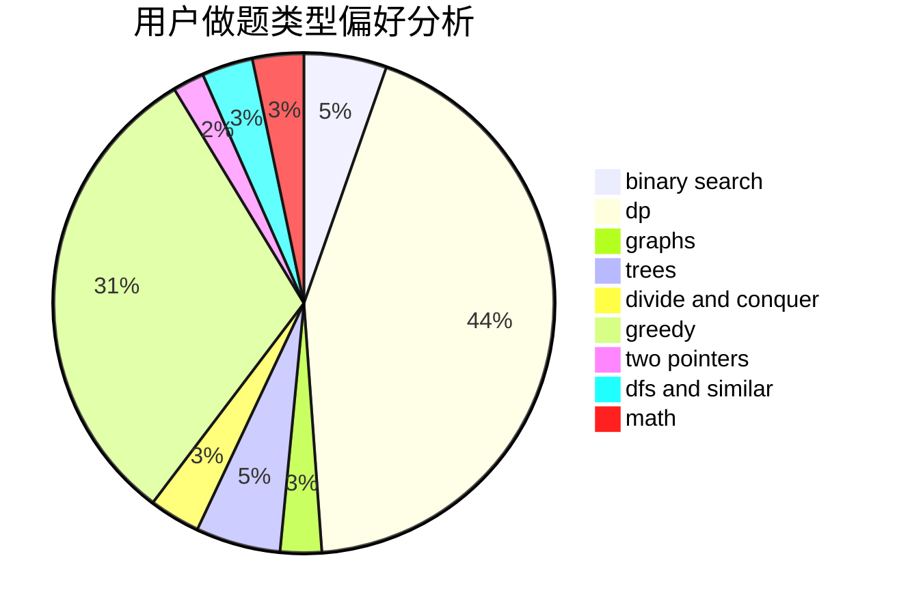

# ctq1999

<!-- tabs:start -->

#### **用户提交结果分析**

#### **用户做题类型偏好分析**

<!-- tabs:end -->
# 推荐题目
[567E](https://codeforces.com/contest/567/problem/E)
[385E](https://codeforces.com/contest/385/problem/E)
[804D](https://codeforces.com/contest/804/problem/D)
[680B](https://codeforces.com/contest/680/problem/B)
[487B](https://codeforces.com/contest/487/problem/B)
[1129C](https://codeforces.com/contest/1129/problem/C)
[297A](https://codeforces.com/contest/297/problem/A)
[676C](https://codeforces.com/contest/676/problem/C)
[659B](https://codeforces.com/contest/659/problem/B)
[843B](https://codeforces.com/contest/843/problem/B)
