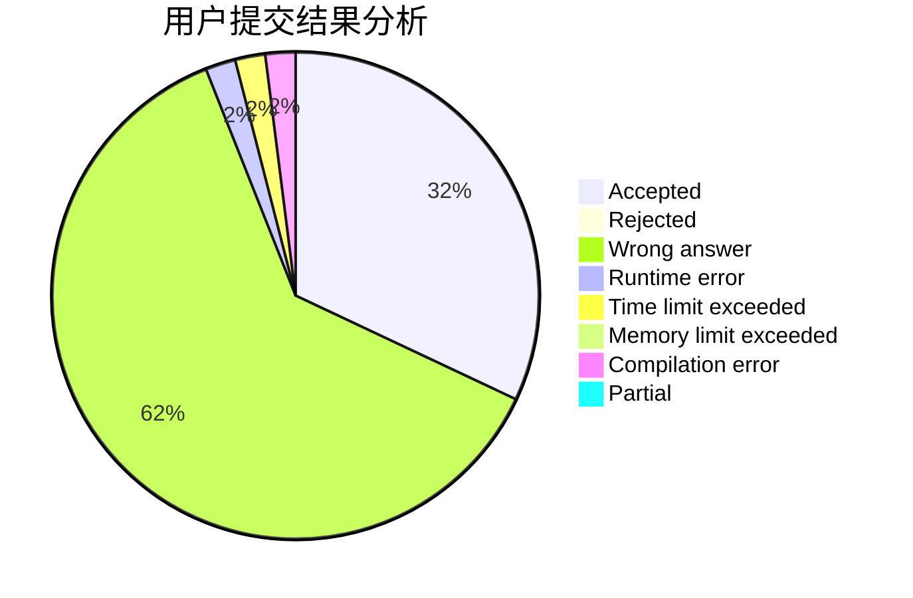
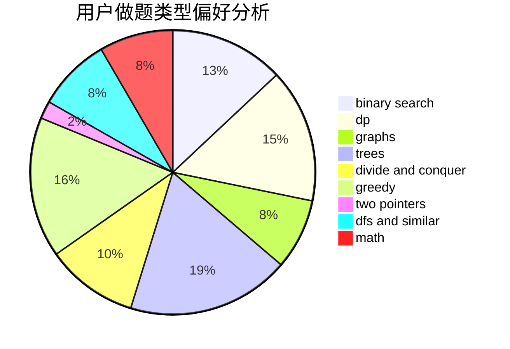

# cu137

<!-- tabs:start -->

#### **用户提交结果分析**

#### **用户做题类型偏好分析**

<!-- tabs:end -->
# 推荐题目
[319E](https://codeforces.com/contest/319/problem/E)
[993B](https://codeforces.com/contest/993/problem/B)
[367B](https://codeforces.com/contest/367/problem/B)
[932A](https://codeforces.com/contest/932/problem/A)
[891C](https://codeforces.com/contest/891/problem/C)
[593D](https://codeforces.com/contest/593/problem/D)
[228B](https://codeforces.com/contest/228/problem/B)
[1152A](https://codeforces.com/contest/1152/problem/A)
[762F](https://codeforces.com/contest/762/problem/F)
[405A](https://codeforces.com/contest/405/problem/A)
