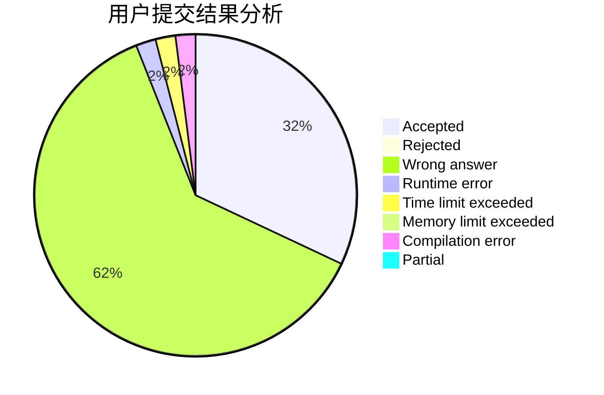
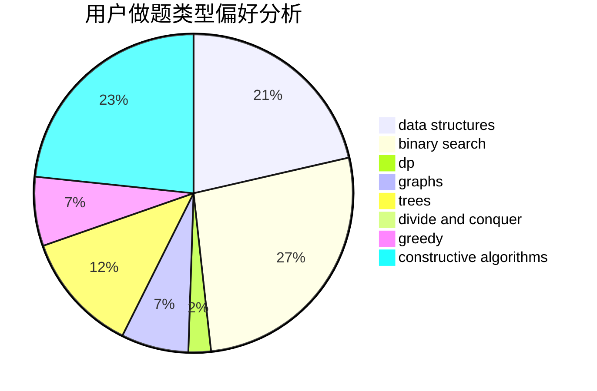

# cu137

<!-- tabs:start -->

#### **用户提交结果分析**

#### **用户做题类型偏好分析**

#### **用户错题知识点分析**

<!-- tabs:end -->
# 推荐题目
[301B](https://codeforces.com/contest/301/problem/B)		binary search,
                        graphs,
                        shortest paths		  
[979B](https://codeforces.com/contest/979/problem/B)		greedy		  
[33A](https://codeforces.com/contest/33/problem/A)		greedy,
                        implementation		  
[913C](https://codeforces.com/contest/913/problem/C)		bitmasks,
                        dp,
                        greedy		  
[870F](https://codeforces.com/contest/870/problem/F)		data structures,
                        number theory		  
[573E](https://codeforces.com/contest/573/problem/E)		data structures,
                        greedy		  
[204C](https://codeforces.com/contest/204/problem/C)		math,
                        probabilities		  
[1150A](https://codeforces.com/contest/1150/problem/A)		greedy,
                        implementation		  
[742C](https://codeforces.com/contest/742/problem/C)		dsu,graphs,sortings,trees		  
[376B](https://codeforces.com/contest/376/problem/B)		implementation		  
