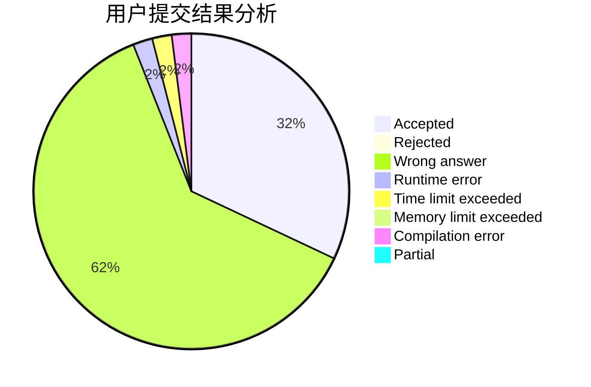
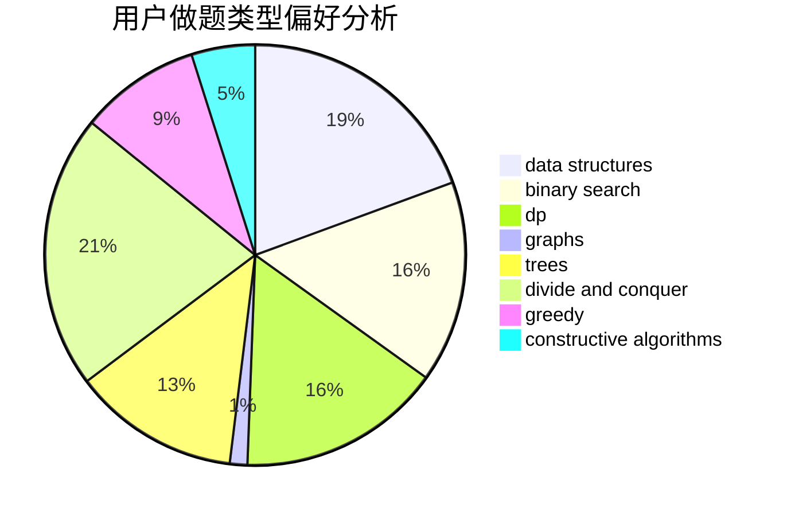

# cu137

<!-- tabs:start -->

#### **用户提交结果分析**

#### **用户做题类型偏好分析**

#### **用户错题知识点分析**

<!-- tabs:end -->
# 推荐题目
[319E](https://codeforces.com/contest/319/problem/E)		data structures		  
[993B](https://codeforces.com/contest/993/problem/B)		bitmasks,
                        brute force		  
[367B](https://codeforces.com/contest/367/problem/B)		binary search,
                        data structures		  
[932A](https://codeforces.com/contest/932/problem/A)		constructive algorithms		  
[891C](https://codeforces.com/contest/891/problem/C)		data structures,
                        dsu,
                        graphs		  
[593D](https://codeforces.com/contest/593/problem/D)		data structures,
                        dfs and similar,
                        graphs,
                        math,
                        trees		  
[228B](https://codeforces.com/contest/228/problem/B)		brute force,
                        implementation		  
[1152A](https://codeforces.com/contest/1152/problem/A)		greedy,
                        implementation,
                        math		  
[762F](https://codeforces.com/contest/762/problem/F)		combinatorics,
                        graphs,
                        trees		  
[405A](https://codeforces.com/contest/405/problem/A)		greedy,
                        implementation,
                        sortings		  
