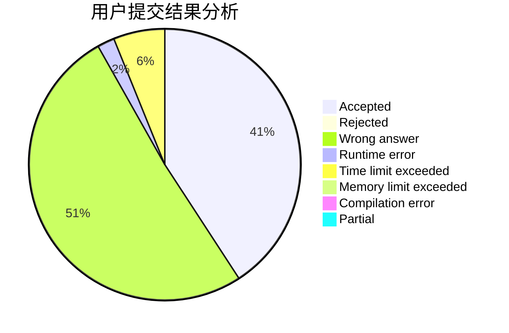
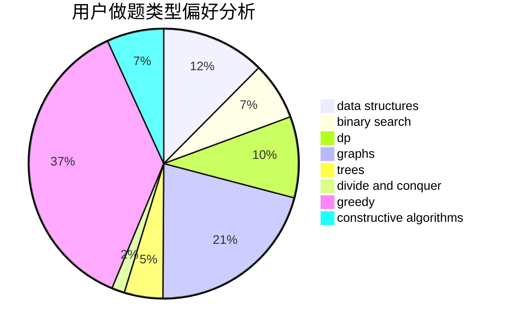
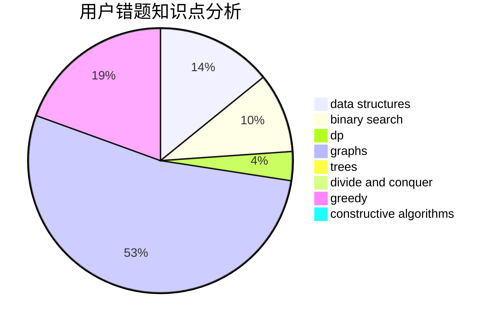

# ArcCCcp

<!-- tabs:start -->

#### **用户提交结果分析**

#### **用户做题类型偏好分析**

#### **用户错题知识点分析**

<!-- tabs:end -->
# 推荐题目
[412D](https://codeforces.com/contest/412/problem/D)		dfs and similar		  
[306D](https://codeforces.com/contest/306/problem/D)		constructive algorithms,
                        geometry		  
[415A](https://codeforces.com/contest/415/problem/A)		implementation		  
[11962](https://codeforces.com/contest/1196/problem/2)		dsu,graphs,sortings,trees		  
[409G](https://codeforces.com/contest/409/problem/G)		*special problem,
                        geometry		  
[418D](https://codeforces.com/contest/418/problem/D)		data structures,
                        graphs,
                        trees		  
[416C](https://codeforces.com/contest/416/problem/C)		binary search,
                        dp,
                        greedy,
                        implementation		  
[417E](https://codeforces.com/contest/417/problem/E)		constructive algorithms,
                        math,
                        probabilities		  
[411A](https://codeforces.com/contest/411/problem/A)		*special problem,
                        implementation		  
[1314F](https://codeforces.com/contest/1314/problem/F)		dsu,graphs,sortings,trees		  
