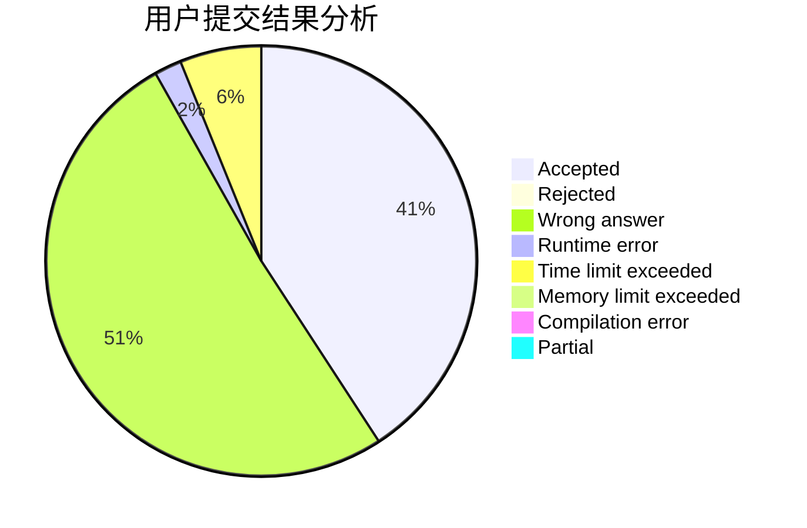
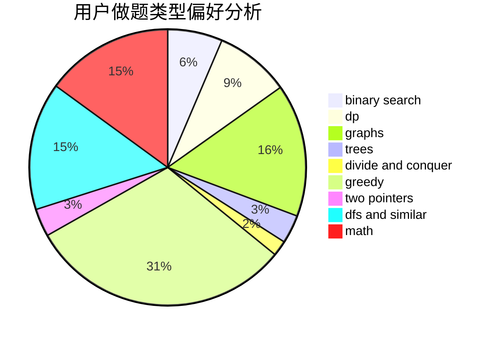

# ArcCCcp

<!-- tabs:start -->

#### **用户提交结果分析**

#### **用户做题类型偏好分析**

<!-- tabs:end -->
# 推荐题目
[412D](https://codeforces.com/contest/412/problem/D)
[306D](https://codeforces.com/contest/306/problem/D)
[415A](https://codeforces.com/contest/415/problem/A)
[11962](https://codeforces.com/contest/1196/problem/2)
[409G](https://codeforces.com/contest/409/problem/G)
[418D](https://codeforces.com/contest/418/problem/D)
[416C](https://codeforces.com/contest/416/problem/C)
[417E](https://codeforces.com/contest/417/problem/E)
[411A](https://codeforces.com/contest/411/problem/A)
[1314F](https://codeforces.com/contest/1314/problem/F)
